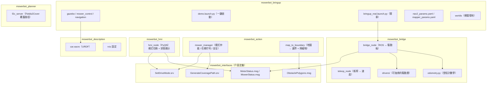
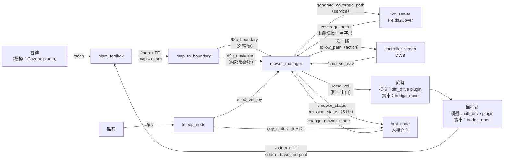
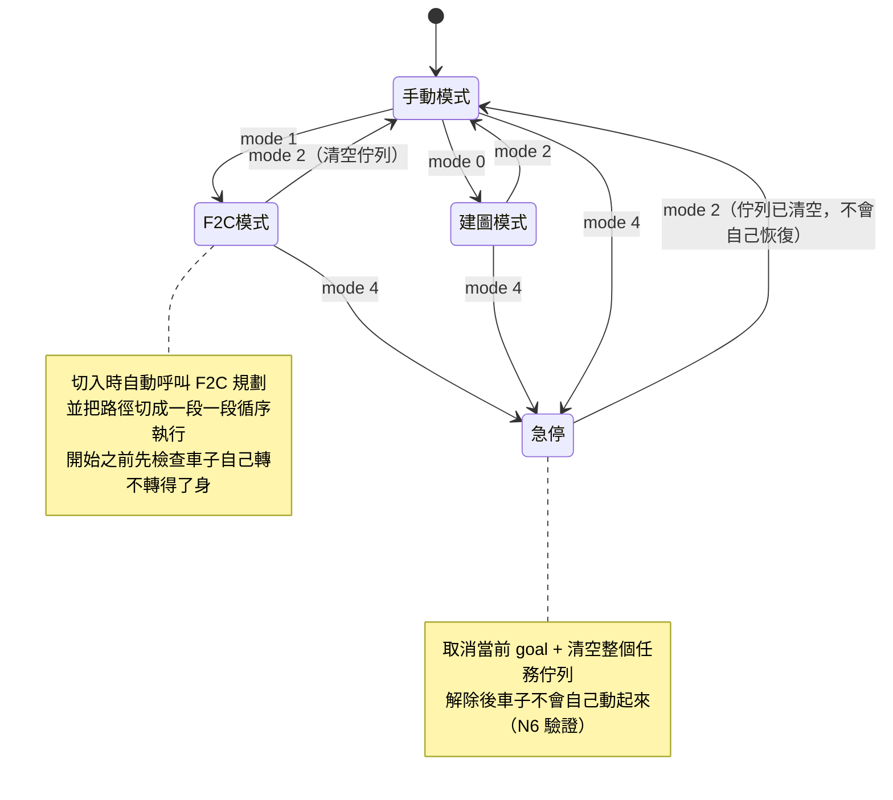
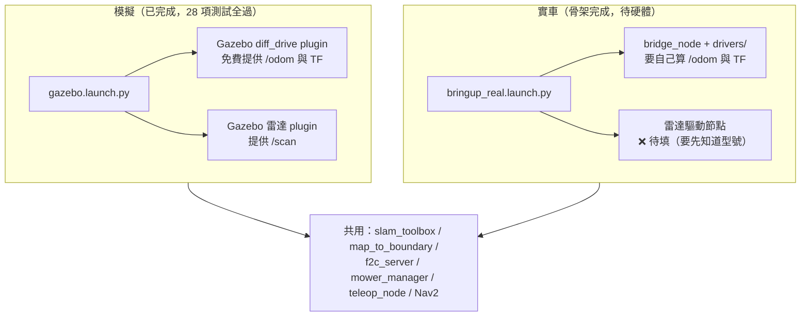
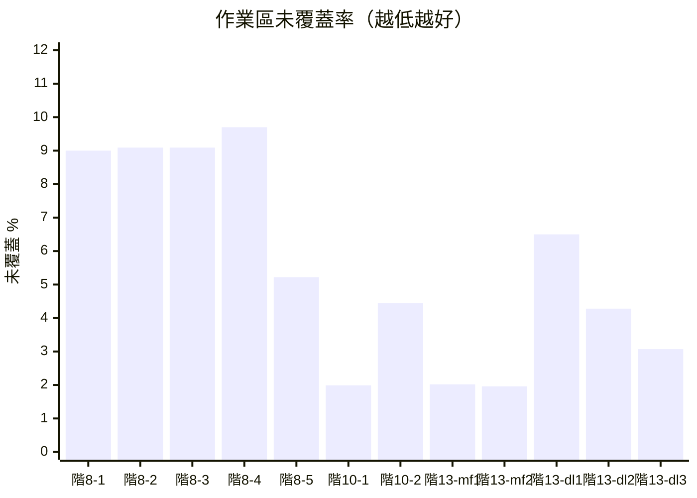
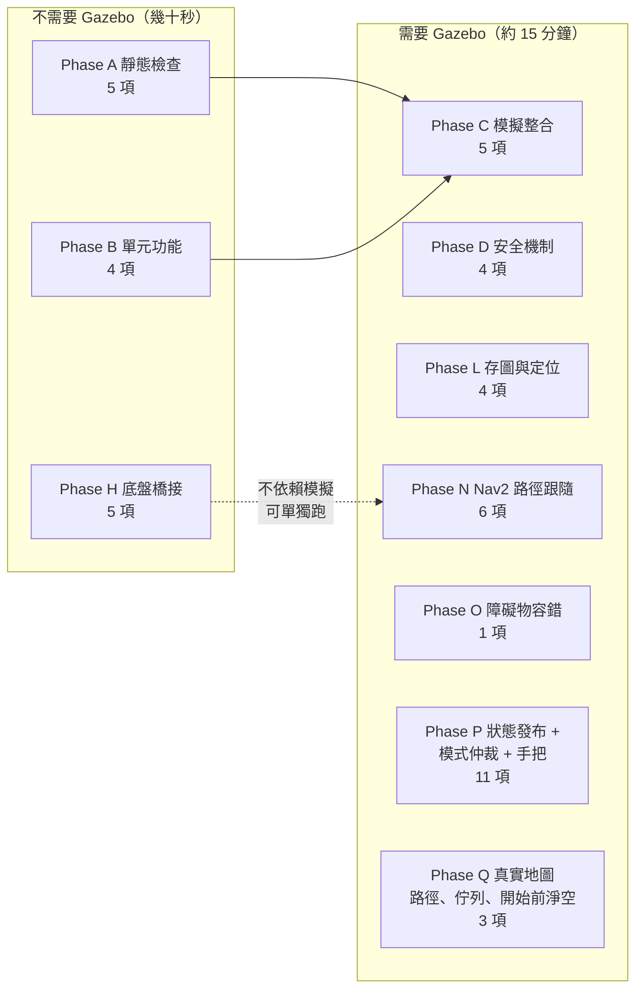

# mowerbot 系統架構與資料流

這份文件是報告要用的圖。圖用 mermaid 語法寫在 markdown 裡，
GitHub、VS Code 的預覽、以及多數 markdown 轉 PDF 的工具都直接看得到，
不需要另外維護圖片檔。

數據與詳細分析在 `simulation_results.md`，實車步驟在 `hardware_bringup.md`。

---

## 1. 套件關係



---

## 2. 完整資料流（割草任務）

從雷射到輪子的一條龍。標在箭頭上的是實際的 topic / service 名稱。



**這張圖最重要的一點：`/cmd_vel` 只有 `mower_manager` 一個發布者。**

Nav2 的輸出被 remap 成 `/cmd_vel_nav`、搖桿的輸出是 `/cmd_vel_joy`，
兩者都必須經過 manager 的模式仲裁才會變成 `/cmd_vel`。
這是安全設計：急停（mode 4）只要讓 manager 不轉發，
任何來源都到不了底盤。詳見 `simulation_results.md` 1.2 節與 N4 測試。

---

## 3. 模式仲裁



| mode | 名稱 | `/cmd_vel` 的來源 | 介面上可選 |
|------|------|------------------|:---------:|
| 0 | 建圖（SLAM） | `/cmd_vel_joy`（搖桿，且要按住 deadman） | ✓ |
| 1 | F2C 割草 | `/cmd_vel_nav`（Nav2） | ✓ |
| 2 | 手動 | `/cmd_vel_joy`（搖桿，且要按住 deadman） | ✓ |
| 3 | **保留，未實作** | `/cmd_vel_nav`（轉發規則與 mode 1 相同） | ✗ |
| 4 | 急停 | 無，全部攔截 | ✓（獨立的大按鈕） |

### 3.1 mode 3 為什麼是「保留，未實作」

原本的規劃是點對點自動導航。**要做出來需要 `planner_server`
（`ComputePathToPose`）與 `bt_navigator`，兩者都沒有啟動** ——
本專題的 Nav2 只跑 `controller_server`，路徑一律由 F2C 產生後
切段送進 `FollowPath`。補上那兩個節點、設計行為樹、決定目標點怎麼給、
以及處理規劃失敗的復原策略，都不在本專題宣告的範圍內，**列為未來工作**。

因此階段 23 把 mode 3 從介面上移掉：

* **HMI 沒有「3」這顆按鈕**（`SELECTABLE_MODES = (0, 1, 2)`）。
* **手把的 Y 鍵不繫結任何東西**。它以前呼叫 `change_mower_mode(3)`，
  那個分支已經移除，而且沒有拿去做別的事 —— 按鍵語意改變在實車上比
  沒有功能危險。`Phase P` 的 P11 驗證「按下 Y 模式不變」，
  並用「同一條 `/joy` 路徑按 A 要切得動」當對照組，避免空過。
* **編號不重新排。** mode 4 必須維持是急停，那是安全介面；
  為了讓表格好看而把 4 挪成 3 是不能接受的。所以 3 留著當空號。
* **manager 對 mode 3 的仲裁行為完全保留**：轉發 `/cmd_vel_nav`、
  擋掉搖桿、急停有效、離開時清空佇列。理由是服務
  `change_mower_mode` 仍然接受 3，萬一有東西把模式設成 3，
  行為必須是定義好而且安全的，而不是未定義。
* **測試也全部保留**：P7（五個模式下急停都有效）、P9（mode 1/3 下
  搖桿速度不會被轉發）、N6（急停解除後不會自己動）都還是會走到 mode 3，
  用服務直接設模式，不需要按鈕。

---

## 4. 模擬與實車的差異

**只有兩個方塊不一樣**，其餘節點完全共用 —— 這是整個架構刻意維持的性質。



**實車最容易被忽略的一點**：Gazebo 的 diff_drive plugin 免費提供
`/odom` 與 `odom → base_footprint` 的 TF，實車上沒有任何東西會發這兩樣，
而 `slam_toolbox` 硬性要求它。沒有 `bridge_node`，實車上整條鏈路等於零。

---

## 5. 覆蓋率的改善（階段 8 → 10 → 13）

分母是「扣掉地頭的作業區」，數字來自
`python3 test/tools/coverage_analysis.py <log 目錄>`。

| 階段 | 做了什麼 | 作業區未覆蓋率 | 覆蓋落差最大 |
|------|---------|--------------|------------|
| 階段 8（封板） | 弓字形 + 跑道 + 重疊率 0.4 | 9.00 ~ 9.70 %（5 次） | 0.419 ~ 0.545 m |
| 階段 10 | 加上周邊環繞 | 1.99 % / 4.44 %（2 次） | 0.369 / 0.447 m |
| 階段 13 | 同配置的重複性驗證 | `mow_field` 1.99 % ± 0.04 (n=2)<br/>`demo_lawn` 4.62 % ± 1.74 (n=3) | — |



（`mf` = `mow_field.world`，`dl` = `demo_lawn.world`。階段 13 還有一次
`mow_field` 的執行沒有畫進來：那一次任務根本沒啟動，未覆蓋 97.58%，
原因是 `/f2c_boundary` 的發布者競態，見 `simulation_results.md` 12.3 節。
不畫是因為它不是「割草品質」的資料點，但它沒有被從紀錄裡刪掉。）

（`xychart-beta` 需要較新的 mermaid；渲染不出來時看上面的表格即可。）

**剩下的未覆蓋面積 98 ~ 100% 是線間的條狀縫隙**，位置在作業區中段，
成因是循跡誤差而不是邊緣漏割 —— 周邊環繞解決不了它。
要再往下壓必須處理循跡誤差本身（DWB 的權重），
那些值在實車上都要重新實測，現在調等於白做。

---

## 6. 測試套件的組成



共 **49 項**。開發時只跑受影響的 Phase（改 F2C 跑 B + N、改 manager 跑 D + N、
改 bridge_node 跑 H），收尾才跑完整套件。

| Phase | 內容 | 需要 Gazebo |
|-------|------|:-----------:|
| A | build、launch 解析、執行檔、介面欄位、xacro | ✗ |
| B | F2C 路徑、邊界提取、內部障礙物挖洞與提取 | ✗ |
| C | 節點清單、topic 頻率、TF 鏈、服務、RTF | ✓ |
| D | deadman、watchdog、急停、模式仲裁 | ✓ |
| H | bridge_node + loopback：里程計、TF、watchdog、MotorStatus | ✗ |
| L | 建圖、存圖、定位模式 | ✓ |
| N | Nav2 生命週期、F2C 路徑、端到端覆蓋任務、remap、RTF、急停清佇列 | ✓ |
| O | 臨時障礙物擋住割草線時跳過該段並繼續（固定用 `demo_lawn_obstacle.world`） | ✓ |
| P | 狀態發布（`/mower_status`、`/mission_status`、`/joy_status`）、邊界防呆、HMI 無頭啟動、五個模式的急停鍵與手把仲裁 | ✓ |
| Q | 真實 SLAM 地圖 → 邊界 → F2C → 路徑與**佇列**可通行性（含掉頭空間，規劃出轉不過去的點就擋下來）＋**任務開始前車子自己的淨空** | ✓ |

覆蓋率拆帳不在測試套件裡（它要跑一次 23 分鐘的完整任務），
用 `test/tools/coverage_run.py` + `test/tools/coverage_budget.py` 手動量，
量法與最新結果見 `simulation_results.md` 第 18 節。

另有 17 項純 Python 的里程計單元測試（`mowerbot_bridge/test/test_odometry.py`），
不需要 ROS，一秒內跑完：

```bash
python3 src/mowerbot_bridge/test/test_odometry.py
```

---

## 7. 專案進度


擋在路上的是**驅動板的規格資訊**，不是程式。
需要查什麼列在 `mowerbot_bridge/drivers/README.md`（26 項），
拿到之後的步驟在 `hardware_bringup.md`。

---

## 8. 安全機制的邊界（它們保護什麼、不保護什麼）

這一節寫的是**已知的保護缺口**，不是設計說明。實車上這些缺口會變成物理後果。

### 8.1 避障能力的三層：各自做得到什麼、做不到什麼

「這台車會不會避障？」沒有單一答案 —— 它分三層，三層的能力完全不同。

| 層 | 時機 | 對付什麼 | 結果 |
|----|------|---------|------|
| 1 | **規劃前** | 建圖時已經看到的障礙物 | 規劃出來的路徑就不會經過 —— **有效** |
| 2 | **執行前** | 規劃出來但轉不了身 / 太貼牆的點 | 在車子動之前擋下來 —— **有效** |
| 3 | **執行中** | 建圖之後才出現的未知障礙物 | 停下來、跳過這一段 —— **不會繞過去** |

#### 第 1 層：規劃前，已知障礙物

**有什麼。** `map_to_boundary` 用 `RETR_CCOMP` 從 `/map` 取出外輪廓底下的每一個洞，
面積 ≥ 0.09 m² 的就當成障礙物發到 `/f2c_obstacles`；manager 把它們轉成
F2C 的**內環**（`cell.addRing()`），F2C 規劃時就不會把割草線畫進去。
周邊環繞那一圈還會逐航點檢查是否落在 mainland 內，被擋住的地方留缺口，
manager 再把環繞切成兩段分別執行。

**沒有什麼。** 只認得**建圖當下**佔據網格上的東西。
建圖之後才出現的（人、寵物、被搬過來的花盆）在這一層完全不存在。
小於 0.09 m² 的洞會被當成雜訊濾掉。

#### 第 2 層：執行前，幾何淨空檢查（階段 21 + 23）

**有什麼。** 送出每一段之前用幾何檢查攔下走不了的點：

* 跑道（lead-in）起點、approach 目標、佇列每一段的起訖點：
  需要**原地掉頭**的點要求淨空 ≥ **0.5841 m**（外接半徑
  √(0.475² + 0.34²)），只是**直線通過**的點要求 ≥ **0.34 m**（內切半徑）。
* 離內部障礙物要求 ≥ 0.45 m（= costmap 的 `inflation_radius`）。
* 任務開始前還會檢查**車子自己當下停的位置**（階段 23，
  `start_pose_blocked()`）：淨空不足就拒絕開始，並說清楚原因。
* Phase Q2 / Q3 在真實 SLAM 地圖上把這兩件事都測起來。

**沒有什麼。** 這是**預防，不是保護**：它算的是規劃層的幾何，
用的是可能已經過期的地圖。地圖錯了或東西是新出現的，這一層看不見。
而且它只擋、不修 —— 不會產生替代路徑，也**刻意不產生脫困動作**
（74 kg 的機器在受限空間自己亂動，風險大於讓人把它推開）。

#### 第 3 層：執行中，local costmap + DWB

**有什麼。** `local_costmap` 5 × 5 m 滾動視窗持續吃雷射，
DWB 的 `BaseObstacle` critic 對候選軌跡評分，撞到膨脹層的軌跡會被扣分／判為無效。
所有軌跡都無效時 `controller_server` 回 `ABORTED`，
manager 的 skip-and-continue 把這一段記進「跳過」清單（含座標，實車可以回頭補割）
然後繼續下一段；連續失敗 3 次才整個中止。

**沒有什麼 —— 這一層有兩個明確的缺口：**

1. **不會繞行。** 沒有啟動 `planner_server`，所以沒有任何東西能「重新規劃一條
   繞過去的路」。DWB 是**局部控制器**，它只在既有路徑附近取樣速度指令；
   路徑本身被擋住時它唯一能做的就是拒絕通行。
   **執行時繞行需要 `planner_server`（未實作，見 3.1 節）。**
2. **只檢查軌跡中心點，不涵蓋車體外框。** 細節見 8.2。
   中心點自由不代表 0.95 × 0.68 m 的車體四角自由。
   **車體外框的防護在實機上由馬達電流／堵轉偵測承擔**，
   要查的項目列在 `mowerbot_bridge/drivers/README.md` 的 D 節。
3. **一個沒進地圖的東西，可能讓整趟任務中止，而不只是損失一段。**（階段 26 記錄，未修）
   撞到規劃器不知道的障礙物、這一段 ABORTED 之後，manager 會從**車子停下的地方**
   補一段 approach 去下一段的起點。這段 approach 是直線、不會繞行（缺口 1），
   而車子就停在那個障礙物前面 —— 於是它從同一個位置出發、撞同一個東西、也失敗。
   連續失敗計數 1 → 2，下一段再失敗就是 3，**整趟任務中止**。
   Phase O 的 log 裡反覆出現「割草線 ❌ → approach ❌ → 下一段 ❌ → 🛑」
   （`docs/simulation_results.md` 26 節）。
   實車上草坪中央一張沒進地圖的椅子就會觸發：預期是「少割一條」，實際可能是「整趟停掉」。
   skip-and-continue 的前提（障礙物只擋一段）在「車子就停在障礙物前面」時不成立。

#### 一句話版本（口試用）

> 已知障礙物在**規劃**時就排除掉；規劃出來但走不了的點在**車子動之前**
> 用幾何淨空擋下來；執行中遇到**未知**障礙物會停下來並跳過那一段，
> **但不會繞過去** —— 繞行需要 `planner_server`，本專題沒有實作。
> 另外 DWB 只看軌跡中心點，車體外框的防護要靠實機的電流／堵轉偵測。

### 8.2 `BaseObstacle` critic 只檢查軌跡中心點，不保護車體外框

`nav2_params.yaml` 的 DWB critics 是
`["RotateToGoal", "Oscillation", "BaseObstacle", "GoalAlign", ...]`。

**`BaseObstacle` 對每個軌跡取樣點只查「該點所在那一格」的 cost。**
車體是 0.95 x 0.68 m，中心點自由不代表四個角自由 ——
原地旋轉時四角掃出的圓半徑是 **0.5841 m**（外接半徑），
中心點的 cost 可以是 0，而角落已經在牆裡面。

實測後果（階段 20 的那次執行）：車子在淨空 0.492 m 的地方被要求掉頭 180°，
`BaseObstacle` 認為所有軌跡都合法（中心點 cost=0），控制器持續送速度指令，
Gazebo 物理上擋住車子，**全程沒有任何一則訊息指出真正的原因**，
直到 15 秒後 progress checker 才以 `Failed to make progress` 中止。

目前的緩解是**規劃層**的幾何檢查（階段 21）：需要掉頭的點要求淨空
≥ 0.5841 m，只直線通過的點要求 ≥ 0.34 m（內切半徑）。
階段 23 又補上「任務開始前檢查車子自己當下的位置」（`start_pose_blocked()`），
淨空不足就拒絕開始、不產生脫困動作 —— 因為在受限空間裡自己亂動的風險
大於讓人把它推開，而且脫困路徑本身也需要它正好沒有的那塊空間。
**這些都是預防，不是保護** —— 規劃層算錯或地圖過期時，控制層不會攔下來。

`nav2` 有 `ObstacleFootprint` critic 會檢查完整外框，但它的隱含門檻更嚴
（見 `simulation_results.md` 17.5 節的量測），要不要採用是未決的決定。

### 8.3 progress checker 要 15 秒才中止 —— 那是 74 kg 的機器推 15 秒

`progress_checker` 的設定是 `required_movement_radius: 0.5` /
`movement_time_allowance: 15.0`：**15 秒內沒有移動 0.5 m 才判失敗**。

模擬裡這只是「卡 15 秒然後跳過」。實車上這 15 秒是：
74 kg 的載具、輪子持續轉、推著它撞到的東西（牆、樹、人）。
馬達不會停、電流不會降，因為從控制器的角度看「命令正常發出中」。

這個時間窗口目前沒有改（改它要權衡：太短會讓正常的掉頭被誤判成卡住）。
實車上真正該補的是**電流或堵轉偵測**：`bridge_node` 從驅動板讀到
電流異常時直接停車，不要等 15 秒。
`mowerbot_bridge/drivers/README.md` 的 D 節已經把「板子能不能回報電流／
堵轉」列為必查項目，就是為了這個。

---

## 9. 圖片索引

| 檔案 | 內容 | 在報告裡的位置 |
|------|------|--------------|
| `coverage_overlap_000.png` | 重疊率 0 的覆蓋示意圖（灰=地頭、淺綠=已割、紅=沒掃到、藍=實際軌跡）。每兩條割草線之間都有月牙形的縫 | 4.6.4 節 |
| `coverage_overlap_040.png` | 重疊率 0.4（選定值）。月牙縫被隔壁那刀補掉，只剩開頭一塊 | 4.6.4 節 |
| `coverage_heatmap.png` | demo_lawn 完整任務的覆蓋熱圖（白=割到、紅=草坪上沒割到、深灰=牆體），疊上規劃的割草線與周邊環繞的實際軌跡 | 18.3.1 節 |

前兩張圖可以用下列指令重新產生：

```bash
python3 test/tools/coverage_analysis.py --figure test/logs/<timestamp>
```

熱圖：

```bash
python3 test/tools/coverage_budget.py <prefix> --log <manager log> \
        --heatmap docs/coverage_heatmap.png
```
