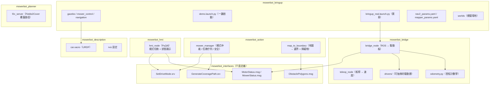
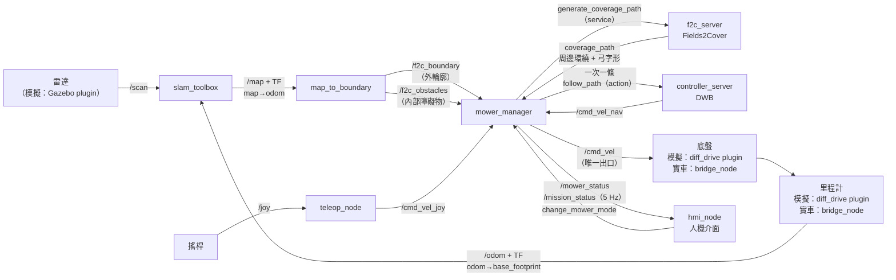
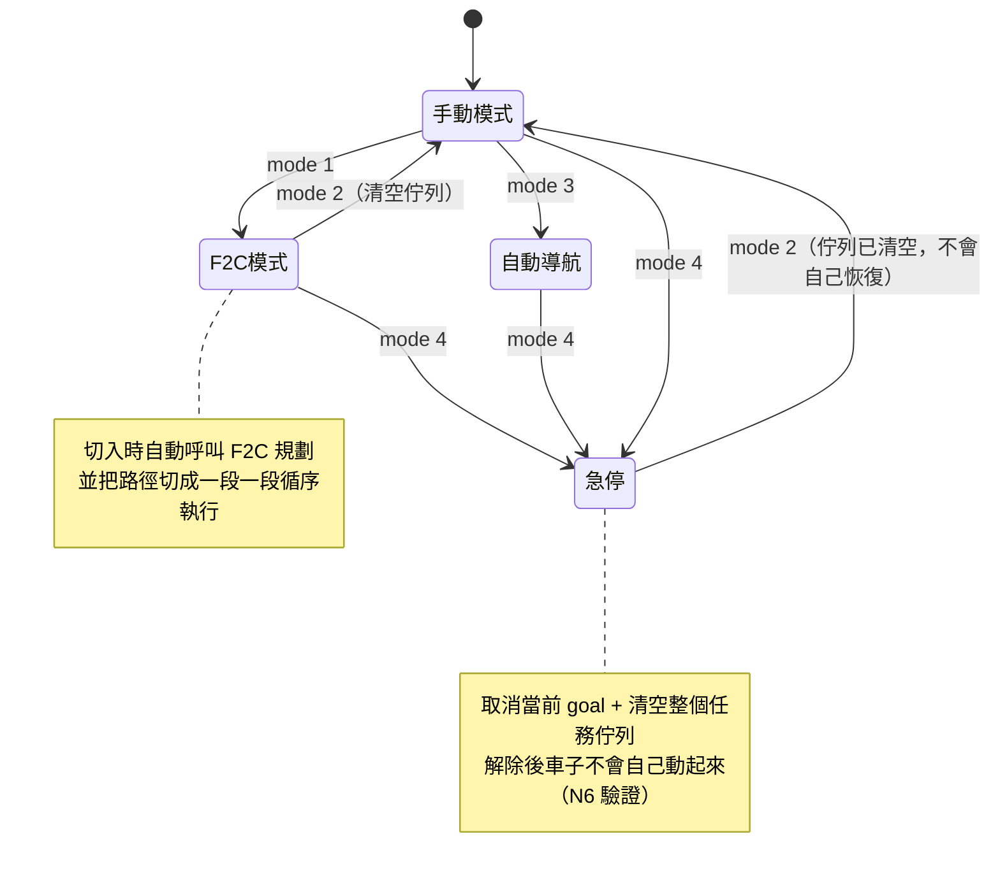
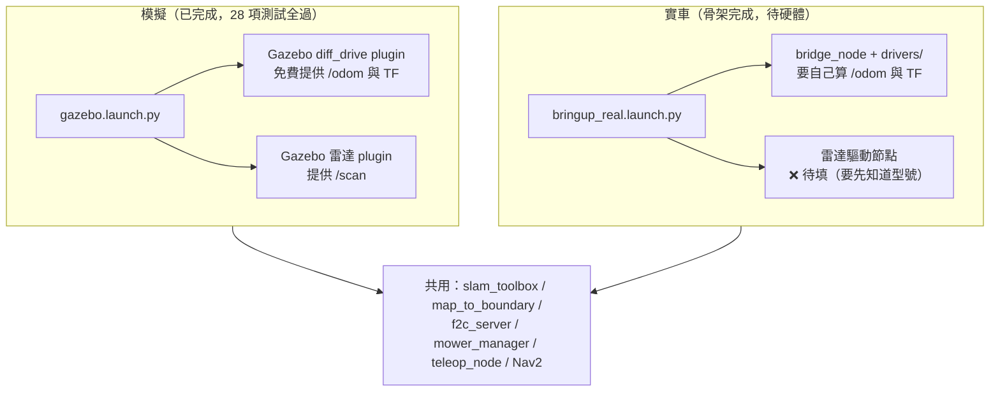
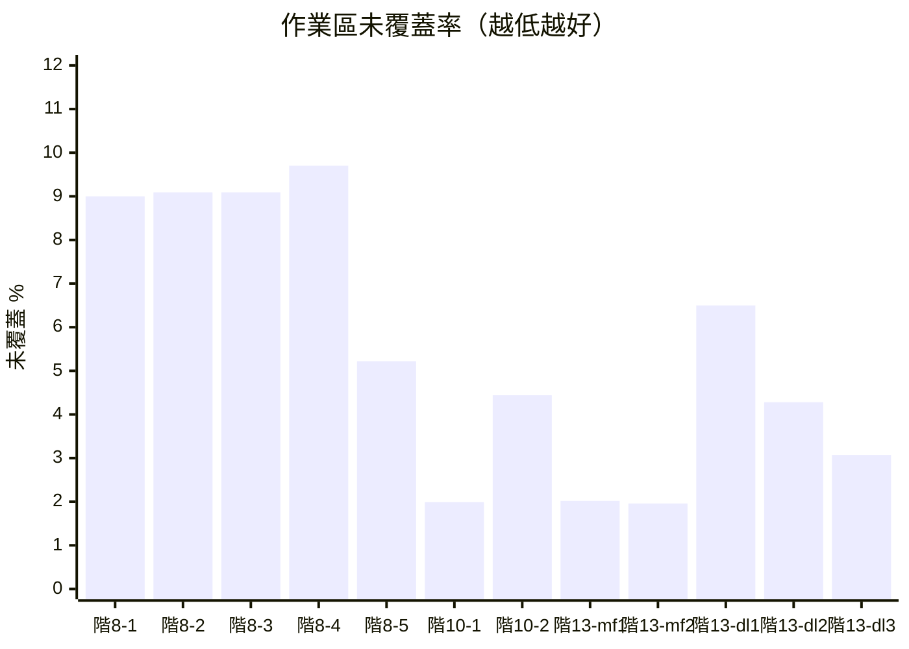
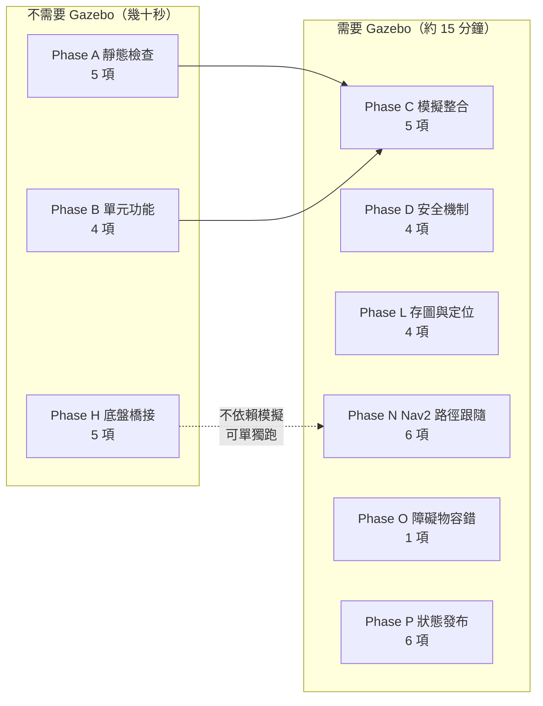

# mowerbot 系統架構與資料流

這份文件是報告要用的圖。圖用 mermaid 語法寫在 markdown 裡，
GitHub、VS Code 的預覽、以及多數 markdown 轉 PDF 的工具都直接看得到，
不需要另外維護圖片檔。

數據與詳細分析在 `simulation_results.md`，實車步驟在 `hardware_bringup.md`。

---

## 1. 套件關係



---

## 2. 完整資料流（割草任務）

從雷射到輪子的一條龍。標在箭頭上的是實際的 topic / service 名稱。



**這張圖最重要的一點：`/cmd_vel` 只有 `mower_manager` 一個發布者。**

Nav2 的輸出被 remap 成 `/cmd_vel_nav`、搖桿的輸出是 `/cmd_vel_joy`，
兩者都必須經過 manager 的模式仲裁才會變成 `/cmd_vel`。
這是安全設計：急停（mode 4）只要讓 manager 不轉發，
任何來源都到不了底盤。詳見 `simulation_results.md` 1.2 節與 N4 測試。

---

## 3. 模式仲裁



| mode | 名稱 | `/cmd_vel` 的來源 |
|------|------|------------------|
| 1 | F2C 割草 | `/cmd_vel_nav`（Nav2） |
| 2 | 手動 | `/cmd_vel_joy`（搖桿，且要按住 deadman） |
| 3 | 自動導航 | `/cmd_vel_nav`（Nav2），但不會自己規劃路徑 |
| 4 | 急停 | 無，全部攔截 |

---

## 4. 模擬與實車的差異

**只有兩個方塊不一樣**，其餘節點完全共用 —— 這是整個架構刻意維持的性質。



**實車最容易被忽略的一點**：Gazebo 的 diff_drive plugin 免費提供
`/odom` 與 `odom → base_footprint` 的 TF，實車上沒有任何東西會發這兩樣，
而 `slam_toolbox` 硬性要求它。沒有 `bridge_node`，實車上整條鏈路等於零。

---

## 5. 覆蓋率的改善（階段 8 → 10 → 13）

分母是「扣掉地頭的作業區」，數字來自
`python3 test/tools/coverage_analysis.py <log 目錄>`。

| 階段 | 做了什麼 | 作業區未覆蓋率 | 覆蓋落差最大 |
|------|---------|--------------|------------|
| 階段 8（封板） | 弓字形 + 跑道 + 重疊率 0.4 | 9.00 ~ 9.70 %（5 次） | 0.419 ~ 0.545 m |
| 階段 10 | 加上周邊環繞 | 1.99 % / 4.44 %（2 次） | 0.369 / 0.447 m |
| 階段 13 | 同配置的重複性驗證 | `mow_field` 1.99 % ± 0.04 (n=2)<br/>`demo_lawn` 4.62 % ± 1.74 (n=3) | — |



（`mf` = `mow_field.world`，`dl` = `demo_lawn.world`。階段 13 還有一次
`mow_field` 的執行沒有畫進來：那一次任務根本沒啟動，未覆蓋 97.58%，
原因是 `/f2c_boundary` 的發布者競態，見 `simulation_results.md` 12.3 節。
不畫是因為它不是「割草品質」的資料點，但它沒有被從紀錄裡刪掉。）

（`xychart-beta` 需要較新的 mermaid；渲染不出來時看上面的表格即可。）

**剩下的未覆蓋面積 98 ~ 100% 是線間的條狀縫隙**，位置在作業區中段，
成因是循跡誤差而不是邊緣漏割 —— 周邊環繞解決不了它。
要再往下壓必須處理循跡誤差本身（DWB 的權重），
那些值在實車上都要重新實測，現在調等於白做。

---

## 6. 測試套件的組成



共 **40 項**。開發時只跑受影響的 Phase（改 F2C 跑 B + N、改 manager 跑 D + N、
改 bridge_node 跑 H），收尾才跑完整套件。

| Phase | 內容 | 需要 Gazebo |
|-------|------|:-----------:|
| A | build、launch 解析、執行檔、介面欄位、xacro | ✗ |
| B | F2C 路徑、邊界提取、內部障礙物挖洞與提取 | ✗ |
| C | 節點清單、topic 頻率、TF 鏈、服務、RTF | ✓ |
| D | deadman、watchdog、急停、模式仲裁 | ✓ |
| H | bridge_node + loopback：里程計、TF、watchdog、MotorStatus | ✗ |
| L | 建圖、存圖、定位模式 | ✓ |
| N | Nav2 生命週期、F2C 路徑、端到端覆蓋任務、remap、RTF、急停清佇列 | ✓ |
| O | 臨時障礙物擋住割草線時跳過該段並繼續（固定用 `demo_lawn_obstacle.world`） | ✓ |
| P | 狀態發布（`/mower_status`、`/mission_status`）、邊界防呆、HMI 無頭啟動 | ✓ |

另有 17 項純 Python 的里程計單元測試（`mowerbot_bridge/test/test_odometry.py`），
不需要 ROS，一秒內跑完：

```bash
python3 src/mowerbot_bridge/test/test_odometry.py
```

---

## 7. 專案進度


擋在路上的是**驅動板的規格資訊**，不是程式。
需要查什麼列在 `mowerbot_bridge/drivers/README.md`（26 項），
拿到之後的步驟在 `hardware_bringup.md`。

---

## 8. 圖片索引

| 檔案 | 內容 | 在報告裡的位置 |
|------|------|--------------|
| `coverage_overlap_000.png` | 重疊率 0 的覆蓋示意圖（灰=地頭、淺綠=已割、紅=沒掃到、藍=實際軌跡）。每兩條割草線之間都有月牙形的縫 | 4.6.4 節 |
| `coverage_overlap_040.png` | 重疊率 0.4（選定值）。月牙縫被隔壁那刀補掉，只剩開頭一塊 | 4.6.4 節 |

兩張圖都可以用下列指令重新產生：

```bash
python3 test/tools/coverage_analysis.py --figure test/logs/<timestamp>
```
