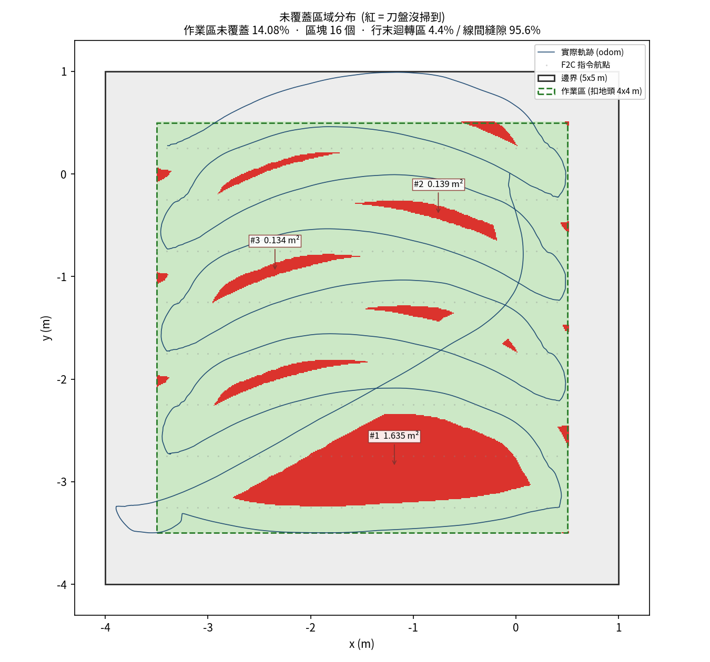
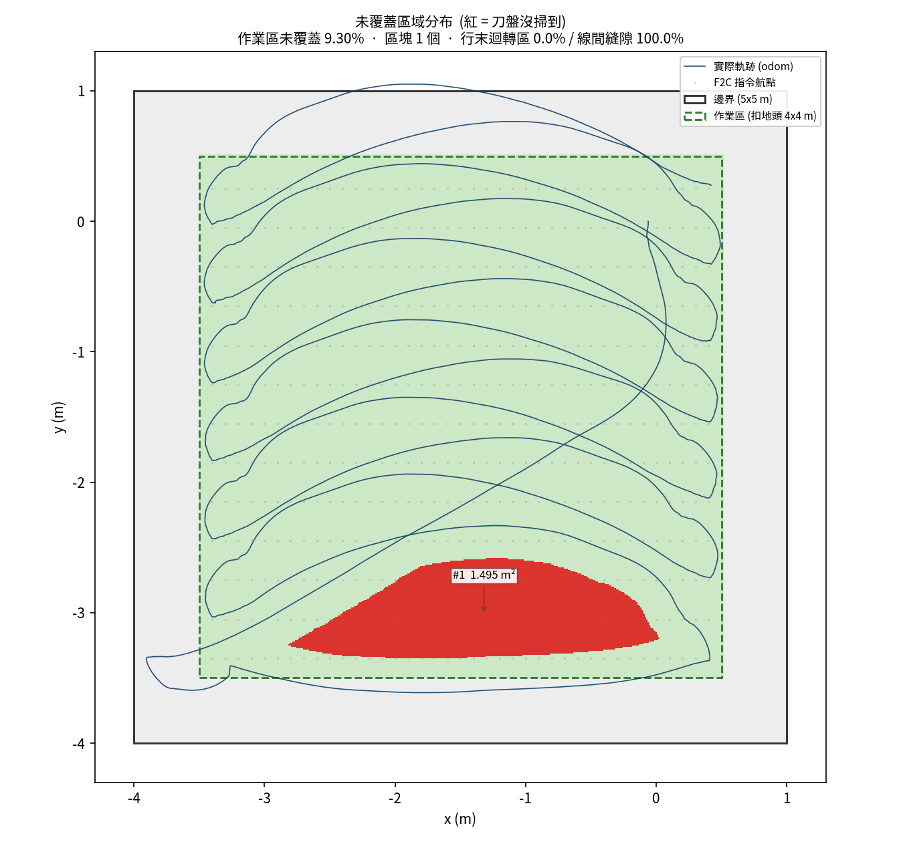
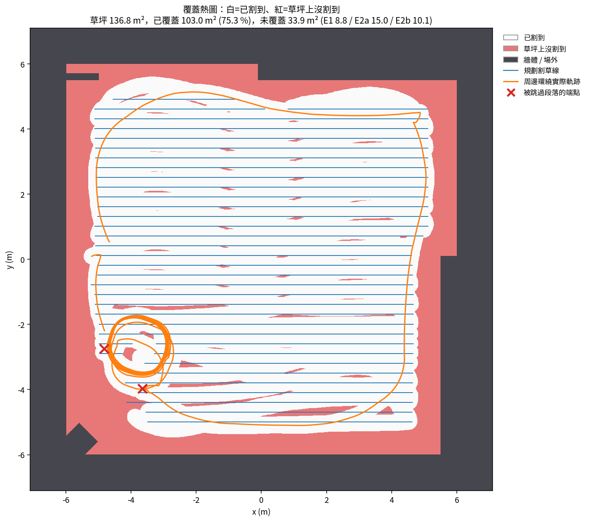

# mowerbot 模擬驗證結果

**相關文件**：系統架構與資料流圖在 [`architecture.md`](architecture.md)，
實車第一次接線的步驟清單在 [`hardware_bringup.md`](hardware_bringup.md)。

本文件整理這一輪在 Gazebo 模擬環境上量到的客觀數據，供專題報告引用。
所有數字都來自 `test/smoke_test.py` 的自動化測試，原始 log 與 CSV 在
`test/logs/<timestamp>/` 底下（該目錄不進版控）。

- 環境：Ubuntu 22.04 / ROS 2 Humble / Gazebo Classic，4 核心 VM
- 模擬世界：`mowerbot_bringup/worlds/mow_field.world`（20 m x 20 m 圍牆場地，4 個障礙物）
  另有 `demo_lawn.world`（12 m x 12 m、內部無障礙物的示範草坪，見 7.11 節）
- 車體：長 0.95 m、寬 0.68 m（輪外緣 ±0.34 m）、輪半徑 0.17 m、輪距 0.58 m
- 實際刀盤寬度：0.5 m（覆蓋落差的判定基準固定是它的一半 = 0.25 m）
- 割草線間距：0.4 m（= 刀盤寬 x (1 − 重疊率 0.2)，見第 4.6 節）

---

## 1. 系統組成與資料流

### 1.1 套件

| 套件 | 語言 | 內容 |
|------|------|------|
| `mowerbot_description` | xacro / CMake | 車體 URDF、感測器（雷達 / 相機 / IMU）、RViz 設定 |
| `mowerbot_bringup` | Python | 所有 launch 檔與參數檔（Gazebo、SLAM、定位、Nav2、控制） |
| `mowerbot_bridge` | Python | `teleop_node`：手把訊號轉速度指令 |
| `mowerbot_action` | Python | `mower_manager`：模式仲裁、watchdog、覆蓋任務執行<br>`map_to_boundary`：從佔據網格圖萃取草地邊界 |
| `mowerbot_planner` | C++ | `f2c_server`：Fields2Cover 覆蓋路徑規劃服務 |
| `mowerbot_interfaces` | CMake | `SetDriveMode.srv`、`GenerateCoveragePath.srv`、狀態訊息 |
| `joy_tester` | Python | 第三方手把測試工具 |

### 1.2 資料流

**手動遙控（mode 2）**

```
實體手把 → joy_node → /joy → mower_teleop → /cmd_vel_joy
                                                  ↓
                                    mower_manager（模式仲裁 + watchdog）
                                                  ↓
                                              /cmd_vel → Gazebo 差速驅動外掛
```

**建圖（mode 0）**

```
Gazebo 雷達 → /scan → slam_toolbox（async，建圖模式）→ /map + TF map→odom
                                                          ↓
                                              map_to_boundary
                                                          ↓
                                              /f2c_boundary（PolygonStamped）
```

**自動割草（mode 1）**

```
/f2c_boundary ─┐
               ├→ mower_manager ──GenerateCoveragePath──→ f2c_server（Fields2Cover）
               │                                                   │
               │                    ConstHL 產生地頭 → 內縮後區域上算 swath
               │                                                   ↓
               │        ←──────────── coverage_path（nav_msgs/Path）─┘
               ↓
   1. split_path_into_swaths()：依方向反轉切成一條一條割草線
   2. build_lead_in()：每條割草線前面接一段共線的跑道
   3. build_approach_path()：從當下位置接到第 1 條的跑道起點
   4. 逐條送出 FollowPath action，等 SUCCEEDED 再送下一條
                                    ↓
                         controller_server（DWB）
                                    ↓
                              /cmd_vel_nav
                                    ↓
                mower_manager（模式仲裁）→ /cmd_vel → 底盤
```

關鍵設計：Nav2 的輸出走 `/cmd_vel_nav` 而不是直接接 `/cmd_vel`，
一律經過 `mower_manager` 仲裁。這樣急停與模式切換才有單一的攔截點，
Nav2 沒辦法繞過安全機制直接驅動底盤（由 N4 驗證）。

### 1.3 模式

| 模式 | 名稱 | 行為 |
|------|------|------|
| 0 | 建圖模式（SLAM） | 轉發手把速度 |
| 1 | 自動割草（F2C 規劃 + 執行） | 切入時呼叫 F2C 規劃並開始執行；轉發 `/cmd_vel_nav` |
| 2 | 手動模式 | 轉發 `/cmd_vel_joy` |
| 3 | **保留（未實作）** | 轉發 `/cmd_vel_nav`，但不會觸發規劃；階段 23 起介面上沒有這顆按鈕（見 7.7） |
| 4 | 緊急停止（E-STOP） | 持續送零速度、取消 Nav2 goal、清空割草線佇列 |

---

## 2. 測試套件架構

`test/smoke_test.py` 是可重複執行的單檔測試，特性：

- 自行 source ROS 與 workspace，使用獨立的 `ROS_DOMAIN_ID`（預設 77）與其他節點隔離
- 每個 Phase 結束會 kill 掉整個 process group，並清掃殘留的 `gzserver` / `gzclient`
- 所有背景 launch 的 log 存到 `test/logs/<timestamp>/`
- N3 的路徑與實際軌跡另存成 `n3_path.csv` / `n3_traj.csv`，關鍵指標存成 `n3_metrics.json`，方便事後離線覆核
- 開跑前會做防呆檢查，清掉同一個 `ROS_DOMAIN_ID` 上前次留下的殘留節點（階段 9）
- 可用 `--phases=AB` 只跑指定 Phase，`--lead-in=L` 覆寫跑道長度，
  `--overlap=R` 覆寫割草線重疊率，`--world=<檔名>` 換模擬世界
  （後兩個都是階段 7 加的，對應 `mower_control.launch.py` 的 `overlap_ratio`
  與 `gazebo.launch.py` 的 `world` 參數）

### 2.1 階段 8 的兩個量測修正（判定標準都沒有動）

這兩項都是「量測方式本身會產生錯誤數據」，不是把門檻調鬆：

**(1) N2 的障礙物清單不再寫死。**
以前 `WORLD_OBSTACLES` 是手抄的 `mow_field.world` 內容，
用 `--world=demo_lawn.world` 跑的時候會去檢查根本不存在的障礙物，
印出來的淨空距離是假數據。
現在改成解析實際載入的 `.world` 檔（`parse_world_models()`），
並且把物體分成「邊界圍牆」與「作業區內部障礙物」兩類
（`classify_world_models()`：先把碰到整體外緣的當成圍牆，
再把與圍牆相接的角落特徵也歸為圍牆，剩下的才是內部障礙物）。
判定仍然是「內部障礙物離測試邊界 >= 1.5 m」；
若某個世界完全沒有內部障礙物（`demo_lawn.world` 就是），
就印「此世界無內部障礙物，淨空檢查不適用」並判 PASS，不硬湊數字。

驗證：對 `mow_field.world` 解析出 4 面圍牆 + 4 個內部障礙物，
淨空 2.19 / 3.90 / 4.25 / 2.05 m，與原本寫死的數值完全一致；
對 `demo_lawn.world` 解析出 10 個物體、全部歸為圍牆、內部障礙物 0 個。

**(2) N3 的任務監聽窗口改成跟著路徑長度伸縮。**
原本寫死「監聽最多 180 秒」。重疊率掃到 0.5 時路徑長從 35.5 m 變成 67.8 m，
任務還在正常割草、一條割草線都沒有 ABORTED，窗口就先到了，
於是被記成 `done=False`、完成 15/16 而判 FAIL。
那是「看得不夠久」而不是「機器做不到」—— 在 0.4 以上的重疊率，
這個窗口讓 N3 結構性地不可能通過。
改成 `max(180, 4.0 s/m x 路徑總長)`（係數來自實測 55.6 m 跑 157 s ≈ 2.8 s/m，
再加四成餘裕）。
**N3 的判定標準完全沒有動**，仍然是
「所有割草線 SUCCEEDED 且完成數 == 總數、終點誤差 < 0.3 m」。
重疊率 0.4 以下的所有歷史數據都在 180 秒內跑完，不受影響。

---

| Phase | 涵蓋範圍 | 是否需要 Gazebo |
|-------|----------|------------------|
| A 靜態檢查 | colcon build、launch 檔解析、執行檔存在、介面欄位、xacro 展開 | 否 |
| B 單元功能 | F2C 路徑規劃服務、從佔據網格圖萃取邊界（餵假地圖） | 否 |
| C 模擬整合 | 節點清單、topic 頻率、TF 鏈路、服務存在、real-time factor | 是 |
| D 安全機制 | deadman（LB）、watchdog 超時、急停、手動模式不轉發導航指令 | 否 |
| L 存圖與定位 | 建圖 → serialize_map / save_map → 切定位模式 → TF 與 /map 驗證 | 是 |
| N Nav2 路徑跟隨 | 生命週期、真實 F2C 路徑、端到端覆蓋任務、remap 仲裁、RTF、急停清佇列 | 是 |

---

## 3. 最終測試結果

共 **49 項**（原本 22 項，階段 3 新增 Phase L 的 4 項，階段 11 新增 B3 / B4，
階段 14 新增 Phase H 的 5 項，階段 17 新增 Phase O 的 1 項，
階段 18 新增 Phase P 的 6 項，階段 19 把 Phase P 補到 10 項，
階段 20 新增 Phase Q 與 O2，階段 21 新增 Q2，階段 23 新增 Q3 與 P11）。
Phase H 測的是實車用的 `bridge_node`，不需要 Gazebo，可以單獨跑
`--phases=H`，幾十秒就有結果；它的內容見 `hardware_bringup.md`。
**下面這張表是階段 12 那次 28 項的執行**（Phase H 當時還不存在），
第 12 節的重複性驗證也都是 28 項的執行。
下表是階段 12 封板後的完整執行（`test/logs/20260921_122840`），
模擬世界 `mow_field.world`、重疊率 0.4（割草線間距 0.3 m）。
階段 8 封板那次的數據是 `test/logs/20260916_125254`，兩者差異見各列的說明。

| # | 項目 | 結果 | 關鍵數值 |
|---|------|------|----------|
| A1 | colcon build 全部通過（7 套件） | PASS | finished=7, failed=0 |
| A2 | 所有 launch 檔可正常解析 | PASS | 8/8 可解析 |
| A3 | 4 個執行檔都找得到 | PASS | 4/4 |
| A4 | 4 個介面欄位正確 | PASS | 4/4 |
| A5 | xacro 解析無錯誤 | PASS | link=9, joint=8 |
| B1 | F2C 路徑規劃 success==true | PASS | success=True |
| B2 | 邊界提取（PolygonStamped 且頂點數 ≥ 4） | PASS | 頂點=4, 座標偏差 0.000 m |
| B3 | 有內部障礙物時：航點不落在障礙物內、送出的路徑不穿越（階段 11 新增） | PASS | 對照組落內 80 點；有障礙物落內 0、穿越 0、割草段 24 |
| B4 | 內部障礙物提取（1 個多邊形且位置吻合，階段 11 新增） | PASS | 多邊形 1 個，位置偏差 0.050 m（容許 0.10 m） |
| C1 | 必要節點都在、robot_state_publisher 只有一個 | PASS | — |
| C2 | Topic 頻率符合預期 | PASS | — |
| C3 | TF 鏈路完整且 base_link→radar z==0.45 | PASS | — |
| C4 | 2 個服務都存在 | PASS | — |
| C5 | Gazebo real-time factor ≥ 0.5 | PASS | RTF = 1.000 |
| D1 | 沒按 LB 全為 0、按住 LB 非 0 | PASS | deadman 有效 |
| D2 | Watchdog：轉發 0.3 後超時歸零 | PASS | 最後一筆 = 0.000000 |
| D3 | 急停時 /cmd_vel 全為 0 | PASS | 非零 0 筆 |
| D4 | 手動模式不轉發導航指令 | PASS | 非零 0 筆 |
| L1 | 建圖模式開車 30 秒建出有內容的地圖 | PASS | 軌跡 9.27 m, /map 401x401 cells |
| L2 | serialize_map 與 save_map 四個檔案都產生且非空 | PASS | 腳本 rc=0，四個檔案都產生 |
| L3 | localization_slam_toolbox_node 啟動且沒掛掉 | PASS | — |
| L4 | map→odom TF 平移 < 0.5 m、/map 有發布、尺寸 20 秒不變且與存檔差 ≤ 5 格 | PASS | TF 0.0020 m；存檔 401x401，定位 401x401，差 0x0 格；20 秒內不變 |
| N1 | controller_server 進入 active | PASS | lifecycle = active |
| N2 | 真實 F2C 路徑、平均間距 < 0.15 m、邊界離內部障礙物 ≥ 1.5 m | PASS | 航點 682（含周邊環繞 149）, 平均間距 0.1036 m, 總長 70.55 m, 最小淨空 2.05 m（由世界檔解析） |
| N3 | 所有割草線 SUCCEEDED 且完成數 == 總數 | PASS | 13/13 完成, 終點誤差 0.107 m, 最大橫偏 0.905 m |
| N4 | Nav2 輸出走 /cmd_vel_nav 且受 manager 仲裁 | PASS | mode2 下 /cmd_vel 非零 0 筆 |
| N5 | Nav2 運行下 RTF ≥ 0.5 | PASS | RTF = 1.000 |
| N6 | 急停清空佇列，解除後不會自己恢復任務 | PASS | 急停後非零 0 筆, 移動 0.01 m |

**總計 28 / 28，全部通過。**

**`demo_lawn.world`（示範用的乾淨草坪）也跑了一次完整套件（`test/logs/20260921_123814`），
同樣 28 / 28 全部通過。** 兩個世界的差異只在 N2 的障礙物淨空那一項：
乾淨草坪沒有內部障礙物，該項印「不適用」並判 PASS，不硬湊。

| 指標 | `mow_field.world` | `demo_lawn.world` |
|------|------------------|-------------------|
| 測試項目 | 28 / 28 PASS | 28 / 28 PASS |
| N3 割草線 | 13/13 完成 | 13/13 完成 |
| N3 終點誤差 | 0.107 m | 0.101 m |
| N3 最大橫向偏差 | 0.905 m | 0.869 m |
| 路徑總長 | 70.55 m（含環繞 14.80 m） | 70.55 m（含環繞 14.80 m） |
| 任務耗時 | — | 217.7 s |
| 作業區未覆蓋 | 4.47 % | 1.94 % |
| 覆蓋落差最大 | — | 0.368 m |

兩個世界的路徑完全相同（測試邊界是測試自己發布的 5 m x 5 m，與世界無關），
差別只在障礙物與牆的位置會影響 costmap，進而影響循跡品質，
所以未覆蓋率一個 4.47 %、一個 1.94 %。這個差距與 10.6 節看到的
run-to-run 變異同一個量級，不是世界本身造成的系統性差異。

L4 從階段 6 的 FAIL 變成 PASS，但**不是因為程式修好了，是因為判定標準本身訂錯、
由使用者決定放寬**。原本要求「/map 尺寸與存檔時完全一致」，
這對 SLAM 地圖本來就不成立。詳細的修訂內容與理由見 7.6 節。
這次量到的差異是 1 x 1 格（5 公分），遠在新門檻的 5 格之內。

需要特別說明的是 N3 雖然標 PASS，但它的判定是
「所有割草線都 SUCCEEDED 且完成數等於總數、終點誤差 < 0.3 m」，
**判定裡沒有包含覆蓋品質**。覆蓋落差是 N3 額外印出來的觀察值。
階段 10 的周邊環繞把這次執行的作業區未覆蓋率壓到 **4.47%**
（階段 8 同一個場景是 9.09%，見第 10 節），有明顯改善但仍然不是「割乾淨了」，
**不要把 N3 的 PASS 讀成「割得夠乾淨」**。

> **⚠️ 這個 4.47% 是舊量法**（分母是 5 m × 5 m 測試邊界的作業區）。
> 真實草坪的覆蓋率拆帳見第 18 節：整片草坪 71.55 %、
> 規劃上可割的範圍 87.17 %。兩者不可相比。

---

## 4. 覆蓋品質：跑道長度 L 與割草線重疊率的實測

### 4.1 問題

刀盤寬 0.5 m，所以「指令航點離車子實際軌跡超過 0.25 m」的地方就是沒割到的縫。
改動之前的量測結果：

- 最大覆蓋落差 **0.627 m**
- 13.9% 的指令航點超過 0.25 m
- 逐條割草線的最大值 `[0.242, 0.243, 0.492, 0.470, 0.500, 0.473, 0.499, 0.463, 0.491, 0.679]`

前兩條之所以好，是因為第 1 條有 approach 路徑帶進正確朝向、第 2 條沾光；
之後固定卡在 0.47~0.50，而 0.5 正是割草線間距。

### 4.2 兩項改動

1. `xy_goal_tolerance` 0.25 → 0.10（`nav2_params.yaml` 的 `general_goal_checker`
   與 DWB 各一份，兩處都改）。0.25 等於允許每條割草線提早 0.25 m 結束，
   每條線尾端天生就少割半個刀盤寬。
2. 每條割草線前面加一段共線的跑道（lead-in）：割草線從 A 到 B，
   方向 `d = normalize(B - A)`，跑道起點 = `A - L*d`，
   整條路徑 `(A - L*d) → A → ... → B` 全部共線，以 0.1 m 內插。

### 4.3 三組對照數據

測試條件：5 m x 5 m 邊界、刀盤 0.5 m、10 條割草線、路徑總長 54.50 m。
**這組掃描是在加入地頭（階段 2）之前做的**，所以是未內縮的場地。
`L = 0` 是後補的對照組，用來分離「收緊 tolerance」與「加跑道」兩件事的效果。

| 跑道長度 L | 最大覆蓋落差 | 平均落差 | 中位落差 | 超過 0.25 m 比例 | 任務耗時 | 終點誤差 | 結果 |
|-----------|-------------|---------|---------|-----------------|---------|---------|------|
| 0（對照組） | 3.441 m | 0.881 m | 0.605 m | 69.8%（356/510） | 42.4 s | 3.592 m | **割草線 3 ABORTED** |
| 0.5 m | 0.670 m | 0.155 m | 0.132 m | 14.1%（72/510） | 142.8 s | 0.091 m | 10/10 完成 |
| 1.0 m | 0.672 m | 0.149 m | 0.121 m | 15.3%（78/510） | 144.7 s | 0.114 m | 10/10 完成 |
| 1.5 m | 0.635 m | 0.147 m | 0.119 m | 16.5%（84/510） | 142.6 s | 0.100 m | 10/10 完成 |

### 4.4 選定值與理由：L = 0.5 m

**目標沒有達成，如實回報。** 三個 L 值都沒有做到「最大覆蓋落差 < 0.25 m」，
而且彼此在誤差內分不出高下（最大落差 0.635~0.672 m，超標比例 14.1~16.5%）。
覆蓋品質這個維度無法用來選 L。

選 0.5 m 的兩個理由：

1. **跑道是可靠度功能，不是覆蓋品質功能。** `L = 0` 的對照組顯示，
   在 `xy_goal_tolerance = 0.10` 之下，第 3 條割草線會因為
   `Controller patience exceeded` 直接 ABORTED（整個任務只跑了 42 秒）。
   機制是：車子走完第 2 條停在 (-4.00, -3.25) 朝向 -x，
   第 3 條的路徑起點就在旁邊 0.5 m 的 (-4.00, -2.75) 且方向相反，
   DWB 在原地掉頭時找不到有效軌跡。跑道把路徑起點往後推，車子才有空間掉頭。
   所以跑道必須保留，只是它買到的是「任務不會中斷」而不是「割得比較乾淨」。
2. **L 同時是階段 2 的地頭寬度，而地頭直接吃掉可作業面積。**
   5 m x 5 m 的場地上，L = 1.5 會讓可作業區只剩 2 m x 2 m。
   既然覆蓋品質分不出高下，就取能用的最小值。

`xy_goal_tolerance` 最後用 **0.10**（沒有往上放寬到 0.15 / 0.20）。
授權裡提到「若 0.10 造成無法收斂而 ABORTED 可以往上調」，
實測顯示 ABORTED 的成因是缺少跑道而不是 tolerance 太緊，
補上跑道之後 0.10 穩定跑完 10/10，所以停在 0.10。

### 4.5 殘留誤差的機制（診斷）

把 `n3_traj.csv` 逐點比對之後，殘留誤差**不是**「進入割草線時沒對準」，
而是**掉頭時的過衝**。以第 2 條割草線（y = -3.25，由 x=+1.0 往 -x 走）為例，
車子的實際軌跡是：

```
(0.90, -3.76) → (0.72, -3.24) → (-0.91, -2.58) → (-1.60, -2.67) → (-3.91, -3.23)
     結束第1條        穿過目標線       過衝 0.67 m       開始收回        終於貼上
```

車子離開第 1 條之後畫一個大弧，最多衝過目標線 0.67 m（幾乎騎在第 3 條線上），
再花 2~3 m 才慢慢收回來。每條割草線超標的航點都集中在
「進入後 0.5~1.1 m」這一段，與這個弧形完全吻合。

#### 為什麼跑道在原理上就不可能改善精度

這不是「跑道不夠長」，是機制上就不會有效，值得寫清楚：

1. **DWB 不是循序路徑跟隨器。** 它每個控制週期取樣一組速度指令，
   把每條候選軌跡丟給一組 critic 打分，選總分最高的。
   其中 `PathDist` / `PathAlign` 評的是「軌跡末端離**全域路徑上任一點**多遠」，
   評分依據是預先算好的一張**網格距離場**（distance field），
   裡面存的是每個網格格子到最近路徑點的距離。
   這張場**沒有弧長、沒有先後順序、沒有「還沒走過的那一段」的概念**。
2. **所以車子會直接切到路徑上最近的點。** 只要距離場的值夠低就得分，
   不管那個點是路徑的第 1 個航點還是第 300 個。
   車子掉完頭之後，離它最近的路徑點本來就在割草線中段，
   它就從那裡切進去，不會退回跑道起點再重走一次。
3. **跑道與割草線共線，對距離場等於沒有貢獻。**
   跑道是把起點 A 沿著同一個方向往後延伸到 `A - L*d`，
   這一段新增的航點全部落在原本那條直線的延長線上。
   距離場在割草線附近的等高線形狀完全沒有改變，
   只有直線兩端各多出 L 公尺的低值區 —— 而車子本來就不會去那裡。
   **共線的延伸不增加任何資訊**，這就是 L = 0.5 / 1.0 / 1.5
   三組數據幾乎一模一樣的原因。

**跑道真正的價值是可靠度，不是精度。** 唯一有顯著差別的對照是「有沒有跑道」：
`L = 0` 時第 3 條割草線直接 `ABORTED`、最大覆蓋落差衝到 3.441 m、
超標比例 69.8%；補上跑道之後 10/10 穩定完成。
跑道買到的是「任務不會中斷」，不是「割得比較乾淨」。
要改善精度必須換一個**有路徑順序概念**的機制（非共線的掉頭路徑，或改用 RPP），
或是從覆蓋規劃端下手（見 4.6 節的重疊率）。

---

### 4.6 割草線重疊率的實測（階段 7 & 8）

> **⚠️ 舊量法**：本節的覆蓋數字分母是「測試自己發布的 5 m × 5 m 邊界扣掉地頭」，
> 而且用的是無腐蝕的理想邊界與 headland 0.5。**不可與第 18 節的覆蓋率相比**，
> 兩者分母差 8.5 倍，量法也不同（見 18.5 節）。

#### 4.6.1 問題

改動之前 `mower_manager` 傳給 F2C 的 `tool_width` 固定是 0.5，
**等於割草線間距剛好等於刀盤寬，是零重疊設計**：
理論上兩刀剛好接邊，實際上只要有任何循跡誤差就會在兩條線之間留下沒割到的帶狀區。
4.5 節量到的掉頭過衝有 0.6 m 之多，遠超過「剛好接邊」能容忍的範圍。
真實農機的標準作法是留重疊來吸收誤差。

實作：`mower_manager` 新增兩個 ROS 參數

| 參數 | 意義 | 預設 |
|------|------|------|
| `blade_width` | 實際刀盤寬（車體的物理屬性） | 0.5 m |
| `overlap_ratio` | 重疊率 | 0.4 |

傳給 F2C 的是**割草線間距**而不是刀盤寬：

```
req.tool_width = blade_width * (1 - overlap_ratio)
```

**判定基準沒有跟著改。** 覆蓋落差的門檻仍然固定是「實際刀盤寬的一半」= 0.25 m，
不會因為間距變小就變鬆 —— 刀盤寬是車體的物理屬性，與割草線怎麼排無關。

#### 4.6.2 完整對照表

測試條件：5 m x 5 m 邊界、地頭 0.5 m、跑道 L = 0.5 m、刀盤寬 0.5 m。
**每個重疊率各跑 3 次 Phase N**（6.2 節已經量到覆蓋指標的變異係數可達 18%，
n = 1 不足以分辨差異）。表中為 3 次的平均 ± 標準差。

未覆蓋面積用兩種分母各算一次（理由見 4.6.3）：

| 重疊率 | 割草線間距 | 割草線數 | (A) 未覆蓋 %<br>分母=整個邊界 | (B) 未覆蓋 %<br>分母=作業區 | 最大覆蓋落差 | 超過 0.25 m 比例 | 任務耗時 | 完成率 |
|-------|-----------|---------|------------------|------------------|-------------|----------------|---------|--------|
| 0（對照組） | 0.500 m | 8 | 31.08 ± 0.45 | 14.80 ± 0.63 | 0.651 ± 0.012 m | 8.54 ± 2.44 % | 107.9 ± 5.4 s | 3/3 |
| 0.1 | 0.450 m | 9 | 28.21 ± 0.21 | 12.41 ± 0.40 | 0.674 ± 0.008 m | 13.64 ± 1.10 % | 115.8 ± 2.3 s | 3/3 |
| 0.2 | 0.400 m | 10 | 26.31 ± 0.31 | 10.38 ± 0.09 | 0.638 ± 0.021 m | 9.35 ± 1.20 % | 125.8 ± 4.3 s | 3/3 |
| 0.3 | 0.350 m | 11 | 25.75 ± 0.14 | 9.65 ± 0.26 | 0.601 ± 0.006 m | 9.09 ± 1.38 % | 135.4 ± 1.3 s | 3/3 |
| **0.4（選定）** | **0.300 m** | **13** | **24.32 ± 0.56** | **8.52 ± 1.21** | **0.500 ± 0.080 m** | **7.82 ± 0.94 %** | **157.3 ± 3.8 s** | **3/3** |
| 0.5 | 0.250 m | 16 | 22.05 ± 0.24 | 8.63 ± 0.22 | 0.510 ± 0.005 m | 7.32 ± 0.30 % | 190.9 ± 3.8 s | 3/3 |
| 0.6 | 0.200 m | 20 | — | — | — | — | — | **0/3 全部中斷** |

設定註記：重疊率 0 ~ 0.4 的資料是在 `navigation.launch.py` 的
`TimerAction period = 5.0` 之下收集的，0.5 / 0.6 是在改成 10.0 之後收集的（見 7.12 節）。
那個參數只影響 Nav2 生命週期的啟動時機，任務耗時是從切到 mode 1 才開始計時的，
覆蓋品質與耗時都不受影響，兩批資料可以直接比較。

**重疊率 0.6 不可行。** 三次都在第 3~4 條割草線就 `ABORTED`，
`controller_server` 的訊息是 `Failed to make progress`。
機制與 4.4 節的 `L = 0` 對照組完全相同：割草線間距只剩 0.2 m 時，
車子掉完 180 度的頭之後要重新接上一條「就在旁邊 0.2 m、方向相反」的線，
progress checker 在它還沒接上之前就先判定沒有前進。
0.5 m 的跑道不足以補償這麼密的線距。

#### 4.6.3 為什麼要用兩種分母，以及為什麼補這個指標

**分母的選擇會差到兩倍。** 地頭是設計上就不割的迴轉區（5 m 場地配 0.5 m 地頭，
佔掉邊界面積的 36%），把它算進未覆蓋面積等於灌水：
同一次執行，分母用整個邊界是 24.03%，用扣掉地頭的作業區是 9.30%。
**(B) 才是誠實的數字**，(A) 只列出來當對照，說明這個差距有多大。

原訂的主要指標是「超過 0.25 m 的航點比例」。它在不同重疊率之間**不是同一把尺**：
分母是指令航點數，會隨重疊率從 328 漲到 820。
重疊率愈高，同一塊沒割到的草地被愈多航點「投票」，分子分母同時變動。
所以另外補了與重疊率無關的面積指標：把作業區鋪成 1 cm 的網格，
算「離實際軌跡超過 0.25 m（刀盤掃不到）」的格子佔多少面積。
它的標準差只有 0.1~1.2 個百分點，而航點比例的標準差到 2.4。

這個數字是從已經存好的 `n3_path.csv` / `n3_traj.csv` 離線算出來的
（`test/tools/coverage_analysis.py`），不需要重跑模擬，
也**沒有動到 Phase N 的任何判定標準**。

#### 4.6.4 未覆蓋區域的空間分布（連通區域分析）

只知道「未覆蓋 8.5%」不夠，要知道那些草漏在哪裡。
用 `cv2.connectedComponentsWithStats` 把未覆蓋區域拆成連通區塊之後，
結論非常明確：

| 重疊率 | 未覆蓋區塊數 | 最大一塊面積 | 最大一塊佔未覆蓋總面積 | 行末迴轉區 | 線間條狀縫隙 |
|-------|-------------|-------------|---------------------|-----------|-------------|
| 0 | 15.7 | 1.753 m² | 73.7 % | 6.2 % | 93.8 % |
| 0.1 | 16.3 | 1.666 m² | 83.5 % | 1.3 % | 98.7 % |
| 0.2 | 22.0 | 1.550 m² | 92.9 % | 1.2 % | 98.8 % |
| 0.3 | 26.7 | 1.510 m² | 97.3 % | 2.1 % | 97.9 % |
| 0.4 | 3.0 | 1.321 m² | 96.4 % | 0.1 % | 99.9 % |
| 0.5 | 1.0 | 1.388 m² | 100.0 % | 0.0 % | 100.0 % |

**未覆蓋面積幾乎全部集中在單一一塊**（佔 73.7% ~ 100%），
其餘都是 0.0001 m² 等級的碎屑。**行末迴轉區幾乎沒有漏割**（0~6%）——
掉頭本身不是漏割的來源，這一點與直覺相反。

那一大塊在哪裡？以重疊率 0.4 的執行為例，它位在
`x ∈ [-2.82, 0.01]`、`y ∈ [-3.35, -2.59]`，也就是**任務一開始的頭幾條割草線**。
逐點比對軌跡可以看到成因：第 2 條割草線（y = -3.05，由 x=+0.5 往 -x 走）
被走成一條外凸的弧 ——

```
(-0.25, -2.57) → (-2.04, -2.44) → (-3.06, -2.89) → (-3.36, -3.02)
   中段偏離 0.56 m，一直到最左端才貼回線上
```

**每一條割草線都有這個弧**（逐割草線最大偏差
`[0.000, 0.563, 0.145, 0.583, 0.146, 0.882, 0.883, ..., 0.876]`，後段甚至到 0.88 m），
但中間那些線的弧會被「隔壁那條的刀盤」順手補掉；
最靠邊的第 1、2 條下面沒有別條線，弧就直接留成一塊沒割到的區域。

這解釋了整條重疊率曲線：**重疊率並不是在補細碎的線間縫隙，
而是在縮小這一塊掉頭弧造成的破口**（最大塊從 1.753 m² 降到 1.321 m²）。
也解釋了為什麼曲線會在 0.4 之後平掉 —— 這一塊的大小由掉頭弧的幅度決定，
而掉頭弧的幅度與線距無關，縮線距只能少量改善，不可能消掉。

示意圖（灰 = 地頭、淺綠 = 已割、紅 = 刀盤沒掃到、藍線 = 實際軌跡）：

| 重疊率 0（對照組） | 重疊率 0.4（選定） |
|---|---|
|  |  |
| 作業區未覆蓋 14.08%，16 個區塊 | 作業區未覆蓋 9.30%，1 個區塊 |
| 每兩條割草線之間都有一條月牙形的縫 | 月牙縫全部被隔壁那刀補掉，只剩開頭那一塊 |

左圖把 4.6.4 節的機制畫得很清楚：**每一條割草線都有掉頭外凸的弧**，
零重疊時這些弧就一條一條變成月牙形的漏割；
右圖把線距縮到 0.3 m 之後，月牙被隔壁割草線的刀盤覆蓋掉，
**只剩最下面那一塊沒有鄰居可以補**。
這就是重疊率真正在買的東西。

（來源：`test/logs/20260915_233539` 與 `test/logs/20260916_003341`，
用 `python3 test/tools/coverage_analysis.py --figure <log 目錄>` 重新產生。）

#### 4.6.5 選定值與理由：重疊率 = 0.4

**0.4 是邊際效益的轉折點，也是這次掃描的選定值。**

用作業區分母 (B) 看整條曲線的邊際效益：

| 區間 | (B) 未覆蓋改善 | 耗時增加 | 每 1 個百分點的代價 |
|------|--------------|---------|-------------------|
| 0 → 0.1 | -2.39 pt | +7.9 s | 3.3 s / pt |
| 0.1 → 0.2 | -2.03 pt | +10.0 s | 4.9 s / pt |
| 0.2 → 0.3 | -0.73 pt | +9.6 s | 13.2 s / pt |
| 0.3 → 0.4 | -1.13 pt | +21.9 s | 19.4 s / pt |
| **0.4 → 0.5** | **+0.11 pt（反而略差）** | **+33.6 s** | **買不到東西** |
| 0.5 → 0.6 | — | — | **任務直接中斷** |

三件事要講清楚：

1. **0.5 完全買不到品質。** 8.52 ± 1.21 % vs 8.63 ± 0.22 %，
   差距遠小於雜訊，卻要多付 33.6 秒（+21%）。
   階段 7 說「曲線到 0.4 還沒平掉、0.5 可能更好」，
   補測之後證明那個推測是錯的 —— 曲線就是在 0.4 平掉。
2. **0.6 不是變差，是不能用。** 三次執行全部在第 3~4 條割草線 ABORTED。
   這是一條硬邊界，不是品質取捨。
3. **覆蓋品質的目標仍然沒有達成。** 作業區還有 8.5% 沒割到，
   而且 96% 集中在開頭那一塊掉頭弧（4.6.4 節）。
   重疊率能做的已經做完了，再往上只有代價沒有效果。
   要再進一步必須從 4.5 節那三條路走（非共線掉頭路徑、換 RPP 控制器、
   或調 DWB 權重），不是繼續縮線距。

因此 `overlap_ratio` 的預設值維持 **0.4**。
如果實車的電池續航吃不消 157 秒，往回退到 0.3（135.4 s、未覆蓋 9.65%）
或 0.2（125.8 s、未覆蓋 10.38%）都是合理的折衷，
改 `mower_control.launch.py` 的 `overlap_ratio` 預設值即可，不需要改程式。

---

## 5. 地頭寬度對作業面積的影響

### 5.1 為什麼需要地頭

加地頭之前，F2C 的第 1 條割草線距離邊界只有半個刀盤寬（0.25 m），
但車體半寬是 0.34 m（輪外緣 ±0.34 m），local costmap 的
`inflation_radius` 又設在 0.45 m。在開闊地測試看不出問題，
但真實草地的邊界是牆或圍籬時，第 1 條與最後 1 條割草線會整條落在膨脹層裡，
車子根本進不去。階段 1 的跑道也會往割草線起點後方延伸 0.5 m，同樣需要這塊空間。

實作：`f2c_server.cpp` 在產生 swath 之前，先用
`f2c::hg::ConstHL::generateHeadlands(field, headland_width)` 內縮出本田（mainland），
割草線改在內縮後的區域上算。`headland_width` 是 ROS 參數，
預設 0.5 m 與跑道長度一致，設 0 時停用地頭、維持舊行為。

### 5.2 實測（5 m x 5 m 測試邊界）

| 項目 | 地頭 0 m | 地頭 0.5 m | 變化 |
|------|---------|-----------|------|
| 邊界面積 | 25.00 m² | 25.00 m² | — |
| 可作業面積 | 25.00 m²（5.0 x 5.0） | 16.00 m²（4.0 x 4.0） | **-36.0%** |
| 割草線數 | 10 條 | 8 條 | -2 條 |
| 路徑總長 | 54.50 m | 35.50 m | -34.9% |
| 任務耗時 | 142.8 s | 101.6 s | -28.9% |
| 最大覆蓋落差 | 0.670 m | 0.653 m | 幾乎不變 |
| 平均覆蓋落差 | 0.155 m | 0.137 m | 略降 |
| 超過 0.25 m 比例 | 14.1%（72/510） | 9.1%（30/328） | -5.0 個百分點 |

兩點說明：

- **面積損失 36% 是小場地的放大效果，不是通例。** 地頭吃掉的是邊界外圈一圈
  寬 `w` 的環帶，面積損失比例約 `4w/L`（L 為場地邊長）。
  5 m 場地配 0.5 m 地頭剛好是最糟的情況；同樣 0.5 m 地頭用在
  20 m x 20 m 的場地上只損失約 9.8%。
- **超標比例下降主要來自割草線變短變少**（航點從 510 降到 328），
  不是循跡變準了 —— 最大落差仍是 0.65 m，機制與 4.5 節描述的掉頭過衝一致。

---
## 6. 重複性驗證

完整測試套件（A/B/C/D/L/N）連續執行三次。

### 6.1 三次的總結果

| 執行 | log 目錄 | 總分 | 差異 |
|------|----------|------|------|
| 第 1 次 | `20260915_103142` | 25/26 | 只有 L4 失敗 |
| 第 2 次 | `20260915_103911` | 25/26 | 只有 L4 失敗 |
| 第 3 次 | `20260915_104640` | 23/26 | **L2 失敗**，連帶 L3/L4 SKIP |

**Phase A~D 三次全部通過，沒有任何一項退步。**

### 6.2 N3 的數值變異（n = 3）

| 指標 | 第 1 次 | 第 2 次 | 第 3 次 | 平均 | 標準差 | 變異係數 |
|------|--------|--------|--------|------|--------|---------|
| 最大覆蓋落差 (m) | 0.643 | 0.662 | 0.675 | 0.660 | 0.016 | 2.5% |
| 平均覆蓋落差 (m) | 0.139 | 0.148 | 0.141 | 0.142 | 0.005 | 3.2% |
| 超過 0.25 m 比例 (%) | 9.15 | 11.59 | 8.23 | 9.65 | 1.73 | 18.0% |
| 任務總耗時 (s) | 102.71 | 101.01 | 101.91 | 101.88 | 0.85 | 0.8% |
| 終點誤差 (m) | 0.090 | 0.104 | 0.075 | 0.090 | 0.014 | 15.9% |
| 車子軌跡總長 (m) | 42.68 | 42.21 | 42.73 | 42.54 | 0.29 | 0.7% |

每條割草線的最大偏差也高度一致：

```
第 1 次  0.267  0.247  0.491  0.494  0.499  0.495  0.502  0.712
第 2 次  0.257  0.248  0.485  0.488  0.481  0.478  0.498  0.700
第 3 次  0.262  0.248  0.486  0.477  0.481  0.485  0.488  0.721
```

判讀：

- **耗時、軌跡長度、最大覆蓋落差都很穩定**（變異係數 0.7% ~ 2.5%），
  代表 4.5 節描述的掉頭過衝是系統性的行為，不是偶發的雜訊。
  前兩條明顯比後面好、最後一條最差的形態，三次完全重現。
- **超標比例（18.0%）與終點誤差（15.9%）的變異係數看起來大，
  但那是小基數放大的效果**：超標航點只有 27~38 個，基數 328；
  終點誤差是 7.5~10.4 公分的差別。絕對值都很小。

### 6.3 間歇性失敗：`/slam_toolbox/save_map` 約 20% 機率回傳 255

第 3 次的 L2 失敗，是這一輪唯一出現的間歇性問題。

**現象**：`/slam_toolbox/save_map` 回傳 `result=255`
（`RESULT_UNDEFINED_FAILURE`），沒有產生 `.pgm` / `.yaml`；
同一次的 `serialize_map` 是成功的（`result=0`），`.posegraph` / `.data` 正常。
三次執行的 L1 條件幾乎完全相同（軌跡 9.63~9.64 m、`/map` 都收到 4 次更新），
所以不是輸入條件的差異。

**假設與推翻**：原本假設是「`serialize_map` 要寫 7 MB 檔案，
卡住 slam_toolbox 的單執行緒 callback，導致緊接著的 `save_map` 逾時」。
用同一個建圖 session 做對照實驗：

| 組別 | 作法 | 結果 |
|------|------|------|
| A | 只呼叫 `save_map`，連續 5 次 | **失敗 2 次** |
| B | `serialize_map` 之後立刻 `save_map`，連續 5 次 | 失敗 0 次 |
| C | `serialize_map` 之後等 3 秒再 `save_map`，連續 5 次 | 失敗 1 次 |

A 組在完全沒有 `serialize_map` 的情況下失敗率最高，直接推翻了原本的假設。
結論是 **`save_map` 這個服務本身就會間歇性失敗，約 20%（15 次中 3 次），
與前面有沒有呼叫 `serialize_map` 無關，加延遲也沒有用。**

**處理**：`scripts/save_map.sh` 的 `save_map` 改成最多重試 3 次，
每次嘗試都把結果印出來，需要重試時額外印一行提醒，
讓這個上游的不穩定性留在 log 裡看得見，而不是被默默吞掉。
**L2 的判定標準完全沒有改**，仍然是「四個檔案都產生且非空」。

**驗證**：對同一個建圖 session 連續執行 `save_map.sh` 六次，
六次都產生四個檔案；其中第 1 次確實用掉了重試（第 2 次嘗試才成功），
證明重試機制有被觸發、而且有效。

---

## 7. 已知限制

誠實列出目前還沒有驗證到、或是驗證方式本身有侷限的地方。

### 7.1 覆蓋品質沒有達標

作業區仍有約 **9%** 的面積沒被刀盤掃過（重疊率 0.4，最佳設定），
最大覆蓋落差 0.50 m，是刀盤寬度（0.5 m）的 1 倍。
這是目前最大的已知缺陷。

連通區域分析（4.6.4 節）顯示這 9% 裡有 **96% 集中在單一一塊**，
位置固定在任務開頭的頭一兩條割草線，成因是掉頭之後的外凸弧
（中段偏離 0.56 m，最靠邊那條下面沒有鄰居可以補）。
**行末迴轉區本身幾乎沒有漏割（0~6%）**，與直覺相反。

三種跑道長度改善不了（4.5 節），重疊率也只能把它縮小、無法消除，
而且到 0.4 就已經平掉（4.6.5 節）。要真正解決必須換掉頭策略或換控制器。

**後續工作：補一趟周邊環繞（perimeter pass）—— 階段 10 已經做了，見第 10 節。**
實測把作業區未覆蓋率從 9.0 ~ 9.7 % 降到 1.99 % 與 4.44 % (兩次)，
沒有達到下面預估的 0.5 %，原因寫在 10.6 節。以下是當時的評估，保留原文：

未覆蓋面積 99.5% 集中於單一區塊
（7.11 節那次 `mow_field.world` 的執行：作業區未覆蓋 9.09%、共 4 塊、
最大一塊 1.454 m²），成因是最外側割草線的掉頭弓形沒有相鄰割草線覆蓋。
標準解法是補一趟沿邊界的周邊環繞（perimeter pass），
F2C 的 headland 物件可直接產生該路徑。
預估可將作業區未覆蓋率從 9.09% 降至約 0.5%，工作量 3~5 小時。

### 7.2 邊界萃取有一格的內縮

`map_to_boundary` 把佔據網格的 cell index 換算成世界座標時用的是
`world = origin + index * resolution`，也就是 cell 的左下角而不是中心。
B2 用 200x200、解析度 0.05 m 的假地圖驗證：自由區是 cell [50..149]²，
真實範圍是 2.50 ~ 7.50 m，但萃取出來的多邊形是 2.50 ~ 7.45 m。
低側準確、高側短了一格（5 cm），平均約 2.5 cm 的內縮。
對 0.5 m 刀盤來說影響很小，但這是系統性偏差不是隨機誤差，
要做邊界貼合度的分析時必須把它算進去。

### 7.3 安全機制是用偽造的 joy 訊息測的

Phase D 的 deadman（LB）、watchdog、急停、模式仲裁全部是由測試程式
直接對 `/joy`、`/cmd_vel_joy`、`/cmd_vel_nav` 發布訊息來驅動的，
**沒有經過實體手把、沒有經過 `joy_node`**。
因此這些測試證明的是「`mower_teleop` 與 `mower_manager` 的邏輯正確」，
不能證明「手把斷線 / 藍牙掉封包時系統會正確停車」。
實體手把的斷線行為必須另外用真的手把測。

### 7.4 沒有測障礙物情境

Phase N 的測試邊界刻意選在離所有障礙物 ≥ 1.5 m 的空曠區（實測最小淨空 2.05 m），
所以整輪覆蓋任務中 local costmap 的 `obstacle_layer` 從來沒有真的擋過路。
「割草途中遇到障礙物會怎樣」完全沒有驗證：
不知道 DWB 會繞過去、會停住、還是會 ABORTED，
也不知道繞過去之後那一段沒割到的區域要怎麼補。

這個侷限原本是 7.10 節那條結構性限制造成的：
規劃鏈路根本沒有辦法把「作業區內部的障礙物」表達出來，所以只能把測試邊界挑在空曠區。

**階段 11 之後這一條只部分成立，階段 17 之後影響再降低一層。**

- 階段 11：規劃層已經會避開**已知的**障礙物（B3 / B4 兩項自動化檢查）。
- 階段 17：遇到**未知的臨時**障礙物時，不再是「整個任務死掉」，
  而是「跳過那一段、繼續割其餘的，並把沒割到的座標記錄下來」，
  這條路徑有 Phase O 的自動化檢查（見第 13 節）。

Phase N 的測試邊界仍然挑在空曠區，因為 N2 的判定標準包含
「邊界離內部障礙物 >= 1.5 m」—— 那條標準沒有動，
障礙物的情境改由獨立的 Phase O 覆蓋。

仍然沒有驗證的是：**車子「繞過」障礙物繼續割那一段**。
目前的行為是整段放棄，不是繞行。11.5 節那兩個問題也還在
（直線 approach 會撞上去、掉頭過衝會卡進膨脹層）。

### 7.5 里程計是完美的

Gazebo 差速驅動外掛回報的 odom 沒有打滑、沒有累積漂移。
實車裝上編碼器之後，這裡量到的所有循跡誤差數字都會變大，
DWB 的 critic 權重、`xy_goal_tolerance`、跑道長度全部要重新實測決定。
**本文件的數字只能當作「控制邏輯與資料流是否接通」的證據，
不能當作實車的循跡精度預期值。**

### 7.6 定位模式的 /map 尺寸會差幾格（L4 的判定標準已由使用者修訂）

**這一條原本是 FAIL，現在是 PASS，但原因是判定標準本身訂錯了，由使用者決定放寬，
不是為了讓測試通過而調鬆的。**

原本的 L4 要求「定位模式的 `/map` 尺寸與存檔時**完全一致**」。
實測顯示這對 SLAM 地圖本來就不成立：地圖尺寸取決於 pose graph 的涵蓋範圍，
**建圖端自己就不是決定性的** —— 同樣的 30 秒方形路線，
第 1 次量到 402 x 401、第 2 次 402 x 402，而定位模式兩次都重算成 401 x 401。
也就是說不穩定的那一端是建圖節點，不是定位節點，
差異只是兩邊各自從同一份位姿圖重算佔據網格邊界時的取整。
1 格 = 5 公分，功能上沒有任何差別。

修訂後的 L4 改為驗證四件事（這才是「地圖不漂」的真正檢查）：

| 判定項 | 門檻 | 為什麼 |
|--------|------|--------|
| `map → odom` 的 TF 存在且平移量小 | < 0.5 m | 定位有鎖上，不是把整張圖平移過去硬對 |
| `/map` 有發布 | 25 秒內收得到 | 定位節點真的把序列化地圖載進來了 |
| 尺寸在 20 秒內穩定不變 | 尺寸集合只有 1 種 | **這才是「地圖不漂」**：建圖模式下 `/map` 會一直被改寫，定位模式不該再變 |
| 尺寸與存檔時的差異 | ≤ 5 格（25 cm） | 允許重算佔據網格邊界的取整誤差，但不允許整張圖尺寸大幅改變 |

### 7.7 mode 3：保留值，未實作（階段 23 從介面上移除）

`mode 1`（F2C）與 `mode 3` 在速度轉發上的行為完全相同，
唯一差別是切到 mode 1 會觸發 `call_f2c_planner()` ——
也就是說 mode 3 從來沒有任何獨立功能。

原本的規劃是點對點自動導航，但那需要 `planner_server`
（`ComputePathToPose`）與 `bt_navigator`，兩者都沒有啟動；
本專題的 Nav2 只跑 `controller_server`。**列為未來工作。**

階段 23 把它從使用者介面上拿掉：

* HMI 的模式按鈕只剩 `(0, 1, 2)`，手把的啟動提示不再把 Y 列成可用功能。
* **編號不重排** —— mode 4 必須維持是急停，那是安全介面。3 留著當空號。
* **manager 的仲裁行為完全保留**（轉發 `/cmd_vel_nav`、擋手把、急停有效、
  離開時清空佇列），因為 `change_mower_mode` 服務仍然接受 3，
  行為必須是定義好而且安全的。
* **測試全部保留**：P7、P9、N6 仍然會走到 mode 3，用服務直接設模式。

詳細理由與「避障能力的三層」寫在 `docs/architecture.md` 3.1 與 8.1 節。

### 7.8 單一場地、單一邊界形狀

所有覆蓋任務的測試都用同一個 5 m x 5 m 的正方形邊界。
凹多邊形、帶內部障礙物的邊界、狹長形場地都沒有測過，
F2C 的 `BruteForce` swath 產生器在這些形狀上的行為未知。

---

### 7.9 存圖服務本身不穩定

`/slam_toolbox/save_map` 約有 20% 的機率回傳 `result=255` 而不產生
`.pgm` / `.yaml`（實測 15 次中 3 次，詳見 6.3 節）。
`save_map.sh` 用重試處理掉了，但這是上游服務的行為，
實車上如果要做「一鍵存圖」的 UI，必須把「存圖可能失敗、要檢查檔案真的產生」
這件事考慮進去，不能假設呼叫成功就一定有檔案。
根因沒有查到底（slam_toolbox 是二進位安裝，手邊沒有原始碼）。

---

### 7.10 不支援作業區內部的獨立障礙物

`map_to_boundary` 取的是佔據網格上**最大的那一圈外輪廓**，
而 f2c_server 只用這一圈頂點建出 `f2c::types::Cell`，
**沒有用到 Cell 的內環（inner ring / hole）**。
結果是：落在外輪廓內部的障礙物在規劃階段完全不存在，
F2C 產生的割草線會直接穿過障礙物，
Nav2 跟到那一段時撞上 costmap 的膨脹層，該條割草線就會 `ABORTED`，
整個覆蓋任務中斷。

因此**障礙物必須位於作業邊界之外**，
`mow_field.world` 的四個障礙物都在 20 m x 20 m 場地的內部，
這就是為什麼 Phase N 的測試邊界要挑在 (-1.5, -1.5) 這塊空曠區。

**階段 11 已經把下面這三步做完了，見第 11 節** ——
規劃層不再讓割草線穿過障礙物（實測環繞離障礙物 0.650 m、割草線 0.500 m），
但端到端還沒跑通，兩個殘留問題寫在 11.5 節。以下是當時的評估，保留原文：

後續解法（估計 4~6 小時，這一輪沒有做）：

1. `map_to_boundary` 改用 `cv2.RETR_CCOMP` 取輪廓，
   它會把外輪廓與內孔分成兩層回傳，內孔就是障礙物的輪廓。
2. 擴充 `GenerateCoveragePath.srv` 的介面，
   在現有的 `boundary` 之外多帶一組內孔多邊形。
3. `f2c_server` 收到之後對每個內孔呼叫 `cell.addRing()` 加入內環，
   F2C 就會把障礙物挖掉，割草線從一開始就不會穿過去。

### 7.11 示範用的乾淨草坪世界

在 7.10 解決之前，示範時可以改用
`mowerbot_bringup/worlds/demo_lawn.world`：
12 m x 12 m 的封閉草坪、四面牆高 1.5 m / 厚 0.2 m、**內部完全沒有障礙物**，
所以整條覆蓋路徑不會被膨脹層打斷。

四個角落刻意做了不規則變化（東北與東南角的牆面各內縮 0.5 m 做出凹角、
西北角伸出一段短翼、西南角用一根 45 度方柱把直角削掉），
目的是給雷達的 scan matching 留特徵點 ——
四面完全光滑的直牆會讓 SLAM 沿牆前進時無法判斷自己走了多遠，定位會漂。
這些變化全部貼在邊界上，不侵入作業區中央，所以不影響覆蓋路徑。

切換方式（`gazebo.launch.py` 的 `world` 參數，預設仍是 `mow_field.world`，
自動化測試不受影響）：

```bash
ros2 launch mowerbot_bringup gazebo.launch.py world:=demo_lawn.world
python3 test/smoke_test.py --phases=N --world=demo_lawn.world
```

`setup.py` 的 `glob('worlds/*.world')` 已經涵蓋新檔案，不用另外加規則。

#### 實測：乾淨草坪下的 Phase N（`test/logs/20260916_130153`）

**Phase N 全部 6 項通過**，與 `mow_field.world` 的結果幾乎一致：

| 指標 | `mow_field.world` | `demo_lawn.world` |
|------|------------------|-------------------|
| 割草線數 | 13 條 | 13 條 |
| 指令航點數 | 533 | 533 |
| 未覆蓋 % (A 整個邊界) | 24.16 % | 24.33 % |
| 未覆蓋 % (B 作業區) | 9.09 % | 9.29 % |
| 未覆蓋區塊數 / 最大塊 | 4 / 1.454 m² | 8 / 1.492 m² |
| 終點誤差 | 0.088 m | 0.101 m |
| 障礙物淨空檢查 | 4 個內部障礙物，最小 2.05 m | 無內部障礙物，不適用 |
| 結果 | 13/13 完成 | 13/13 完成 |

兩者數字幾乎相同是預期的：Phase N 的測試邊界是寫死的
5 m x 5 m（中心 (-1.5, -1.5)），這塊區域在兩個世界裡都是空地，
所以覆蓋路徑與循跡行為本來就該一樣。
這次驗的是「換世界之後整條鏈路（Gazebo → SLAM → costmap → Nav2）仍然正常」，
不是「乾淨草坪會割得比較好」。

**階段 8 已修正的量測缺陷：** N2 的障礙物淨空檢查原本用寫死在
`smoke_test.py` 裡的 `WORLD_OBSTACLES`（內容是 `mow_field.world` 的），
在 `demo_lawn.world` 底下會印出「obstacle_box_a 距離 2.19 m OK」這種
**指涉不存在障礙物的假數據**。已改成直接解析實際載入的 `.world` 檔，
詳見 2.1 節。

---

### 7.13 gzserver 偶發起不來，`/spawn_entity` 服務從頭到尾沒出現

**現象。** Phase C 的 C2 / C3 失敗，訊息是
`0/4 符合, 不合格=['/scan(無資料)', '/odom(無資料)', '/tf(無資料)', '/clock(無資料)']`
與 `斷鏈=['map->odom', 'odom->base_footprint']`。
看起來像 TF 或感測器壞掉，實際上是**車子根本沒有被生出來**。

**證據**（`C_gazebo.log`，階段 23 那次）：

```
[spawn_entity.py-3] Waiting for service /spawn_entity, timeout = 30
[spawn_entity.py-3] [ERROR] Service /spawn_entity unavailable.
                            Was Gazebo started with GazeboRosFactory?
[spawn_entity.py-3] [ERROR] Spawn service failed. Exiting.
```

`gzserver` 在這 30 秒內沒有把 `gazebo_ros_factory` 掛起來。
沒有車就沒有 `/scan`、`/odom`、`/tf`，`/clock` 也不會有 ——
C2 與 C3 的失敗是同一個原因的兩個症狀。

**處置。** 與 7.9（`save_map` 255）、7.12（Nav2 lifecycle）一樣，
**這是上游的間歇性失敗，處理方式是重跑該 Phase 並把發生次數記下來，
不是在測試裡加重試**。階段 23 收尾的完整套件出現一次（46/48），
單獨重跑 `--phases=C` 立刻 5/5。

**已知會讓它變嚴重的操作**：上一輪的 `gzserver` 還沒完全退乾淨就起下一輪。
`sweep()` 已經會用 `pgrep -x gzserver` 精確清掉殘留，但退出本身需要時間。

### 7.12 Nav2 生命週期偶發卡在 inactive（試過延長延遲，沒有改善）

**現象。** Phase N 的 N1 會等 `controller_server` 進入 `active`，
偶發會卡在 `inactive [2]`（configure 做完了，但沒有往下 activate），
整個 Nav2 bringup 停住，後續 N2~N6 全部 SKIP。

**機制。** `navigation.launch.py` 用 `TimerAction` 延後啟動 `lifecycle_manager`，
就是為了避開「manager 一上線就立刻送 `change_state`、但 DDS 還沒配對完成」的競態。
失敗時的 log 永遠是同一條：

```
[lifecycle_manager] Configuring controller_server
[controller_server] Configuring controller interface
[local_costmap]     Configuring
[controller_server.rclcpp] failed to send response to
    /controller_server/change_state (timeout): client will not receive response
```

也就是轉換本身成功（節點自己到達 `inactive`），
但**回應送不回去**，manager 等不到回應就不會送 `Activate`。

**階段 8 的實驗：把 `TimerAction` 的 `period` 從 5.0 秒拉長到 10.0 秒，
連續跑 10 次 Phase N。結果是沒有改善。**

| 設定 | Phase N 執行次數 | N1 失敗次數 | 失敗率 |
|------|----------------|------------|--------|
| `period = 5.0`（階段 7 以前的歷史統計） | 31 | 2 | 6.5 % |
| `period = 10.0`（階段 8 的 10 次專門測試） | 10 | 2（第 4、8 次） | **20 %** |
| `period = 10.0`（含同期的 6 次重疊率掃描） | 16 | 2 | 12.5 % |

失敗率不但沒降，數字上還比較高。
樣本數小（Fisher 精確檢定 p ≈ 0.25），
所以**正確的結論是「看不出改善」，而不是「延長反而更糟」**。

**為什麼延長延遲不可能有效（這次才看清楚）。**
量測兩次失敗的時間戳可以看到，configure 從開始到回應只花了
**140 ms 與 153 ms**：

```
失敗 1:  903.471 Configuring  ->  903.612 failed to send response   (141 ms)
失敗 2:  770.119 Configuring  ->  770.272 failed to send response   (153 ms)
```

所以**根本不是「costmap 設定太慢、超過逾時」**——
階段 7 寫的那個「機器負載高導致設定變慢」的假設是錯的，在此更正。
真正的競態發生在 **DDS 的 request/response 通道配對**：
`lifecycle_manager` 的 service client 與 `controller_server` 的 response writer
還沒互相發現，回應就寫不出去。
這個競態的窗口在「manager 建立 client 的那一刻」，
與 manager 是第 5 秒還是第 10 秒啟動無關 —— 所以延長 `period` 治不到它。

**處理：`period` 已還原成 5.0，不在測試層加重試。**
延長沒有證據支持（上表），而且時間戳已經說明它在原理上治不到這個競態，
沒有理由把一個無效的值留在 launch 檔裡、看起來像「已經處理過」。
階段 8 結束時已改回 5.0。

**這次嘗試與它的結果刻意留在本節，不刪。**
「拉長延遲試過、無效、已還原」本身就是有價值的紀錄 ——
下次再看到同一條 `failed to send response` 的 log 時，
不用再花一輪測試把同一條死路重走一次。

測試層的重試則是另一回事：那會把這個脆弱性蓋掉，
而它在實車上一樣會發生，等於自欺。

**對實車的意涵：不能假設 Nav2 一定會起來。**
開機自動啟動必須有「檢查 `controller_server` 是否真的到 `active`、
沒到就重啟整個 navigation stack」的機制，
而且要有明確的失敗告警，不能靜靜卡住 —— 一台 74 kg 的機器
如果因為 bringup 卡住而處於「以為自己在待命、其實控制器沒上線」的狀態是危險的。
與 7.9 節的 `save_map` 一樣，這類上游的間歇性失敗要當作常態處理。

---

## 8. 覆核方式

本文件的每個數字都可以重跑覆核：

```bash
cd ~/Desktop/mowerbot
python3 test/smoke_test.py                 # 全部 Phase A/B/C/D/L/N
python3 test/smoke_test.py --phases=N      # 只跑覆蓋任務
python3 test/smoke_test.py --phases=N --lead-in=1.0   # 掃描不同跑道長度
python3 test/smoke_test.py --phases=N --overlap=0.3   # 掃描不同重疊率
python3 test/smoke_test.py --phases=N --world=demo_lawn.world   # 換成乾淨草坪
python3 test/smoke_test.py --phases=B      # 只跑單元檢查 (含 B3/B4 障礙物，不開模擬器，約 1 分鐘)
```

未覆蓋面積的離線分析（讀已存的 CSV，不重跑模擬）：

```bash
python3 test/tools/coverage_analysis.py test/logs/<timestamp>
python3 test/tools/coverage_analysis.py --figure test/logs/<timestamp>   # 另外輸出 PNG
```

一鍵啟動示範（第 9 節）：

```bash
./run_demo.sh                                    # 無頭 Gazebo + RViz
./run_demo.sh world:=demo_lawn_obstacle.world    # 作業區內有障礙物的草坪 (第 11 節)
```

產出在 `test/logs/<timestamp>/`：

| 檔案 | 內容 |
|------|------|
| `smoke_test.log` | 完整測試輸出（與終端機相同） |
| `n3_metrics.json` | N3 的關鍵指標（覆蓋落差、耗時、地頭資訊等） |
| `n3_path.csv` | F2C 產生的指令航點 |
| `n3_traj.csv` | 車子實際走過的軌跡（帶時間戳） |
| `N_*.log` | 各個 launch 的完整節點 log |

4.5 節的掉頭過衝診斷就是直接用 `n3_path.csv` + `n3_traj.csv` 算出來的，
不需要重跑模擬。

## 9. 一鍵啟動（示範用）

示範時原本要開四個終端機分別跑 `gazebo` / `mower_control` / `navigation` / `rviz`
四支 launch，任何一支掛掉（在這台 VMware 上最常見的是 gzclient 閃退）
就得四個全部重開。階段 9 把它們收成一支 `demo.launch.py`，
外面再包一支 `run_demo.sh` 負責環境準備與收尾。

```bash
cd ~/Desktop/mowerbot
./run_demo.sh                          # 無頭 Gazebo + RViz（預設）
./run_demo.sh gui:=true                # 要看 Gazebo 的 3D 畫面
./run_demo.sh nav:=false               # 只跑建圖，不啟動 Nav2
./run_demo.sh world:=mow_field.world   # 換回原本的測試場地
```

參數就是 `demo.launch.py` 的 launch argument（`use_sim_time` / `world` / `gui` /
`rviz` / `nav` / `overlap_ratio`），可以疊加，由 `run_demo.sh` 原封不動透傳。

### 9.1 啟動順序

`demo.launch.py` 用 `TimerAction` 把四段錯開，每段都先印出正在啟動什麼，
畫面卡住時一眼看得出卡在哪一段：

| 時間 | 啟動內容 | 為什麼要等 |
|------|----------|-----------|
| t = 0 s | gazebo（模擬器 + robot_state_publisher + spawn_entity） | — |
| t = 10 s | mower_control（SLAM / teleop / manager / F2C） | 要等機器人 spawn 完、`/clock` 開始發布才有 sim time |
| t = 16 s | navigation（controller_server + lifecycle_manager） | 要等 TF 鏈完整（含 SLAM 的 map → odom），否則 local_costmap 抓不到轉換 |
| t = 18 s | rviz | 最後開畫面，此時 `/map` 與 TF 都已經在了 |

`navigation.launch.py` 內部自己還有一個 5 秒的 `TimerAction`（7.12 節），
所以 Nav2 實際進入 active 大約在 t = 21 s。這裡不再往上疊：
疊上去只是讓示範等更久，對 7.12 節那個競態一點幫助也沒有。

預設 `gui:=false`（無頭）。理由是 gzclient 在這台虛擬機的軟體 OpenGL（mesa svga）
底下不穩定，示範到一半會閃退；而自動化測試全部跑無頭，幾十次沒當過一次 ——
問題在圖形介面，不在模擬本身。

### 9.2 驗收時抓到的兩個錯誤（都已修正）

這兩支檔案寫好之後一直沒有實際跑過，第一次執行時兩個都是「完全起不來」：

**`set -u` 讓 `source /opt/ros/humble/setup.bash` 直接中止。**
ROS 的 setup.bash 會讀 `AMENT_TRACE_SETUP_FILES` 這類沒有預先定義的變數，
在 `set -u` 底下等於未定義變數錯誤，腳本印完 workaround 訊息就 exit 1。
處理：source 那一段暫時 `set +u`，出來再 `set -u`。

**Gazebo 的 launch 參數洩漏，害 Nav2 讀不到 `nav2_params.yaml`。**
`IncludeLaunchDescription` 的 launch configuration 是所有被 include 的檔案共用的，
而 `gazebo_ros` 的 `gzserver.launch.py` 會宣告一個 `params_file`（預設空字串）。
t = 0 s 啟動 Gazebo 之後這個空字串就留在 context 裡，
t = 16 s 才被 include 進來的 `navigation.launch.py` 認為 `params_file` 已經有人給了，
於是它自己的預設值 `nav2_params.yaml` 不生效，路徑正規化後變成 `"."`：

```
[WARNING] [launch_ros.actions.node]: Parameter file path is not a file: .
[lifecycle_manager-12] terminate called after throwing an instance of
    'rclcpp::exceptions::ParameterUninitializedException'
[lifecycle_manager-12]   what():  parameter 'node_names' is not initialized
[ERROR] [lifecycle_manager-12]: process has died [pid 4172, exit code -6]
```

`lifecycle_manager` 直接 abort，`controller_server` 永遠停在 inactive。
處理：在 `demo.launch.py` 裡把 Gazebo 那一段包進 `GroupAction`（`scoped=True`
是預設值），Gazebo 宣告的參數關在自己的作用域裡，不會外流。

值得記一筆的是：單獨跑 `navigation.launch.py` 不會踩到這個問題，
自動化測試也是單獨起 launch，所以整個階段 1~8 完全沒有徵兆。
一鍵啟動把四支合成一支之後才暴露出來。

### 9.3 驗收結果

在 `demo_lawn.world` 上跑過兩輪（`rviz:=false` 一輪、預設值一輪）：

| 項目 | 結果 |
|------|------|
| 四段啟動訊息 | t=0 / t=10 / t=16 / t=18 都有按時印出 |
| 節點 | `rviz:=false` 那輪 `ros2 node list` 共 18 個，controller_server / f2c_server / mower_teleop / mower_manager / map_to_boundary / slam_toolbox / joy_node 等全數上線；預設那輪另外確認 rviz2 行程有起來（載入 `mowerbot.rviz`） |
| Nav2 生命週期 | `ros2 lifecycle get /controller_server` → `active [3]`，log 有 `Managed nodes are active` |
| 建圖 | `/map` 有資料（241 x 241），`map_to_boundary` 持續成功萃取邊界 |
| 話題 | `/cmd_vel`、`/cmd_vel_joy`、`/cmd_vel_nav`、`/f2c_boundary`、`/f2c_path`、`/scan` 都在 |
| Ctrl+C 收尾 | 兩輪都印出「已關閉」，事後掃描 gzserver / rviz2 / controller_server / slam_toolbox 等全部為 0 個殘留 |

RViz 啟動時會噴一行 GLSL 錯誤：

```
[rviz2] Vertex Program:rviz/glsl120/indexed_8bit_image.vert ... GLSL link result :
active samplers with a different type refer to the same texture image unit
```

這是軟體 OpenGL 底下顯示 `/map` 的已知訊息，RViz 本身繼續正常執行，
不影響功能，這裡記下來是為了下次看到時不用再查一次。

### 9.4 殘留清理曾經是比對整條命令列（階段 13 已修）

`kill_stale()` 用的是 `pgrep -f <pattern>`，比對的是整條命令列而不是執行檔本身。
驗收過程中就親眼看到它誤殺了一個命令列剛好含有 `controller_server` 字樣的
無關 shell。實際使用上，像 `tail -f controller_server.log`
或編輯器開著 `navigation.launch.py` 都有機會被殺掉。

`test/smoke_test.py` 的 `domain_processes()` 用的是另一套辦法：
逐一讀 `/proc/<pid>/environ` 比對 `ROS_DOMAIN_ID`，只殺同一個 domain 的行程，
不會誤傷。但 `run_demo.sh` 沒有設自己的 domain，而且**刻意不設** ——
示範環境如果吃一個獨立的 `ROS_DOMAIN_ID`，另開終端機下 `ros2 topic list`
之類的指令會看不到任何節點，安靜地失效，那比誤殺更難查。

**階段 13 的修法：把比對綁在這個 workspace 的 install 路徑上。**
`run_demo.sh` 與 `smoke_test.py` 兩邊改成同一套規則：

1. **本專案的節點**：命令列要有 `--ros-args`（ROS 節點的特徵），
   而且命令列或環境變數含有這個 workspace 的 `install` 路徑。
   從這裡啟動的節點命令列會帶 `<WS>/install/...` 的參數檔或執行檔路徑；
   `robot_state_publisher` 與 `joint_state_publisher` 的參數檔在 `/tmp`，
   但它們的 `AMENT_PREFIX_PATH` 一定含有這個 install 路徑，所以走環境變數那條。
   `--ros-args` 這個條件同時擋掉兩種誤殺：「只是 source 過這個 workspace 的
   互動式 shell」（環境變數會中），以及 `tail`／編輯器之類
   「命令列剛好提到 install 目錄」的行程。
2. **gzserver / gzclient**：名稱夠獨特，用執行檔名精確比對（`pgrep -x`）。
3. 兩條規則都排除自己、父行程、以及**整條祖先鏈**（原本只排除 PID 與 PPID）。

實測驗證（一邊開著 demo，一邊放三個誘餌行程）：

| 行程 | 舊規則 | 新規則 |
|------|-------|-------|
| 8 個真正的節點（含參數檔在 `/tmp` 的 rsp / jsp） | 會殺 | 會殺 |
| `gzserver` | 會殺 | 會殺 |
| `tail -f ~/Desktop/mowerbot/install/setup.bash` | **會誤殺** | 不殺 |
| 執行檔名就叫 `controller_server` 的無關行程 | **會誤殺** | 不殺 |
| 執行這些指令的 shell 自己與其祖先 | **會誤殺** | 不殺 |

`smoke_test.py` 的 `sweep()` 也一併改掉，不再吃 pattern 清單。

## 10. 周邊環繞（perimeter pass）

7.1 節列的後續工作：作業區的未覆蓋面積幾乎全部集中在最外側那幾條割草線旁邊，
成因是掉頭時的外凸弧，最靠邊那條割草線的外側沒有鄰居可以補。
階段 10 補上標準解法 —— 在弓字形割草線之前，先沿著作業區邊緣繞一圈。

### 10.1 這一圈走在哪裡

```
真實邊界 (牆)
   │←── 地頭 headland_width = 0.5 m ──→│
   │                                   │
   │            作業區 mainland 的邊緣 ─┤
   │                                   │←─ tool_width/2 = 0.15 m ─→│
   │                                   │                     周邊環繞這一圈
```

距離真實邊界 `headland_width + tool_width/2` = 0.65 m。
這個位置是被兩邊夾出來的：

- 不能更外面：costmap 的 `inflation_radius` 是 0.45 m，車體半寬 0.34 m。
  貼著真實邊界繞的話路徑整條落在膨脹層裡，控制器根本不會走。
- 不能更裡面：再往內就跟最外側那條割草線重疊，補不到它外面那條縫。

實作是 `f2c::hg::ConstHL::generateHeadlandSwaths(mainland, tool_width, 1, true)`，
它回傳的就是 `mainland.buffer(-tool_width * 0.5)` —— 作業區往內縮半個線距的那一圈。
用 F2C 自己的 headland 物件而不是自己寫多邊形內縮，是因為邊界是 SLAM 化簡出來的
20 幾個頂點的多邊形，自己寫的內縮在凹角會自交。

### 10.2 為什麼要切成一段一段，而且不加跑道

整圈當成單一個 FollowPath goal 是不行的：轉角處方向劇變，
DWB 的距離場評分會在轉角前就把車子拉向下一條邊（與 2 節、
`split_path_into_swaths` 的理由相同）。所以環繞跟割草線一樣，
在方向變化達 90 度的地方切開，一次只送一條直邊給控制器。

環繞段**不加跑道（lead-in）**。跑道是沿行進方向往後延伸 0.5 m，
對環繞的邊來說那個位置在轉角外側，已經超出作業區、落進膨脹層，車子到不了。

### 10.3 介面沒有改：用「回到起點」辨識這一圈

`f2c_server` 把環繞放在整條路徑的最前面，並且把環繞的最後一個航點座標
設成與第 0 個航點完全相同。弓字形割草線不會回到起點，所以
`mower_manager`、`smoke_test.py`、`coverage_analysis.py` 三邊都用同一個特徵
把環繞切下來，不需要在 `GenerateCoveragePath.srv` 多加一個欄位。
舊版 `f2c_server` 產生的路徑找不到這個特徵，會完全照原本的流程走。

### 10.4 第一次跑就踩到的問題：環繞結束離割草線太遠

環繞是封閉的圈，走完會回到它的起點，那裡離第 1 條割草線的跑道起點有好幾公尺。
第一次實跑時 4 段環繞全部 SUCCEEDED，接著第 1 條割草線在 23 秒後被
`controller_server` 以 `Failed to make progress` 中止，整個任務跟著停掉：

```
[mower_manager] ✅ 周邊環繞 4/4 完成
[mower_manager] ➡️ 送出任務 [割草線 1/13] (46 個航點)
[controller_server] [ERROR] Failed to make progress
[mower_manager] ❌ [割草線 1/13] 失敗 (status=ABORTED)，停止整個覆蓋任務
```

處理：環繞與第 1 條割草線之間補一段「銜接段」，
沿用 approach 那支程式（`build_approach_path`），只有 log 字樣不同。

### 10.5 量測修正：環繞的軌跡不能算進逐割草線的橫向偏差

**判定標準沒有動**，改的是量測方式，理由如下。

`lateral_deviation_per_swath()` 原本用 `trim_radius = 0.35 m` 丟掉軌跡開頭的
approach 移動段：車子第一次走進「距離第 1 條割草線起點 0.35 m」以內，
就認定 approach 結束、後面都是割草軌跡。加了環繞之後這個判斷會太早成立 ——
環繞的第一個轉角 (-3.35, -3.35) 離第 1 條割草線起點 (-3.50, -3.35) 只有 0.15 m。
於是整圈環繞的軌跡都被當成割草軌跡，圈的對面那條邊離最遠的那條割草線 3.7 m，
就被記成「某條割草線的橫向偏差 3.742 m」。

改成從 mower_manager 的 log 讀「第 1 條割草線送出去」的時間戳
(log 時間戳與軌跡取樣的 `time.time()` 同一個時鐘)，只用那之後的軌跡算偏差。
修正後同一個場景量到 0.876 m，與階段 8 的 0.87 m 同一個量級，可以互相比較。

覆蓋落差 `coverage_gap()` 仍然用**完整**軌跡，沒有改：
環繞時刀盤本來就在割，那段覆蓋是真的，扣掉才會低估。

### 10.6 實測結果

> **⚠️ 舊量法**：本節的覆蓋數字分母是「測試自己發布的 5 m × 5 m 邊界扣掉地頭」，
> 而且用的是無腐蝕的理想邊界與 headland 0.5。**不可與第 18 節的覆蓋率相比**，
> 兩者分母差 8.5 倍，量法也不同（見 18.5 節）。

`mow_field.world`、重疊率 0.4、5 m x 5 m 測試邊界，與階段 8 同一個場景。
未覆蓋面積用 `test/tools/coverage_analysis.py` 離線算，分母是扣掉地頭的作業區。

| 執行 | 階段 | 作業區未覆蓋 | 覆蓋落差最大 | 超過 0.25 m 的航點 | 任務耗時 |
|------|------|------------|------------|------------------|---------|
| 20260916_123734 | 8 | 9.00 % | — | — | — |
| 20260916_124325 | 8 | 9.09 % | — | — | — |
| 20260916_124744 | 8 | 9.70 % | — | — | — |
| 20260916_125254 | 8 | 9.09 % | 0.545 m | 7.32 % | — |
| 20260916_153030 | 8 | 5.22 % | 0.419 m | 4.69 % | — |
| **20260921_110543** | **10** | **1.99 %** | **0.369 m** | **1.91 %** | 約 200 s |
| **20260921_111259** | **10** | **4.44 %** | **0.447 m** | **3.67 %** | 207.8 s |

階段 8 的五次落在 5.22 ~ 9.70 %，階段 10 的兩次是 1.99 % 與 4.44 %。

**沒有達到 7.1 節預估的 0.5 %。** 預估是假設「外圈補起來之後就只剩線間的縫」，
實際上剩下的那一塊仍然是線間條狀縫隙 (兩次都佔未覆蓋面積的 98 ~ 100 %)，
位置在作業區中段而不是邊緣。那是循跡誤差造成的，不是環繞能解決的問題：
兩次之間的差別也正是循跡品質的差別 —— 20260921_110543 的每條割草線最大偏差
是 0.13 ~ 0.29 m，20260921_111259 是 0.85 ~ 0.88 m，後者就留下比較大的縫。
要再往下壓必須處理循跡誤差本身 (DWB 的權重，屬於要先經過確認才能動的範圍)。

代價是路徑變長：環繞 14.80 m，佔整條路徑 70.55 m 的 21 %。

n = 2，沒有做三次重複性驗證 (這一輪的時間預算不做)，
所以上面的兩個數字要當成「同一個量級的兩次觀察」，不是收斂過的平均值。

### 10.7 回歸測試

`--phases=BDN` (F2C 改了跑 B、manager 改了跑 D、端到端跑 N)：**12/12 全過**，
其中 N3「所有割草線 SUCCEEDED 且完成數 == 總數」在有環繞的情況下仍然通過
(13/13 完成，終點誤差 0.106 m)。

期間另外撞到一次 7.12 節那個 Nav2 生命週期競態 (`controller_server` 卡在
inactive，N1 就 FAIL)，與本階段的改動無關，重跑即通過。
在 period = 5.0 的設定下，階段 8 的紀錄是 31 次失敗 2 次，
今天跑了 4 次 Phase N 失敗 1 次，累積 35 次失敗 3 次 (8.6 %)。

## 11. 作業區內部的障礙物

7.10 節那條結構性限制：`map_to_boundary` 只取最大的一圈外輪廓，
`f2c_server` 只用那一圈建 `Cell`，內部障礙物在規劃階段完全不存在，
割草線直接穿過去、Nav2 跟到那一段就 ABORTED。
階段 11 按 7.10 節列的三步做完了規劃鏈路，但**端到端還沒有完全跑通**，
兩個尚未解決的問題寫在 11.5 節。

### 11.1 介面改動

| 檔案 | 改動 |
|------|------|
| `GenerateCoveragePath.srv` | request 多一個 `geometry_msgs/Polygon[] obstacles`。空陣列 = 沒有內部障礙物，行為與階段 10 完全相同 |
| `ObstaclePolygons.msg`（新） | `std_msgs/Header` + `geometry_msgs/Polygon[] polygons`。`/f2c_boundary` 的 `PolygonStamped` 一次只能帶一個多邊形，內部障礙物可能有好幾個 |
| 新話題 `/f2c_obstacles` | `map_to_boundary` 發布、`mower_manager` 訂閱後轉給 F2C |

A4（`ros2 interface show`）檢查的是「列出的欄位是否都存在」，不是欄位總數，
所以加欄位不會讓 A4 失敗，判定標準沒有動。

### 11.2 f2c_server：把障礙物挖成內環

每個 `obstacles` 多邊形用 `cell.addRing()` 加成 `Cell` 的內環，
F2C 的 swath generator 與 headland 都會自動避開。
另外把原本寫死的 `swaths_by_cells[0]`（註解寫「我們只有一塊草地」）
改成走遍所有 cell —— 障礙物有可能把作業區切成不只一塊，只取第 0 塊會整塊沒割到。

周邊環繞那一圈另外加了逐航點的裁切：環是從作業區的**外環**算出來的，
它不知道內部障礙物在哪裡。目前實測的幾何裡環離箱子 0.650 m（夠遠），
裁切沒有真的切掉任何點，但障礙物剛好落在環的路線上時就需要它。
**環繞本身不會繞行障礙物**（不會沿著障礙物繞一圈把它周圍割掉），
這是已知缺口，列在 11.5 節。

### 11.3 mower_manager：跳接切割與障礙物感知的跑道

**跳接切割（`GAP_CUT_DISTANCE = 0.3 m`）。**
挖掉障礙物之後，同一列的割草線會被切成前後兩段，
這兩段在 F2C 的輸出裡是**共線**的，中間隔著一條橫越障礙物的跳接線。
原本「方向變化達 90 度就切開」的規則對共線的跳接完全無效，
不切開的話送給 Nav2 的那條路徑會直接穿過障礙物。
實測（10 m x 10 m 邊界、正中央 2 m x 2 m 障礙物）：
F2C 原始路徑有 8 條線段橫越障礙物，切開後送出去的是 0 條。

**障礙物感知的跑道。**
被障礙物切開的割草線，後半段起點離障礙物剛好是地頭寬度 0.5 m，
再往後延伸 0.5 m 的跑道起點就正好壓在障礙物邊緣，整段跑道都在膨脹層裡。
所以跑道起點落在障礙物內、或離障礙物不到 0.45 m（`inflation_radius`）時就不加跑道。
實測 13 條割草線裡有 3 條因此不加跑道。

### 11.4 map_to_boundary：從佔據網格取出洞

`cv2.RETR_EXTERNAL` 改成 `cv2.RETR_CCOMP`，取最大外輪廓底下的每一個洞。
小於 `MIN_OBSTACLE_AREA = 0.09 m²`（0.3 m x 0.3 m）的洞不算障礙物。

這個門檻不是隨手取的：實跑時零星的未知格與雷射雜訊會產生**上千個**小洞
（log 實際印出「另有 3320 個小於 0.09 m² 或頂點不足，已略過」），
不濾掉的話割草線會被切得粉碎。

**這一層的輸出在建圖還沒完成時很不穩定。**
同一次執行裡，隨著車子移動與地圖長大，
`/f2c_obstacles` 的數量依序是 0 → 17 → 19 → 20 → 4 → 1 個。
原因是障礙物背後的陰影區還是未知格，未知區與外界相連時那個洞不是封閉的，
要等車子繞過去把陰影補起來，洞才會收斂成障礙物本身。
**實務上的意涵：要先把場地繞完再規劃，不能一開機就按開始。**

### 11.5 端到端實測：兩個還沒解決的問題

用 `demo_lawn_obstacle.world`（乾淨草坪加一個 1 m x 1 m 箱子，
放在 5 m x 5 m 測試邊界內的 (-2.5, -0.75)），
手動發布邊界與障礙物多邊形、切到 mode 1 實跑。

規劃層是對的：**環繞離箱子 0.650 m、割草線離箱子 0.500 m**，
而且執行時車子的軌跡沒有任何一點落在箱子裡。

但任務兩次都沒跑完，原因是兩個規劃層之外的問題：

**(a) approach 與銜接段是直線，不會繞過障礙物。**
`build_approach_path()` 畫的是從 A 到 B 的直線。第一次把箱子放在
車子起點 (0, 0) 與環繞起點 (-3.35, -3.35) 的連線上，任務在 approach 就
`Failed to make progress` 中止。後來把箱子移開那條對角線才測得下去。
另一次實驗（把送給規劃器的障礙物外擴 0.5 m）車子在銜接段上
**離箱子最近只剩 0.229 m，小於車體半寬 0.34 m —— 車體擦到箱子了**。
本專案刻意只啟動 `controller_server`、沒有全局規劃器，
所以這一段沒有東西會繞路。

**(b) 掉頭過衝會撞進障礙物的膨脹層。**
箱子移開對角線之後，任務連續兩次都在**第 5 條割草線**中止，
位置完全一樣：車子停在 (-2.93, -1.85)，離箱子南面 0.60 m，
14 秒完全沒動，`controller_server` 判 `Failed to make progress`。
這條割草線本身離箱子 0.9 m，路徑沒問題 ——
是上一條割草線走完掉頭時的外凸弧（4.5 節那個過衝，也是 7.1 節漏割的成因）
把車子帶進箱子的膨脹層，DWB 找不到可行軌跡就卡住。

**階段 17 之後這兩個問題的「後果」變小了。**
以前任一段被擋住就是整個任務死掉；現在是那一段被跳過、座標被記下來、
其餘照割（見第 13 節）。也就是說 (a) 與 (b) 從「任務殺手」降級成
「那一塊沒割到」。**問題本身沒有被修掉**：approach 段仍然走直線、
掉頭仍然可能過衝進膨脹層。

**兩者都不是改 F2C 能解決的。**可能的方向（都需要先確認再做）：
1. 送給規劃器的障礙物多邊形統一外擴一段（例如 0.5 m），讓割草線離障礙物更遠。
   已經試過，但因為 (a) 的關係那一次是在銜接段失敗，沒有測到 (b) 有沒有被解決。
2. approach 與銜接段改成呼叫全局規劃器（要多起 `planner_server`）。
3. 環繞改成連障礙物也繞一圈，順便把障礙物周圍割掉。

### 11.6 測試

新增兩項（都是新增，沒有動任何既有項目的判定標準）：

- **B3 F2C 內部障礙物挖洞**：服務層級的幾何檢查，不開模擬器。
  判定分兩段：航點不落在障礙物內，而且**照 manager 的規則切開之後**
  送出去的每一段都不穿越障礙物。同時跑一組沒有障礙物的對照組，
  對照組必須確實穿過去，否則這個檢查沒有鑑別力。
- **B4 內部障礙物提取**：餵一張中央有洞的假地圖給 `map_to_boundary`，
  要求 `/f2c_obstacles` 收到 1 個多邊形且位置與餵進去的那一塊吻合（容許 2 個 cell）。

**端到端沒有做成 Phase N 的項目，原因要說清楚：**
N2 現行的判定標準包含「邊界離內部障礙物 >= 1.5 m」，
那條標準正是為了描述 7.10 這個限制而訂的。
把障礙物放進測試邊界裡再跑 Phase N，N2 會依設計失敗。
**要不要改這條判定標準是使用者的決定，不是測試為了通過而自行放寬的範圍**，
所以端到端是用 11.5 節那種手動實跑做的，結果如實記在上面。

回歸測試：`--phases=BDN` **14/14 全過**（B 4/4、D 4/4、N 6/6）。
沒有收到 `/f2c_obstacles` 時 `obstacles` 是空陣列，行為與階段 10 完全相同。

## 12. 最終配置的重複性驗證（階段 13）

配置：重疊率 0.4、周邊環繞開啟、跑道長度 0.5 m —— 也就是目前的預設值，
沒有為了這次驗證改過任何參數。兩個世界各連續跑 3 次**完整套件**。

### 12.1 六次的結果

| 世界 | 次數 | 通過 | log 目錄 | 作業區未覆蓋 | 任務耗時 |
|------|------|------|---------|------------|---------|
| `mow_field.world` | 1 | 28/28 | `20260921_191842` | 2.02 % | 204.5 s |
| `mow_field.world` | 2 | 28/28 | `20260921_192811` | 1.96 % | 201.5 s |
| `mow_field.world` | 3 | **26/28** | `20260921_193720` | (97.58 %) | (282.2 s) |
| `demo_lawn.world` | 1 | 28/28 | `20260921_194752` | 6.50 % | 215.9 s |
| `demo_lawn.world` | 2 | 28/28 | `20260921_195714` | 4.28 % | 215.5 s |
| `demo_lawn.world` | 3 | 28/28 | `20260921_200640` | 3.07 % | 207.2 s |

第 3 次的 97.58 % 不是「割得很差」，是**任務根本沒有啟動**（原因見 12.3），
所以它的未覆蓋率與耗時不能跟其他次放在一起算平均，下面的統計把它排除，
但**不會把這次執行從紀錄裡拿掉**。

### 12.2 統計（排除沒有啟動的那一次）

> **⚠️ 舊量法**：本節的覆蓋數字分母是「測試自己發布的 5 m × 5 m 邊界扣掉地頭」，
> 而且用的是無腐蝕的理想邊界與 headland 0.5。**不可與第 18 節的覆蓋率相比**，
> 兩者分母差 8.5 倍，量法也不同（見 18.5 節）。

| 指標 | `mow_field.world` (n=2) | `demo_lawn.world` (n=3) |
|------|------------------------|------------------------|
| 通過項數 | 28/28 兩次 | 28/28 三次 |
| 作業區未覆蓋率 | 1.99 % ± 0.04 | 4.62 % ± 1.74 |
| 任務耗時 | 203.0 s ± 2.1 | 212.9 s ± 4.9 |

（± 是樣本標準差。`mow_field` 只有兩個點，那個 ±0.04 不要當成收斂性的證據。）

兩個世界的路徑完全相同（測試邊界是測試自己發布的 5 m x 5 m，與世界無關），
未覆蓋率的差別來自循跡品質，而循跡品質受 costmap 裡的牆與障礙物影響 ——
這與 10.6 節看到的 run-to-run 變異同一個量級。

### 12.3 第 3 次為什麼沒有啟動：`/f2c_boundary` 有兩個發布者

manager 的 log 說得很清楚：

```
[mower_manager] 🚀 正在將邊界發送給 F2C 伺服器進行運算... (內部障礙物 0 個)
[f2c_server]    ERROR 地頭寬度 0.50 m 之後已經沒有可作業面積了 (原始面積 3.10 m^2)
[mower_manager] ERROR ⚠️ F2C 伺服器回報路徑規劃失敗！
```

送進去的邊界只有 **3.10 m²**，不是測試發布的 5 m x 5 m = 25 m²。

原因：Phase N 執行期間 `/f2c_boundary` 上有**兩個**發布者 ——
測試夾具發的合成邊界（25 m²），以及 `map_to_boundary` 從當下的 SLAM 地圖
萃取出來的邊界。車子剛開始還沒探索多少，地圖上的自由區域很小，
萃取出來就是那 3.10 m²。manager 用的是「最後一次收到的」那一個，
所以這變成一個時序競態：`map_to_boundary` 的週期性發布如果插在
測試發布與切換 mode 1 之間，任務就會拿到小邊界而規劃失敗。

**這不是階段 13 改出來的**，是 Phase N 從一開始就有的性質，
只是先前每次都剛好沒踩到。

累計觀察：**12 次裡踩到 3 次（25 %）**。
發生的三次送進去的邊界分別是 3.10、2.75、2.93 m²（正常值是 25 m²）：
階段 13 的 6 次重複性驗證 1 次、階段 14 加入 Phase H 之後的完整套件 1 次、
階段 18 的回歸執行 1 次。其餘 9 次（含階段 16 與 17 的最終確認）都正常。
Phase H 插在 D 與 L 之間會改變後續的時序，可能讓這個窗口更容易被踩到，
但 n 太小，不能當成結論。

**沒有處理，維持現狀**，理由：

- 在測試層面加「重試」或「延後 map_to_boundary」都是把問題蓋掉，
  而這個競態在實車上一樣存在（使用者按下開始的那一刻，
  manager 用的就是最後一次收到的邊界）。
- 實車上這個行為其實是**對的**：應該用最新的地圖邊界，而不是幾分鐘前的。
  真正該補的是「邊界太小就不要開始，並且告訴使用者原因」，
  而 f2c_server 已經印了明確的錯誤訊息，manager 也停住了 —— 沒有暴衝。
- 要真正修好，該做的是讓任務啟動前先檢查邊界面積是否合理，
  那會動到 manager 的行為，屬於要先確認的範圍。

**對實車的意涵**：自動啟動割草前必須檢查「這個邊界合不合理」，
不能假設 `/f2c_boundary` 上的最後一筆就是使用者想要的那一塊。

**階段 18 已經處理掉了。**`mower_manager` 的 `boundary_cb` 現在會做
合理性檢查（頂點數 >= 4、面積 >= 4.0 m²），不通過就保留上一個有效邊界，
所以那些 2~3 m² 的垃圾邊界不會再進到 `latest_boundary`。
連續 5 次 Phase N 全部 6/6 通過，詳見 14.3 節。
HMI 的工具區另外顯示「目前收到的邊界面積與頂點數」，
讓操作者按下自動割草之前就看得到 —— 那是介面層的第二道防線。

**這個競態本身沒有消失**（`/f2c_boundary` 上仍然有兩個發布者），
消失的是它的後果：拿到小邊界時會被擋下並留下明確的 log，
而不是讓任務帶著垃圾邊界啟動。
要修需要動 `mower_manager` 的啟動流程（例如「邊界面積小於某個門檻就拒絕開始
並回報原因」），屬於要先確認的範圍，所以留在這裡等決定。

### 12.4 Nav2 生命週期競態的累積統計

7.12 節那個 `controller_server` 卡在 inactive 的競態，
**今天這 6 次完整套件裡一次都沒有發生**。

`period = 5.0` 的累積觀察：

| 來源 | 次數 | N1 失敗 |
|------|------|--------|
| 階段 8 的紀錄 | 31 | 2 |
| 階段 10 的開發與回歸 | 4 | 1 |
| 階段 11 的回歸 | 2 | 0 |
| 階段 12 的封板 | 2 | 0 |
| 階段 13 的重複性驗證 | 6 | 0 |
| **合計** | **45** | **3 (6.7 %)** |

（階段 11 期間還有一次 N1 失敗沒有算進去：那次是清理殘留 gzserver 的時機
撞到測試自己啟動 Gazebo，屬於環境污染，不是這個競態。如實記在這裡，
是為了不讓「累積統計」看起來比實際乾淨。）

結論不變：**開機自動啟動必須有「檢查 controller_server 是否真的到 active、
沒有就重試」的機制**，不能假設 Nav2 一定會起來。

## 13. 任務層的失敗處理：跳過並繼續

這一節記錄的是**會直接帶到實車上**的行為決策，不是模擬的調校。

### 13.1 原本的行為是錯的

階段 12 以前，`mower_manager` 收到任何一段 `FollowPath` 的非成功結果就
清空整個佇列、停止任務。也就是說 —— **一張椅子可以讓整片草坪停擺。**

割草環境本來就會變化：椅子被搬出來、樹枝掉下來、有人站在草坪上。
這些臨時障礙物由 local costmap 即時偵測，不在地圖裡，也不需要為它重新建圖。
遇到一個就整個任務中止，是把「暫時過不去」當成「系統壞了」。

### 13.2 改成：跳過該段，繼續下一段

`follow_path_result_callback` 現在把三種結果分開處理：

| 結果 | 意義 | 行為 |
|------|------|------|
| `SUCCEEDED` | 這一段走完了 | 送下一段，**連續失敗次數歸零** |
| `CANCELED` | **我們主動喊停**（急停 mode 4、離開 mode 1/3） | 清空佇列、整個停掉（**行為與訊息完全沒有變**） |
| `ABORTED` | 控制器自己放棄（例如被臨時障礙物擋住） | **跳過這一段、繼續下一段**，並記錄下來 |

連續失敗達到 `max_consecutive_failures`（ROS 參數，預設 3）時仍然停止整個任務。

### 13.3 為什麼要有連續失敗門檻

單一障礙物擋住的是「某幾段」，不會讓每一段都失敗 ——
實測那次任務跳過的是割草線 5、7、9、11，中間的 6、8、10 都成功，
所以連續失敗計數一直被歸零，從來沒有接近門檻。

但如果**連續**好幾段都失敗，通常不是障礙物，而是：定位跑掉（車子以為自己
在別的地方）、Nav2 掛掉、或整片區域根本進不去。這時繼續把後面幾十段送出去
只會讓車子在場上亂撞，而且會把「哪裡有問題」這個資訊淹沒在一堆失敗裡。
門檻的作用是把這兩種情況分開，並且在 log 裡講清楚是哪一種。

### 13.4 為什麼 ABORTED 與 CANCELED 一定要分開

**這是安全問題，不是程式風格問題。**

急停（mode 4）與離開自動模式時，manager 會呼叫 `cancel_current_goal()`，
Nav2 回來的結果是 `CANCELED`。如果這條路徑也走「跳過並繼續下一段」，
那麼**按下急停之後，車子會自己開始執行下一條割草線** —— 那是最不能接受的失效。

所以做法是在 `cancel_goal_async()` 之前先立一個 `_cancelling` 旗標，
結果回呼**先檢查旗標**再看 status：

```python
if self._cancelling or status == GoalStatus.STATUS_CANCELED:
    # 維持原本的行為與訊息，一個位元都不改
    self.clear_swath_queue()
    self.stop_robot()
    return
```

不只看 status 是因為旗標比較可靠：它記錄的是「我們的意圖」，
而 status 是 Nav2 的回報，中間還隔著一層 action 通訊。
N6（急停清空佇列、解除後不會自己恢復）在改動後仍然通過。

### 13.5 任務結束時的摘要

```
🏁 覆蓋任務結束：共 19 段，完成 12 段，跳過 5 段
   未完成：割草線 5/13 (起點 -4.00, -2.15) 原因 ABORTED
   未完成：割草線 7/13 (起點 -4.00, -1.55) 原因 ABORTED
   ...
```

**座標是給實車用的**：割完之後要知道「哪裡沒割到」才能回頭補，
只說「跳過 5 段」沒有用。

「全部完成而且一段都沒跳過」時，才會另外印
`🏁 覆蓋任務完成！共完成 N 條割草線` 這一行 —— 它的意思就是「整個任務完整跑完」，
測試套件也是靠它判斷，所以有跳過的時候不能印，那等於謊報。

### 13.6 Phase O：新增的自動化檢查

`--phases=O`，固定用 `demo_lawn_obstacle.world`（測試邊界裡面真的有一個
1 m x 1 m 的箱子），而且**刻意發一則空的障礙物清單**給 manager ——
規劃器不知道箱子在那裡，割草線就會穿過去，控制器跟到那一段必然 ABORTED。
這就是實車上「臨時多一張椅子」的情況。

這個情境在階段 11 做不到：那時 N2 的判定標準要求「邊界離內部障礙物 >= 1.5 m」，
把障礙物放進邊界裡會讓 N2 依設計失敗。現在預期行為變成「跳過並完成任務」，
所以獨立成 Phase O，**N2 的判定標準完全沒有動**。

判定：任務有跑到結束、跳過段數 >= 1、摘要有列出每一段的座標、
而且「提早中止」只有在連續失敗真的達到門檻時才允許出現。

兩次實測都通過，而且剛好各走到一條路徑：

| 執行 | 共幾段 | 完成 | 跳過 | 提早中止 |
|------|-------|------|------|---------|
| 第 1 次 | 19 | 15 | 4（割草線 5/7/9/11） | 否（連續失敗從未超過 1） |
| 第 2 次 | 19 | 12 | 5 | 是（最後連續 3 段失敗，觸發門檻） |

同一個場景兩次結果不同，是循跡誤差的 run-to-run 變異造成的
（與 10.6 節看到的是同一件事）。兩種結果都是設計預期內的行為。

回歸測試：`--phases=DN` **10/10 全過**，其中 N3 仍然要求「所有割草線
SUCCEEDED 且完成數 == 總數」（沒有障礙物時不會有 ABORTED，行為不變），
N6 的急停行為也不變。Phase O 併入預設套件，總項數 33 -> 34。

### 13.7 什麼時候才真的需要重新建圖

臨時障礙物**不需要**重新建圖 —— 那是 local costmap 的工作，
而且這一節的跳過機制就是為了讓它不必中斷任務。

真正需要重新建圖的只有三種情況：

1. **邊界變了** —— 圍籬移位、草坪擴建。
2. **固定障礙物增減** —— 種了新的樹、蓋了工具間。
3. **定位持續失敗** —— 地圖與現場差太多，`map -> odom` 一直跳。

正常使用是：**建圖一次 -> 存檔 -> 之後每次都用定位模式載入同一張圖**，
也就是 `localization.launch.py` 在做的事（Phase L 驗證的就是這條路徑）。

## 14. 人機介面（HMI）與它需要的狀態介面

### 14.1 狀態發布：`/mower_status` 與 `/mission_status`

`MowerStatus.msg` 從專案初期就定義了，但**沒有任何節點發布**，
所以任何外部工具（包含 GUI）都無從得知目前是哪個模式、任務跑到哪裡。
`mower_manager` 現在以 5 Hz 發布兩支話題：

| 話題 | 內容 | 真假 |
|------|------|------|
| `/mower_status` | `mode`、`stop_active` | **真的**，來自 manager 自己的模式狀態 |
| | `battery_*`、`bumper_pressed`、`is_overheated` | 一律 0 / false，**沒有來源** |
| `/mission_status` | `state`、`total/completed/skipped_segments`、`current_label`、`skipped_labels` | 真的，manager 內部本來就有 |

硬體欄位刻意留空而不是填假值：**GUI 顯示假的電量比不顯示更糟**。
要等實車的 `bridge_node` 接上驅動板才有來源
（`drivers/README.md` 的 D 節），屆時再決定是 manager 訂閱 bridge_node
的遙測後合併發布、還是把訊息拆成「車輛狀態」與「作業狀態」兩支。

兩個設計決定：

- **`total_segments` 在任務結束後保留不歸零。** 它是任務開始時佇列長度的快照。
  否則佇列一清空，畫面上的「完成 12 / 共 19」會瞬間變成「12 / 0」，
  操作者看不到剛跑完的結果。
- **`skipped_labels` 帶座標**（`割草線 5/13 (-4.00, -2.15)`）。
  實車要靠這個回頭補割，只知道「跳過 5 段」沒有用。

### 14.2 急停狀態與任務狀態是兩個不同的關注點

一開始的寫法是「急停就把 `mission state` 設成 ABORTED」，那是錯的：

- 任務跑完（DONE，完成 12/19）之後按急停，那份完成紀錄會被蓋掉 ——
  而 `total_segments` 不歸零正是為了保住它，兩個設計互相打架。
- 手動模式待命中按急停，畫面顯示「任務已中止」，但使用者從來沒啟動過任務；
  解除急停之後該回到什麼狀態也沒有答案。

**改成：只有 `state` 是 PLANNING 或 EXECUTING 時，急停才轉成 ABORTED；
IDLE 與 DONE 維持原狀。** 同樣的規則也套用在「離開 mode 1/3」的取消路徑上。

理由是 `MissionStatus.state` 描述的是**任務**，
急停狀態由 `MowerStatus` 的 `mode` 與 `stop_active` 表達 —— 兩者關注點不同。
分開之後「已完成 12/19」與「急停中」可以同時呈現。

### 14.3 邊界合理性檢查

12.3 節那個 `/f2c_boundary` 兩個發布者的競態，累計 12 次踩到 3 次（25 %），
實測送進 F2C 的邊界只有 2.93 m²（正常是 25 m²）。
`boundary_cb` 以前**無條件接受**收到的任何邊界。

這不只是測試環境的問題：11.4 節記錄過，建圖未完成時 `map_to_boundary`
的輸出本來就不穩定。實車上使用者若在那個瞬間切自動割草，
任務就會拿著垃圾邊界啟動。

**改成：通過檢查的才更新 `latest_boundary`，不通過就保留上一個有效的邊界。**

| 檢查 | 門檻 |
|------|------|
| 頂點數 | >= 4 |
| 面積（shoelace 公式） | >= `min_boundary_area`，ROS 參數，預設 4.0 m² |

- 面積用 **shoelace 而不是 bounding box**：L 形或凹形的草坪用 bounding box
  會高估面積，「看起來夠大、實際上割不了」的邊界就會通過檢查。
- 預設 4.0 m² 的理由：地頭 0.5 m 是從四周往內縮，
  小於 2 m x 2 m 的邊界扣掉地頭之後作業區就是零，
  F2C 不可能規劃出任何割草線 —— 低於這個值的邊界怎麼樣都不會成功，早點擋掉。

拒絕時的 log 帶著具體數值，而且會說清楚保留了什麼：

```
⚠️ 拒絕邊界：面積 3.03 m² < 門檻 4.00 m²，保留上一個有效邊界（面積 25.0 m²，頂點 4 個）
```

從未收過有效邊界時，`call_f2c_planner` 的錯誤訊息會說
「收過 N 個邊界但都沒通過檢查」，而不是誤導性的「尚未接收到邊界」。

**驗證：連續跑 5 次 Phase N，全部 6/6 通過**
（`20260922_201318` 起的五次執行）。
log 顯示檢查確實在擋 —— 那幾次執行裡都出現了
「拒絕邊界：面積 3.03 m²」，也就是以前會造成 25 % 失敗的那種垃圾邊界，
現在被擋在門外而任務照常啟動。

### 14.4 HMI（`mowerbot_hmi`）

一鍵啟動之後 t = 20 s 自動跳出來，可以 `./run_demo.sh hmi:=false` 關掉。

**安全聲明（同樣寫在 `hmi_node.py` 的檔頭）**

> 這個 GUI 的緊急停止按鈕是「操作便利性」功能，**不是主要安全裝置**。
> 它依賴：筆電沒當機、與機器人的連線正常、服務呼叫成功 ——
> 這三項都無法保證。
> 74 kg 的載具**必須**有實體急停按鈕在機器本體上，那才是主要安全裝置。
> GUI 急停、手把 deadman、機身實體急停是三層，缺一不可。

**刻意不做：GUI 上的手動駕駛控制。**
手動駕駛必須有 deadman（放開就停）。滑鼠點擊無法提供「持續按住」的語意 ——
按下去之後滑鼠飄走、視窗失焦、或程式卡住，車子都會繼續動。
對 74 kg 的載具這是不可接受的風險。手動駕駛維持只能透過實體手把。

**介面內容**

| 區域 | 內容 |
|------|------|
| 最上方 | 佔滿寬度的紅色大型「緊急停止」，按下直接切 mode 4，**沒有確認對話框**（真的需要急停的那一秒沒有人有空再點一次「確定」）。已在急停時改顯示「急停中 — 按下方模式鍵解除」 |
| 連線指示 | 超過 1 秒沒收到 `/mower_status` 就把狀態區變灰、模式按鈕停用、顯示「⚠ 與系統失去聯繫」 |
| 模式 | 0/1/2/3 四顆按鈕（mode 4 在上面那顆大的，不重複放），目前模式高亮，顯示服務回傳的 success |
| 狀態 | 目前模式（文字）、任務狀態（待命/規劃中/執行中/已完成/已中止）、進度條、完成/總數/跳過、目前段落、跳過清單 |
| 工具 | 儲存地圖（同時呼叫 `serialize_map` 與 `save_map`，兩個都成功才算存好，顯示完整路徑）；邊界狀態（面積、頂點數，小於 4 m² 會標紅並說明會被 manager 拒絕） |

**執行緒：不另開執行緒跑 `rclpy.spin`。**
用 `QTimer` 每 50 ms 呼叫 `rclpy.spin_once(node, timeout_sec=0)`，
讓 ROS 回呼在 Qt 主執行緒裡執行。這樣 ROS 回呼與 widget 更新天生同一個執行緒，
不需要 Qt signal 跨執行緒 marshal，少掉一整類競態
（「回呼在背景執行緒直接改 widget」是 PyQt 最常見的當機原因）。
代價是回呼延遲上限 50 ms，對給人看的介面完全足夠。

**邊界顯示是那個競態在介面層的第二道防線**：
操作者按下「自動割草」之前，就看得到目前收到的邊界有多大、幾個頂點。

### 14.5 測試：Phase P（6 項）

| 項目 | 內容 | 實測 |
|------|------|------|
| P1 | `/mower_status` 約 5 Hz、mode 與實際切換一致 | 5.00 Hz，連切 mode 0/2/3 三次全部一致 |
| P2 | 急停（**無任務**）：`stop_active` 變 true，`mission state` 不被覆寫 | mode=4、stop_active=True、state 0 → 0 |
| P3 | `/mission_status` 隨任務更新 | state=2、total=19、completed 0→1→2、label `approach` → `周邊環繞 1/4` → `2/4` |
| P4 | 急停（**任務執行中**）：轉成 ABORTED | 急停前 state=2，急停後 mode=4、stop_active=True、state=4 |
| P5 | 太小的邊界被拒絕且不覆蓋 `latest_boundary` | 拒絕 1.00 m²（門檻 4.00），保留 25.00 m²／4 頂點 |
| P6 | `hmi_node` 在無頭環境（`QT_QPA_PLATFORM=offscreen`）啟動 12 秒不 crash | 存活、log 無 Traceback |

GUI 的版面與互動沒辦法自動化測試，但「一啟動就死」可以，
而那是最常見的壞法（import 錯、widget 用錯、Qt 版本不合）。

P5 的判定一開始寫錯過：原本想用「切 mode 1 之後 F2C 收到多大的面積」來驗，
但那時 `map_to_boundary` 已經從真實地圖算出 184.95 m² 的**合法**邊界，
它比測試發的 25 m² 新、本來就該贏 —— 用它判定會把正常行為判成失敗。
改成直接看拒絕訊息裡「保留下來的那個邊界」的面積，那才是
「`latest_boundary` 沒有被小邊界覆蓋」的直接證據。

## 15. 模式仲裁的查核，與手把連線顯示

### 15.1 查核：目前的模式仲裁表

這張表是讀 `manager.joy_vel_cb` / `nav_vel_cb` 與 `teleop.joy_callback`
的**實際 if 條件**整理出來的，不是照註解抄的。

| 模式 | 手把速度 → `/cmd_vel` | 手把急停鍵 | 程式裡的判斷式 |
|------|---------------------|-----------|--------------|
| 0 建圖 | **轉發** | 有效 | `if self.current_mode == 0 or self.current_mode == 2:` → `publish_and_update(msg)` |
| 1 自動割草 | **不轉發**（靜默丟棄，沒有 else） | 有效 | 上面那條 if 不成立，只有 `elif current_mode == 4` 另做處理 |
| 2 手動 | **轉發** | 有效 | `current_mode == 2` 命中同一條 if |
| 3 保留（未實作） | **不轉發** | 有效 | 同 mode 1 |
| 4 急停 | **歸零** | 有效 | `elif self.current_mode == 4: handle_estop_violation(...)` → `stop_robot()` |

**與目標規格比對的結果：沒有差異，這一輪沒有修改任何仲裁邏輯。**

急停鍵之所以「五個模式都有效、沒有例外」，是因為它在 **teleop** 端處理，
而 teleop 根本不知道目前是哪個模式 —— `joy_callback` 的第一件事就是

```python
is_estop_pressed = data.buttons[self.p['button_stop']] == 1
if is_estop_pressed:
    self.vel_pub.publish(Twist())          # 立刻發零
    if self.last_button[...] == 0:         # rising edge
        self.call_service(4)               # 通知 manager 進急停
    return                                  # ← 在 deadman 判斷之前就 return
```

排在 deadman 判斷**之前**，所以放開 LB 一樣能急停。
manager 那邊收到 mode 4 之後，`safety_check` 以 20 Hz 持續送零速度，
`joy_vel_cb` 與 `nav_vel_cb` 也都會攔截後續指令。

**查核結論雖然是「沒有差異」，但原本只是讀碼得到的結論。**
所以這一輪把它變成三項自動化檢查（P7 / P8 / P9），
以後任何人改動仲裁邏輯都會被擋下來，不必再靠讀碼確認。

### 15.2 `/joy_status`：手把的連線與按鍵狀態

新增 `JoyStatus.msg`，由 **teleop** 以 5 Hz 發布到 `/joy_status`：

| 欄位 | 意義 |
|------|------|
| `connected` | 最近 0.5 秒內有收到 `/joy` |
| `deadman_held` | 目前 deadman (LB) 是否按住 |
| `stop_pressed` | 目前急停鍵是否按住 |
| `last_msg_age` | 距離上一筆 `/joy` 幾秒（從未收到時是 999.0） |

**為什麼由 teleop 發而不是另外寫一個節點**：`button_deadman` / `button_stop`
的 index 是從 `joystick.yaml` 讀進來的參數，只有 teleop 知道。
第二個節點要自己再抄一份 index，兩邊遲早會不同步 ——
而不同步的後果是「畫面說安全鈕沒按，實際上按著」。

**失效方向一律偏安全**：沒有連線時 `deadman_held` 與 `stop_pressed`
一律回報 false。寧可誤報「安全鈕沒按住」（操作者會再按一次），
不可誤報「按住中」（那會讓人以為車子隨時可以動）。

**`autorepeat_rate` 不需要改：`joystick.yaml` 原本就是 20.0。**
joy_node 會以 20 Hz 重複發最後狀態，所以手把靜止時 `/joy` 也不會斷；
「沒有訊息」就等於「手把不在了」，可以直接當心跳用。
（本來的規格說「如果是 0 就改成 20.0」—— 實際值已經是 20.0，所以沒有動它。）

### 15.3 HMI 的手把狀態列

畫面上多一列，放在 manager 連線指示的下面、模式按鈕的上面：

- **● 手把已連線** — 綠底，並且顯示「安全鈕 按住中 / 未按住」
- **● 手把未連線** — **紅底**（不是灰色）。手把不在線上代表
  「現在沒有人能用實體按鈕停下它」，那是要一眼看到的事

三種情況都顯示未連線，任何不確定一律偏向紅色：

1. 從來沒收到 `/joy_status`（teleop 沒在跑）
2. `/joy_status` 自己超過 1 秒沒更新（teleop 掛了）—— **不會停在最後一筆綠色**
3. 收到的訊息本身說 `connected = False`

**這一列與 manager 的連線判斷是獨立的兩件事。**
實作上它刻意放在「系統狀態」群組**外面**：manager 斷線時那一區會整個變灰，
但手把在不在線上是另一回事，而且那個訊息在斷線時反而更需要看得到。
程式裡也把它排在 `_refresh()` 的最前面，因為 manager 斷線那條路徑會提早 return，
放在後面的話手把那一列就會停在舊資料 —— 那正是這個功能要避免的事。

### 15.4 測試：Phase P 擴充到 10 項

| 項目 | 內容 | 實測 |
|------|------|------|
| P7 | 五個模式各按一次手把急停鍵，`/cmd_vel` 都要歸零 | 五個模式急停後 `/cmd_vel` 最大絕對值都是 **0.000000**，模式都變成 4 |
| P8 | mode 0 建圖模式下 deadman + 搖桿要能驅動車子 | linear.x = **0.5600**（= 0.8 × scale_linear 0.7） |
| P9 | mode 1 下手把不可以影響 `/cmd_vel` | 46 筆裡等於手把值的有 **0 筆** |
| P10 | `/joy` 停發 1 秒後 `connected` 轉 false | 發布中 connected=True/deadman=True；停發後 **False/False**（deadman 沒有殘留） |

P9 的判定是「有沒有出現手把那個值 (0.56)」而不是「是不是全零」：
mode 1 下 `/cmd_vel` 本來就可能有 Nav2 的輸出，用「全零」判會把正常行為判成失敗。

P7 每個模式的流程是：切到該模式 → 先按住 deadman 推搖桿 1 秒
（在 mode 0/2 會真的動起來）→ 改成只按急停鍵 1.2 秒 → 檢查之後的
`/cmd_vel` 全為零、且 `/mower_status` 的 mode 已經變成 4。

## 16. 實車那次中止的四項修正（階段 20）

第 15 節之後做的一次真實執行（`demo_lawn.world`、一鍵啟動）在外圈跑完之後中止：
**共 42 段、完成 5 段、跳過 3 段、state=ABORTED**。診斷出來的四個問題與修正如下，
每一項的參數都是量出來的，不是估的。

### 16.1 `map_to_boundary`：邊界多邊形必須是自由區域的「內縮子集」

**問題**：`approxPolyDP(epsilon = 1% 弧長)` 沒有方向性保證，會把凸出來的角
截彎取直，產生一個**比真實自由區域更大**的多邊形。下游（地頭、跑道、周邊環繞）
的餘裕計算因此全部失真，而且不會有人發現。

**量測（demo_lawn 的真實 SLAM 地圖，原始輪廓 1589 點、圍出 123.29 m²，
真正的自由格 114.52 m²）**：

| 設定 | 頂點 | 面積 m² | **向外偏差 m** | 多邊形離真牆最近 m |
|------|------|---------|--------------|------------------|
| **現況：eps = 1% 弧長** | 13 | 124.08 | **1.250** | **0.000**（壓在 `wall_east_south` 上） |
| 絕對 eps = 0.05 m（1 cell） | 551 | 123.90 | 0.049 | 0.003 |
| 絕對 eps = 0.10 m | 237 | 123.82 | 0.099 | 0.003 |
| 填實 + 腐蝕 1 cell + eps 0.05 | 254 | 119.21 | 0.005 | 0.038 |
| **填實 + 腐蝕 2 cell (0.10 m) + eps 0.05** | **185** | **115.31** | **0.000** | **0.110** |
| 填實 + 腐蝕 4 cell + eps 0.05 | 151 | 108.91 | 0.000 | 0.215 |
| 填實 + 腐蝕 10 cell + eps 0.05 | 80 | 93.08 | 0.000 | 0.507 |

「向外偏差」= 原始輪廓每個點到簡化多邊形的有號距離取最大正值
（正值代表多邊形在那裡向外鼓出、含入了非自由區域）。

**選定：腐蝕 2 cell（0.10 m）+ 絕對 epsilon 0.05 m。**
理由是量出來的：eps 0.05 m 的最大向外偏差是 0.049 m（恰好一個 cell，
與 Douglas-Peucker 的容差定義一致），腐蝕 2 cell 蓋掉它還留一個 cell 餘裕；
腐蝕 1 cell 時偏差還有 0.005 m，沒有歸零。

**一個實作上的陷阱**：不能直接腐蝕自由區域的遮罩。建圖中的地圖內部散布著未知格，
直接腐蝕會把區域打碎，最大連通塊從 123.9 m² 掉到 **84.3 m²**。
正確做法是先把外輪廓填實再腐蝕（內部的洞本來就由 `RETR_CCOMP` 另外當障礙物處理）。

**代價（這是預期中的取捨，不是 bug）**：可割面積從 124.08 m² 縮到 115.31 m²，
**少 8.77 m²（7.1 %）**。其中約 8.8 m² 本來就不是自由區域（真正的自由格只有
114.52 m²），也就是說**以前那 8.8 m² 是「多邊形宣稱、但實際上不存在」的面積**。
寧可少割一圈，不要規劃出撞牆的路徑。

覆蓋率方面：Phase N 的測試邊界是測試自己發布的理想多邊形，不經過
`map_to_boundary`，所以這個改動不影響 N3 的覆蓋數字（修正後實測作業區未覆蓋
**2.91 %**，落在先前 1.96 ~ 4.47 % 的變異帶內）。

### 16.2 跑道：延伸前檢查可行性，不可行就漸進縮短

**問題**：跑道往割草線反方向延伸 0.5 m，而 F2C 的地頭本來就貼邊，
延伸後的起點可能落到邊界外 —— 實測割草線 2/36 的跑道起點 x=5.51
落在牆體 5.50~5.70 **裡面**。舊的 `lead_in_blocked()` 只檢查內部障礙物、
**不檢查邊界**，名字卻讓人以為它把「跑道能不能走」都看過了。

**改法**：
- 改名為 `lead_in_point_unsafe()`，**邊界與內部障礙物都檢查**，並回傳具體原因。
- 邊界的淨空要求 = 車體內切半徑 **0.34 m**；內部障礙物維持 0.45 m（`inflation_radius`）。
- 整條跑道逐點檢查（每 0.1 m），不是只看起點 —— 凹多邊形時起點安全但中段會壓牆。
- 不可行就**漸進縮短**：0.5 → 0.3 → 0.2 → 0，取第一個可行的。

**實測（Phase Q，真實地圖、41 條割草線）**：

| 跑道長度 | 條數 |
|---------|------|
| 0.50 m（原長） | 5 |
| 0.30 m | 3 |
| 0.20 m | 8 |
| **0（不加跑道）** | **25** |

**一個必須讓你知道的結構性結果**：割草線的起點就在地頭邊緣，也就是離邊界
`headland_width` = 0.5 m。跑道長度 L 會讓起點離邊界只剩 `0.5 − L`，
而要求是 ≥ 0.34 m，所以**可行的跑道最長只有 0.16 m**。
指定的階梯（0.5 / 0.3 / 0.2 / 0）裡沒有 ≤ 0.16 的值，
於是「起點貼著地頭邊緣」的割草線一律落到 0。
Phase N 的 13 條割草線因此**全部**沒有跑道。

覆蓋數字沒有因此變差（見 16.1 末段），但那只是一次執行。
要保留跑道的話有三條路（都需要決定，不是我能自己選的）：
階梯加入 0.15 m、把 `headland_width` 從 0.5 加大、或降低邊界淨空要求。

### 16.3 跳過之後要重新計算 approach

**問題**：跳過一段之後直接 `send_next_swath()`，沒有為新目標重新產生 approach。
新目標常常落在 5×5 m 的 local costmap 之外，`controller_server` 立刻回
`Resulting plan has 0 poses in it` 再 ABORTED —— 那次執行的割草線 2/36
就是這樣死的。**skip-and-continue 因此在結構上保證自己會撞到連續失敗門檻。**

**改法**：把「判斷是否需要 approach 並產生它」抽成 `maybe_insert_approach()`，
由 `send_next_swath()` 統一呼叫。任務開頭、環繞結束、跳過之後**走同一條路徑**。
原本分散在三個地方各寫一份（而且「跳過之後」那份根本沒寫），
現在連「環繞結束的銜接段」也由同一個機制處理，那段專用程式碼已移除。

**驗證（新增 Phase O 的 O2）**：故意讓中間幾段失敗，檢查
`Resulting plan has 0 poses` 出現 **0 次**、且跳過之後確實補了 approach。
實測：20 段任務、完成 9、跳過 3，`0 poses` **0 次**，跳過後補送 **2 段 approach**。

### 16.4 中止訊息：列事實，不要歸因

`max_consecutive_failures = 3` **沒有動**（那次它的判斷是對的）。
改的是訊息：舊版印「(定位跑掉、Nav2 異常、或整片區域無法通行)」是猜測，
而那次的三個真實原因（跑道起點在牆體內、車子被角柱夾住、下一段在 costmap 之外）
**一個都不在列舉裡**，只會把看 log 的人帶去查錯方向。

現在改成列出那 N 段各自的 label、起點座標、FollowPath 的 status，
以及該起點在 local costmap 上的實際 cost（manager 新增訂閱
`/local_costmap/costmap` 純粹為了報這個值，不拿它做任何判斷）：

```
🛑 連續 3 段失敗，達到 max_consecutive_failures=3，停止整個覆蓋任務。這 3 段分別是：
   銜接段：起點 (-5.28, -4.77)，status=ABORTED，起點 cost=88 (膨脹層內)
   割草線 1/36：起點 (-4.94, -5.29)，status=ABORTED，起點 cost=99 (INSCRIBED，車體一定碰到)
   割草線 2/36：起點 (5.51, -4.99)，status=ABORTED，起點 (不在 local costmap 範圍內或還沒收到 costmap)
```

### 16.5 Phase Q：真實地圖這一段的測試

**為什麼 44/44 全綠卻真跑一次就掛**：其餘所有 Phase 的邊界都是測試程式自己
發布的理想多邊形，`map_to_boundary` 的缺陷永遠不會被執行到。

Phase Q 走完整條真實鏈路：開車繞場 → SLAM 建圖 → `map_to_boundary` 萃取邊界
→ F2C 規劃 → **檢查每個段落的起點與整條路徑的可通行性**。
不需要真的把路徑跑完 —— 它要攔的是「規劃出來就撞牆」的路徑，
在車子動之前就攔下來。

cost 的判定方式：用同一張 `/map` 與同一組參數（內切半徑 0.34、
`inflation_radius` 0.45）重建等效的距離場。這是重建、不是 Nav2 的實際 costmap
（local costmap 是 5×5 m 的滾動視窗，沒辦法拿來檢查 40 m 的路徑），
但輸入資料與參數相同。

**實測結果**：

| | 修正後 | 還原成舊的簡化方式（鑑別力驗證） |
|---|---|---|
| 邊界 | 174 頂點 / 115.87 m² | 12 頂點 / **126.37 m²**（大於真實自由區域 115.6 m²） |
| F2C 路徑最小淨空 | **0.640 m** | **0.255 m** |
| 路徑上 cost ≥ INSCRIBED 的點 | **0** | **5** |
| 跑道起點最小淨空 | 0.500 m | 0.850 m |
| 判定 | **PASS** | **FAIL** |

右欄是刻意把 `map_to_boundary` 還原成舊行為跑出來的 —— 證明這項檢查抓得到
原本那個缺陷，不是一個永遠會過的裝飾品。

### 16.6 過程中發現的測試環境問題：實體手把會讓四個 Phase 變成擲骰子

做這一輪的中途，機器上接上了實體 Xbox 手把（log 裡出現
`Opened joystick: Xbox Series X Controller`，時間點可以在 `test/logs` 裡查到
是 `20260923_025404` 那次之後才有的）。接上之後：

- **L4 開始失敗**：存檔時 `/map` 是 401x401，定位模式重算出 401x**306**，差 95 格。
- **P10 開始失敗**：停止發布合成 `/joy` 之後 `connected` 仍然是 true。

原因不是程式壞了，而是 `joy_node` 以 `autorepeat_rate`（20 Hz）持續發布
**真實**的 `/joy`，teleop 看到「沒有按住 deadman」就持續往 `/cmd_vel_joy`
送零速度 —— **那是正確的行為**，但它與測試發出的合成 `/joy` 與合成速度指令
互相競爭：Phase L 的建圖開車被零速度稀釋、地圖因此比較小；
Phase P 的 `/joy` 心跳永遠不會斷。

**處理：在 Phase L / O / P / Q 啟動 `mower_control` 之後停掉 `joy_node`**
（`stop_joy_node()`），讓 `/joy` 上只剩測試自己一個發布者。
被測的仲裁邏輯一行都沒有改，改的只是「把不受控的外部輸入移出測試環境」。
Phase C 要檢查 `joy_node` 在不在，所以那裡不停。

停掉之後重跑：**L 4/4、P 10/10**，L4 回到 401x401、差 0 格。

**這件事本身是有價值的紀錄**：44/46 那次的兩個失敗完全不是程式回歸，
而是「測試對環境做了一個沒有寫下來的假設」。實車上這個假設會再出現一次 ——
真實手把永遠是接著的。

## 17. 掉頭空間：把淨空門檻從內切半徑改成外接半徑（階段 21）

階段 20 之後又跑了一次實車模擬，結果仍然中止：**共 43 段、完成 7、跳過 3**。
但失效模式換了 —— 三段全部是 `Failed to make progress`，
全程 `No valid trajectories` 0 次、`Resulting plan has 0 poses` 0 次
（階段 20 修掉的兩個問題確實不再出現），三個起點的 local costmap cost 都是 **0（自由）**。

**根因是一個規格錯誤**：階段 20 的淨空門檻用了**內切半徑 0.34 m**，
但原地掉頭 180° 需要的是**外接半徑**：

```
footprint 0.95 x 0.68  ->  內切半徑 0.34 m（直線通過）
                           外接半徑 sqrt(0.475² + 0.34²) = 0.5841 m（原地掉頭）
```

出事的點 (-5.36, -4.57) 淨空 **0.492 m**：大於 0.34 所以檢查放行，
小於 0.5841 所以車子轉不過去。而 `BaseObstacle` critic 只看軌跡中心點，
不會判定軌跡無效（見 `architecture.md` 8.2 節），於是控制器安靜地送了 15 秒
速度指令才由 progress checker 中止。

### 17.1 兩種門檻，依「該點需不需要轉向」分別適用

| 情境 | 門檻 | 理由 |
|------|------|------|
| 直線通過 | 0.34 m（內切半徑） | 車體不重疊就好 |
| 原地掉頭 | **0.5841 m（外接半徑）** | 四角掃出的圓不能碰到障礙物 |

**沒有全部改成 0.5841** —— 那會把只是路過的點也擋掉，過度保守。
套用的三個地方：跑道（lead-in）起點、動態 approach 的終點、Phase Q 的判定。

### 17.2 跑道不得降低淨空

原本的邏輯允許跑道把起點推到比 F2C 原始起點更差的位置：
實測 **0.610 m → 0.492 m**，那 0.20 m 的跑道自己製造了一個轉不過去的點。

現在跑道只有在「延伸後的淨空 ≥ 外接半徑」時才採用，否則退回不加跑道。

### 17.3 `headland_width` 0.5 → 0.70（量測決定）

地頭存在的目的就是提供掉頭空間，**但 0.5 m 比車子的迴轉圓 0.5841 m 還小** ——
這是原始設計時沒有參照車體幾何。

用實車那張地圖掃了一輪（真實 SLAM 地圖，邊界 23 頂點）：

| `headland_width` | 割草線 | 作業面積 | 起點最小淨空 |
|---|---|---|---|
| 0.50（原值） | 36 | 107.16 m² (83.0 %) | 0.600 m |
| 0.60 | 35 | 103.05 m² (79.8 %) | 0.695 m |
| 0.65 | 35 | 101.03 m² (78.3 %) | 0.750 m |
| **0.70（選定）** | **35** | **99.04 m² (76.7 %)** | **0.800 m** |
| 0.80 | 34 | 95.10 m² (73.7 %) | 0.900 m |
| 0.90 | 33 | 91.24 m² (70.7 %) | 1.000 m |

量到的規律是「起點最小淨空 ≈ headland + 0.10 m」（0.10 是階段 20 的邊界腐蝕量）。

**選 0.70 的推導**：外接半徑 0.5841 + `xy_goal_tolerance` 0.10 = **0.6841**，進位到 0.70。
那 0.10 m 是因為車子停在上一段終點時本來就允許差一個 `xy_goal_tolerance`，
它可能停在更靠近邊界的一側。

**代價：作業面積 107.16 → 99.04 m²（−8.12 m²、−7.6 %），割草線 36 → 35 條。**
這是正確的取捨：少割一圈，好過規劃出一個車子轉不出來的點。

### 17.4 跑道長度分布（改完之後）

Phase Q 的真實地圖執行，36 條割草線：

| 跑道長度 | 條數 |
|---|---|
| 0.50 m | 3 |
| 0.30 m | 2 |
| 0.20 m | 5 |
| 0（不加） | 26 |

比階段 20 那次（0.50×1 / 0.20×4 / 0×31）多保住了 5 條 —— headland 加大之後，
起點離邊界更遠，反而有更多跑道通得過檢查。

Phase Q 的量測：佇列 42 段、**需要掉頭的 40 段，起點淨空最小 0.762 m**
（門檻 0.5841 m）、掉頭點不足 **0 段**、直線通過點不足 **0 段**。
F2C 路徑全部 3076 個航點最小淨空 0.849 m、0 點不合格。

### 17.5 `ObstacleFootprint` critic 的評估（**尚未採用，等決定**）

**計算成本：可以忽略。** 用 `/tmp` 的參數副本（專案設定沒有動）實測，
送一條直線路徑量控制迴圈的實際週期：

| | 週期中位數 | 第 95 百分位 | 最大 | `missed its desired rate` |
|---|---|---|---|---|
| 現況（`BaseObstacle`） | 50.0 ms | 50.7 ms | 55.2 ms | 0 次 |
| 加 `ObstacleFootprint` | 50.0 ms | 51.0 ms | 52.4 ms | 0 次 |

設定是 20 Hz（50 ms），兩者都沒有超時。419 條候選軌跡下差異在雜訊內。

**行為會變成什麼：從「靜默卡 15 秒」變成「0.4 秒明確失敗」。**
把車開到離西牆 0.63 m 處，送一條反方向（需要原地掉頭 180°）的路徑：

```
送出反方向路徑，accepted = True
結果 status = 6 (ABORTED)，耗時 0.4 s
controller log: No valid trajectories out of 419 x18
                ObstacleFootprint/Trajectory Hits Obstacle x9
```

對照現況：同樣的情境會安靜地送 15 秒速度指令才被 progress checker 中止。
**對 74 kg 的實車，那 15 秒是輪子推著障礙物空轉 15 秒。**

**風險：它的隱含門檻比幾何值嚴格得多，會在狹窄處造成新的停滯。**
`ObstacleFootprint` 拒絕的條件是「footprint 覆蓋到 cost ≥ INSCRIBED(253) 的格」，
而 inscribed 區域從障礙物往外延伸 0.34 m。所以原地掉頭實際需要的淨空是

```
外接半徑 0.5841 + 內切半徑 0.34 = 0.9241 m
```

用 Phase Q 這次的佇列量：**40 個需要掉頭的段落裡，17 個的淨空低於 0.9241 m**
（最小 0.762、中位 1.000）。也就是說**今天就採用的話，有 17 段會立刻失敗**，
而不是安靜卡住 —— 失敗訊息是對的，但任務一樣跑不完。

要採用的話，`headland_width` 得從 0.70 再往上拉到約 0.9241 + 0.10 = **1.03 m**，
作業面積會從 99.04 掉到約 **88 m²**（依 17.3 的趨勢外插，未實測）。

**這是 DWB critic 的變更，依規定不自行更動，以上數據供決定。**

## 18. 覆蓋率拆帳（可辯護的量法，取代之前的數字）

**這一節的數字與第 10、12 節那些「作業區未覆蓋 1.99 % / 98.1 % 覆蓋率」
不可直接比較。** 原因在 18.5 節，先看規則與結果。

### 18.1 規則（可重現）

工具：`test/tools/coverage_budget.py`，光柵解析度 **0.01 m**。

| 符號 | 定義 | 來源 |
|------|------|------|
| **A** | 草坪總面積 | **世界檔幾何**：把 `demo_lawn.world` 的所有 box 光柵化，取包含原點的連通自由區域。用世界檔而不是 SLAM 地圖，因為 A 是分母、不該隨建圖品質浮動 |
| **B** | 外圈 pass 實際覆蓋 | `current_label` 以「周邊環繞」開頭的**實際軌跡**，往外膨脹刀盤半徑 0.25 m |
| **C** | 割草線實際覆蓋 | 同上，label 以「割草線」開頭；**扣掉跑道段**（跑道上刀盤是關的），以 manager log 的 `起點 -> A` 決定分界 |
| **D** | 重疊 | B ∩ C |
| **E** | 未覆蓋 | A − (B + C − D) |

E 依 **E1 → E3 → E2** 的順序歸屬（先扣物理上不可能的，再扣根本沒去割的，
剩下的才算循跡誤差）：

| 類別 | 規則 | 意義 |
|------|------|------|
| **E1** | 離真實牆面 < **0.19 m** | 0.19 = (車體半寬 0.34 + 邊界腐蝕 0.10) − 刀盤半徑 0.25。車心最近只能到 0.44 m，刀盤再往外 0.25 m 仍然到不了 —— **物理上不可能割到** |
| **E2a** | 0.19 ~ **0.55 m** | 0.55 = 0.45 + 0.10。割草線刀盤最外緣只到離邊界 0.70−0.25 = 0.45 m，外圈是 0.70+0.15−0.25 = 0.60 m，邊界本身又內縮 0.10 m —— **規劃上就沒有涵蓋**，不是循跡誤差 |
| **E2b** | 其餘未覆蓋 | 真正的**割草線之間的縫隙**，成因是循跡誤差 |
| **E3** | 落在被跳過段落的規劃路徑 ± 0.25 m | 被跳過的**割草**段落（approach 段刀盤本來就關著，不計） |

**E2a 是我加的細分，不在原規格裡。**
原規格的 E2 是「割草線之間的縫隙（追蹤誤差造成）」，
但不拆的話那個 15.67 m² 的邊界環帶會被算成「循跡誤差」，那是錯的歸因。

### 18.2 重現方式

```bash
# 1. 起模擬（demo_lawn，headland 0.70 是現在的預設值）
./run_demo.sh rviz:=false hmi:=false

# 2. 跑一次完整任務並記錄帶標籤的軌跡（建圖 -> 切 mode 1 -> 錄到任務結束）
python3 test/tools/coverage_run.py <prefix> 1500

# 3. 拆帳（需要 manager 的 log 取得佇列、跳過紀錄與跑道分界）
python3 test/tools/coverage_budget.py <prefix> --log ~/.ros/log/python3_<pid>_<ts>.log

# 3b. 順便輸出熱圖（18.3.1 那張）
python3 test/tools/coverage_budget.py <prefix> --log <log> \
        --heatmap docs/coverage_heatmap.png
```

`coverage_run.py` 的作用只是「開車 + 錄軌跡」，它靠
`/mission_status.current_label` 把每個取樣點標成外圈／割草線／approach ——
這是階段 18 才有的介面，在那之前沒辦法做這種拆帳。

`<prefix>_traj.csv` 的欄位（階段 23 補上後四欄）：

| 欄位 | 內容 |
|------|------|
| `t, x, y, label` | 時刻、位置、`current_label` |
| `odom_vx, odom_wz` | `/odom` 的 twist —— 車子**實際**的線速度與角速度 |
| `cmd_vx, cmd_wz` | `/cmd_vel` 最後一筆的 `linear.x` / `angular.z` —— **指令** |
| `cmd_age` | 這一筆指令是多久以前收到的（秒）。`/cmd_vel` 20 Hz、`/odom` 30 Hz，正常 < 0.05 s；變大代表那段時間根本沒有指令 |

九個欄位全部在同一個 `/odom` 回呼裡寫進同一列，所以時間戳天生對齊。

**為什麼要分開錄指令與實際**：「車子在原地轉圈」有兩種完全不同的成因 ——
控制器一直在下轉向指令，或是指令是直線但車子被擋住走不動。只錄位置分不出來。
階段 23 的診斷（第 21 節）就是卡在這裡：`/cmd_vel` 從來沒有被錄過，
「linear.x 是不是恆為 0」這個基本問題答不出來。

### 18.3 結果（demo_lawn，headland = 0.70，2026-09-24 的執行）

那次任務**完整跑到結束**（`state=DONE`）：共 80 段、完成 74、跳過 6、耗時 1394 s。
跳過的 6 段裡 5 段是 approach（不割草），1 段是 `周邊環繞 4/5`。
**沒有任何一條割草線被跳過。**

> ⚠️ **這裡的數字是 2026-09-25 修正量測程式之後重算的。**
> 修正的是 `coverage_budget.py` 解析 log 的方式，不是判定規則，也不是這次執行
> 本身。細節與修正前後的對照見 18.6.1。

| 項目 | 面積 | 佔 A |
|------|------|------|
| **A** 草坪總面積 | **136.83 m²** | 100 % |
| **B** 外圈 pass 實際覆蓋 | 21.94 m² | 16.0 % |
| **C** 割草線實際覆蓋（已扣跑道段） | 99.55 m² | 72.8 % |
| **D** 重疊 B∩C | 18.53 m² | — |
| **B + C − D** 已覆蓋 | **102.97 m²** | **75.25 %** |
| **E** 未覆蓋 | **33.87 m²** | **24.75 %** |

E 的拆解：

| 類別 | 面積 | 佔 A | 最大區塊 |
|------|------|------|---------|
| **E1** 邊界安全帶（物理上割不到） | 8.85 m² | 6.5 % | 8.85 m²（整圈，質心 (-0.33, 0.14)） |
| **E2a** 邊界環帶（規劃就沒涵蓋） | 14.96 m² | 10.9 % | 14.96 m²（整圈） |
| **E2b** 割草線之間的縫隙（循跡誤差） | **10.06 m²** | **7.4 %** | 3.10 m² 於 (-4.80, -3.82)；2.99 m² 於 (4.10, -1.50) |
| **E3** 被跳過的割草段落 | 0.00 m² | 0.0 % | 沒有任何割草線被跳過；唯一被跳過的 `周邊環繞 4/5` 量不出來，見 18.6.2 |

三個覆蓋率，分母不同、意義不同：

| 分母 | 覆蓋率 | 讀法 |
|------|-------|------|
| 整片草坪 A | **75.25 %** | 使用者站在草坪上看到的 |
| A − E1 | 80.45 % | 扣掉物理上不可能割到的 |
| A − E1 − E2a | **91.10 %** | **規劃上可割的範圍裡，實際割到多少** —— 這個數字反映的才是控制品質 |

**唯一真正「做不好」的是 E2b 的 10.06 m²（7.4 %）**，成因是循跡誤差。
E1 + E2a 合計 23.81 m²（17.4 %）是**設計決定的結果**，不是誤差：
腐蝕 0.10 m（階段 20）與 headland 0.70 m（階段 21）都是為了讓車子不撞牆、轉得了身。

### 18.3.1 覆蓋熱圖



由 `python3 test/tools/coverage_budget.py <prefix> --log <log> --heatmap docs/coverage_heatmap.png` 產生。

* 白 = 割到了、紅 = 草坪上沒割到、深灰 = 牆體或場外。
* 藍色細線是**規劃**的割草線。割草線是直線，log 的起點/終點就是完整的規劃路徑。
* 橘色是周邊環繞的**實際軌跡**。周邊環繞是沿著邊界多邊形走的折線，
  log 只留了起點與終點，畫成直線會變成一條穿過場中央的假線，所以改畫實際軌跡。
* 紅色 ✕ 是被跳過的 `周邊環繞 4/5` 的兩個端點。

圖上看得到的三件事：

1. 紅色的外框一圈就是 E1 + E2a —— **設計上就割不到**，寬度大致等於
   地頭 0.70 m 減掉刀盤半徑 0.25 m 再加上邊界腐蝕 0.10 m。
2. 場中央的紅色都是**細長的碎片**，不是整塊，而且大多貼在割草線的兩端
   （場地左右兩側 |x| > 3 m）—— 那正是掉頭之後車子回到線上的那一段。
3. 西南角 (-4.5, -3.0) 附近橘線繞了好幾圈：那是 `周邊環繞 4/5` 失敗前
   在原地打轉，222 秒、136 m，佔整趟任務 16 % 的時間（見 18.7）。

### 18.4 量測過程中發現的一件事

第一次量測失敗：建圖繞完之後車子停在離東牆 **0.40 m** 的角落，
小於外接半徑 0.5841 m，第一段 approach 連續 3 次 `Failed to make progress`，
任務 46 秒就中止。

**這是真實的缺口：任務開始時車子本身就停在轉不了身的地方，目前沒有任何檢查會發現。**
階段 21 的檢查涵蓋「規劃出來的段落」，但不涵蓋「車子當下的位置」。
量測腳本的解法是先把車開回場中央 —— 那是實驗設置，不是產品修正。

### 18.5 為什麼不能跟舊數字比

| | 舊量法（第 4、10、12 節） | 新量法（本節） |
|---|---|---|
| 分母 | **作業區**（測試自己發的 5 m × 5 m 理想邊界扣掉地頭 = 16.08 m²） | **整片草坪**（世界檔幾何 = 136.83 m²） |
| 邊界來源 | 測試程式發布的理想多邊形，**沒有腐蝕** | 真實 SLAM 地圖，**往內腐蝕 0.10 m** |
| headland | 0.50 m | **0.70 m** |
| 覆蓋判定 | 指令航點離軌跡是否 > 0.25 m（間接） | 軌跡往外膨脹刀盤半徑後的**面積聯集**（直接） |
| 外圈與割草線 | 混在一起 | **分開計（B / C / D）** |

四項都不同，**分母差了 8.5 倍**。舊的「作業區未覆蓋 1.99 %」講的是
「在那塊刻意挑在空曠處的 5 m × 5 m 測試區的作業區裡，航點離軌跡超過 0.25 m 的比例很低」，
它從來沒有包含地頭、邊界環帶、或真實地圖的不規則邊界。

**第 4、10、12 節的覆蓋數字請一律視為「舊量法」，不要再引用成整體覆蓋率。**
要講覆蓋率就用本節的三個數字，而且要把分母講出來。

### 18.6 那兩塊「未覆蓋大區塊」到底是什麼（階段 23 的追查）

18.3 第一版列出的兩個最大未覆蓋區塊是 **4.41 m² 於 (3.77, -0.07)** 與
**3.10 m² 於 (-4.80, -3.82)**，而且 E3 算出來是 0.00 m²。
以刀盤 0.50 m、間距 0.30 m（重疊 0.20 m）的設定，循跡誤差要造成這種面積的
**連續塊**確實說不通 —— 所以去追了這兩塊。結論是兩件事都要修正：

#### 18.6.1 先修的是量測程式（判定規則沒有動）

`coverage_budget.py` 用 `findall` 掃整份 log 取跑道（lead-in）的 A 點。
但一份 log 可能含**多輪規劃**（第一次失敗、切回 mode 0 再切 mode 1 會重規劃一次），
而跑道是在規劃階段算的：同一條割草線每一輪都會印一次 🛬，而且每一輪的結果不同
（邊界變了，可行的跑道長度就變了）。
`findall` 會讓「這一輪根本沒有跑道」的割草線沿用**上一輪**的 A 點，
C 因此被多切掉一段、未覆蓋面積虛增。

實測這次執行有 **8 條割草線中招**（2、4、6、24、32、34、36、38），
其中 `割草線 38/39` 整條被切光（A 點被切在 8.23 m 處，而它這一輪沒有跑道）。

修法：改成逐行掃描，看到 `📋 佇列 1/N` 就同時重置佇列與跑道 A 點。
**E1/E2a/E2b/E3 的歸類規則一個字都沒有改**，改的只是「哪些軌跡點算數」。

| | 修正前 | 修正後 | 差 |
|---|---|---|---|
| C 割草線實際覆蓋 | 92.10 m² | **99.55 m²** | +7.45 |
| B+C−D 已覆蓋 | 97.90 m² (71.55 %) | **102.97 m² (75.25 %)** | +5.07 |
| E 未覆蓋 | 38.93 m² | **33.87 m²** | −5.06 |
| E2a | 15.67 m² | 14.96 m² | −0.71 |
| **E2b（循跡誤差）** | **14.41 m²** | **10.06 m²** | **−4.35** |
| 規劃可割範圍的覆蓋率 | 87.17 % | **91.10 %** | +3.93 |

修正後那個 4.41 m² 的區塊縮成 **2.99 m² 於 (4.10, -1.50)**。

#### 18.6.2 「連續塊」是錯覺：兩塊都不是實心的

把連通塊本身量一次（內切圓直徑當厚度）：

| 區塊 | 面積 | 外接框 | 填充率 | 厚度中位數 | 厚度 < 0.20 m 的面積 | \|x\| > 3 m 的面積 |
|------|------|--------|--------|-----------|-------------------|-----------------|
| #1 (-4.80, -3.82) | 3.10 m² | 2.42 × 5.47 m | 23.4 % | 0.26 m | 42 % | 100 % |
| #2 (4.10, -1.50) | 2.99 m² | 7.84 × 10.41 m | **3.7 %** | **0.09 m** | **95 %** | 80 % |

**區塊 #2 根本不是一塊。** 它的外接框有 7.84 × 10.41 m，填充率只有 3.7 % ——
是一大堆細長碎片 8-連通串起來的網狀結構，95 % 的面積厚度不到 0.20 m。
形心 (4.10, -1.50) 是把整張網平均出來的結果，那個位置本身沒有東西。
E2b 全部 10.06 m² 一共分成 **62 個連通塊**。

**這些碎片在哪裡**：80 % 的面積落在 |x| > 3 m，也就是割草線的**兩端**。
那正是 180° 掉頭之後的位置。

#### 18.6.3 這些縫隙介於哪兩條割草線之間，那些割草線有沒有跑完

**39 條割草線一條都沒有被跳過**（跳過的 6 段是 5 段 approach + 1 段周邊環繞），
所以這些縫隙全部發生在「有跑完的割草線」之間。

用 log 的佇列起訖點當規劃直線，量每一條割草線的實際側向偏差，
並且按「沿線走了多遠」分段看（扣掉跑道段之後）：

| 沿線進度 | 全部 39 條的 p95 | 最大 |
|---------|----------------|------|
| 0 ~ 1 m | 0.600 m | 0.982 m |
| 1 ~ 2 m | 0.811 m | 0.976 m |
| 2 ~ 3 m | 0.725 m | 0.760 m |
| 3 ~ 4 m | 0.513 m | 0.560 m |
| 4 ~ 5 m | 0.232 m | 0.271 m |
| > 5 m | **0.110 m** | **0.154 m** |

**是局部偏移，不是整段偏移。** 典型的一條（割草線 16/39，規劃 y = -1.69）：

```
 x= 4.57  y=-1.94   <- 從掉頭出來，進入割草線
 x= 2.99  y=-0.95   <- 離規劃線 0.74 m（最遠）
 x= 1.25  y=-1.26
 x=-0.47  y=-1.63
 x=-2.21  y=-1.78   <- 已經收斂
 x=-4.99  y=-1.68
```

機制：掉頭時車子往外甩出一個弧，進入下一條割草線時橫向差了 0.6 ~ 0.8 m，
DWB 花 **4 ~ 5 m** 才把它拉回線上。收斂之後的循跡誤差只有 0.11 m（p95），
遠小於割草線間距 0.30 m，所以**線的中段完全沒有縫隙** —— 縫隙全在兩端。

為什麼 0.30 m 的間距還會開縫：相鄰兩條的覆蓋帶各是 ±0.25 m，
要開縫必須兩條的**相對**偏差大於 0.50 − 0.30 = 0.20 m。
掉頭那幾公尺的偏差量（0.5 ~ 0.8 m）遠超過這個值，而且相鄰兩條掉頭的方向相反，
所以縫隙一定出現在兩端、而且細長。

這裡沒有動 DWB 的 critic 權重。要收掉這些碎片有兩條路（都要先確認過才做）：
(a) 把跑道（lead-in）長度拉長到 1.5 ~ 2 m，讓收斂發生在割草段之外 ——
但這次 39 條裡有 **25 條完全加不了跑道**，因為跑道起點的淨空不足以掉頭；
(b) 調 PathAlign / PathDist 的權重，那要等實車的輪滑與漂移出現之後再調
（模擬的里程計是完美的，現在調是白做）。

#### 18.6.4 E3 = 0.00 m² 是量測的瑕疵，不是「被其他段落補掉」

唯一被跳過的割草類段落是 `周邊環繞 4/5`。
`coverage_budget.py` 用「起點到終點的**直線**」當作被跳過段落的規劃路徑 ——
割草線是直線，這個近似是精確的；但**周邊環繞是沿著邊界多邊形走的折線**：

| | 值 |
|---|---|
| log 記的段長 | **5.21 m** |
| 起點 (-3.65, -3.97) 到終點 (-4.83, -2.74) 的直線弦長 | **1.70 m** |

所以 E3 的帶狀區被畫在一條 1.70 m 的假直線上，那條線穿過的是已經割掉的地方，
交集當然是 0.00 m²。**「被其他段落補掉了」這個說法是錯的**，
正確的說法是「那一段的 E3 根本沒有被量到」。

把邊界多邊形（從那次執行存下來的 `/map` 重建）往內縮
`headland 0.70 + 刀盤半徑 0.25 = 0.95 m` 得到環繞的環，再取兩個端點之間的弧
（重建長度 2.99 m，端點吻合 0.07 / 0.93 m —— 是近似，因為這裡用的是
影像腐蝕而不是 F2C 的多邊形 buffer），量出來：

| | 直線弦（原本的算法） | 重建的弧 |
|---|---|---|
| 帶狀面積 | 1.05 m² | 1.72 m² |
| 其中未覆蓋 | **0.00 m²** | **1.05 m²** |

也就是說區塊 #1（3.10 m²）裡面有 **1.05 m²（34 %）其實屬於 E3**，
現在被錯算進 E2b。西南角那一塊之所以比較「實」（填充率 23 %、厚度中位數 0.26 m），
就是因為它混了一段根本沒去走的周邊環繞。

**已做的修正**：`coverage_budget.py` 現在會偵測「段長明顯大於弦長」的被跳過段落，
不再默默輸出 0.00，而是印出

```
⚠️ 周邊環繞 4/5 被跳過，但它是折線 (段長 5.21 m、弦長 1.70 m)，
   log 裡沒有中間航點，這一段的 E3 量不出來，沒有計入上面的 E3。
```

**還沒做的**：要真正量到它，manager 必須把被跳過段落的完整航點留下來
（或讓 `coverage_run.py` 訂閱 `/f2c_path` 一起存）。這是下一次量測前要補的。

#### 18.6.5 那次執行被跳過的 6 段（完整清單）

來自 `🏁 覆蓋任務結束：共 80 段，完成 74 段，跳過 6 段`：

| # | 段落 | 起點 | 狀態 | 說明 |
|---|------|------|------|------|
| 1 | `周邊環繞 4/5` | (-3.65, -3.97) | ABORTED | 唯一被跳過的**割草類**段落。失敗前在西南角原地繞圈 **221.9 s、136 m**（規劃長度只有 5.21 m），最後由 progress checker 中止 |
| 2 | `approach` | (-3.46, -4.43) | ABORTED | 接在 1 之後的重新接近 |
| 3 | `approach` | (-3.50, -3.85) | ABORTED | 同上 |
| 4 | `approach` | (4.37, 0.60) | ABORTED | — |
| 5 | `approach` | (-3.99, 4.99) | ABORTED | — |
| 6 | `approach` | (-3.99, 4.97) | ABORTED | — |

5 段 approach 都不割草（刀盤是關的），所以跳過它們不會造成未覆蓋面積；
它們的代價是時間（見 18.7）。
`max_consecutive_failures = 3` 沒有被觸發：這 6 次失敗沒有連續三次發生。

### 18.7 80 段是怎麼來的，1394 秒花在哪裡

#### 18.7.1 段數：44 段是規劃的，36 段是執行時才插進去的

`MissionStatus.total_segments` 是**當下佇列的長度**，而 approach 是執行到一半
才動態插入的，所以這個數字在任務進行中會一直長大。
拿任務中途看到的「5/42」跟任務結束時的「80」比，比的不是同一種東西。

這次執行的實際組成（`📋 佇列` 與送出的 goal 數對得起來）：

| | 段數 |
|---|---|
| 規劃時的佇列 | **44** = 周邊環繞 5 + 割草線 39 |
| 執行時插入的 approach | **36**（31 段完成、5 段 ABORTED） |
| 不需要 approach（車子離下一段起點 < 0.5 m，直接開始） | 44 次 |
| **實際送出的 goal 總數** | **80** |

另外 44 + 36 = 80 正好也說明：每一段之前都問過一次「要不要 approach」。

#### 18.7.2 地頭改變 vs 地圖形狀：是地圖形狀

同一份 log 裡有**兩輪規劃**，headland 都是 0.70，差別只在那一刻的 SLAM 地圖：

| | 第 1 輪 | 第 2 輪 |
|---|---|---|
| 佇列總段數 | 52 | 44 |
| 周邊環繞 | **13 段** | **5 段** |
| 割草線 | 39 段 | 39 段 |

**割草線的條數完全沒變（39 = 39）**，變的是周邊環繞被切成幾段。
周邊環繞是一個閉環，manager 在方向劇變的地方把它切開
（`cut_on_direction_change`）；地圖邊緣越毛躁、轉角越多，就切得越碎。
地頭寬度影響的是割草線的**條數與長度**，影響周邊環繞段數的是**邊界多邊形的形狀**。

所以「42 → 80」主要是兩件事，跟 headland 0.50 → 0.70 的關係最小：
1. 兩個數字的定義不同（中途的佇列長度 vs 結束時的總 goal 數）；
2. approach 是動態插入的，這次插了 36 段。

#### 18.7.3 1394 秒花在哪裡

用軌跡上的 `current_label` 切段（取樣 29.4 Hz，40939 點）：

| 類別 | 時間 | 佔比 | 移動距離 | 段數 | 平均速度 |
|------|------|------|---------|------|---------|
| **割草線** | 632.1 s | **45.4 %** | 328.1 m | 39 | 0.519 m/s |
| **approach** | 472.3 s | **33.9 %** | 155.0 m | 16 段連續區間 | 0.328 m/s |
| **周邊環繞** | 287.6 s | **20.7 %** | 169.5 m | 5 | 0.589 m/s |
| 合計 | 1392.2 s | 100 % | 652.6 m | | |

「原地掉頭或等待」（位移速度 < 0.05 m/s）只有 **60.3 s，佔 4.3 %** ——
**時間不是花在等待上，是花在開車上。**

最貴的幾段：

| 段落 | 時間 | 移動距離 | 備註 |
|------|------|---------|------|
| `周邊環繞 4/5` | **221.9 s** | 135.8 m | 規劃長度只有 5.21 m。在西南角繞圈直到被中止，**佔整趟 16 %** |
| `approach` | 100.4 s | 30.1 m | |
| `approach` | 87.7 s | 25.9 m | |
| `approach` | 70.4 s | 18.3 m | |
| `周邊環繞 2/5` | 26.4 s | 16.4 m | 正常 |
| `割草線 34/39` | 20.0 s | 10.5 m | 正常，一條長割草線就是 20 秒 |

36 段 approach 的規劃距離：中位數只有 0.68 m，但有 8 段在 5.10 ~ 8.82 m，
合計 55 m（總規劃距離 76.5 m）。那 8 段長 approach 是在
**西側小割草線（8、10、12、14 條，長度 0.69 ~ 1.62 m）與主場割草線之間來回**
造成的 —— F2C 的排序把它們交錯在一起。實際開了 155 m，比規劃的 76.5 m 多一倍，
差額來自 5 次失敗的 approach 與重試。

**三個可以省時間的地方（都還沒做，先記錄）**：
1. `周邊環繞 4/5` 那 222 s 是純浪費。它在淨空不足的西南角打轉，
   progress checker 15 s 的門檻要連續踩很多次才會中止 —— 這與
   `docs/architecture.md` 第 8.3 節記的問題是同一個。
2. 那 8 段長 approach（55 m 規劃距離）來自割草線的執行順序，屬於規劃層。
3. approach 的平均速度 0.328 m/s 只有割草線的 63 %，因為它是短路徑、
   一路都在加減速。

---

## 19. 任務開始前的自我淨空檢查（階段 23）

### 19.1 問題

18.4 節記的那個缺口：**階段 21 的掉頭淨空檢查涵蓋「規劃出來的段落」，
不涵蓋「使用者按下開始的當下，車子停在哪裡」。**

- 跑道起點：查過（`lead_in_first_feasible`）
- approach 目標：查過（`approach_target`）
- 佇列每一段的起訖點：查過（Phase Q2）
- **車子自己當下的位置：沒有任何檢查**

實測後果（18.4）：建圖繞完之後車子停在離東牆 0.40 m 的角落，
第一段 approach 連續三次 `Failed to make progress`，任務 46 秒就中止，
而且全程沒有任何一則訊息指出真正的原因。
量測腳本當時的解法是「先把車開回場中央」—— 那是實驗設置，不是產品修正。

### 19.2 做法

`mower_manager.call_f2c_planner()` 在送出 F2C 請求**之前**先呼叫
`start_pose_blocked()`：

```
車子在 map 上的位置 (TF: map -> base_footprint)
    -> lead_in_point_unsafe(x, y, need_rotation=True)
       * 離邊界 >= 0.5841 m（外接半徑 sqrt(0.475² + 0.34²)）
       * 離內部障礙物 >= max(0.5841, 0.45) m
    -> 不足就拒絕開始
```

拒絕時：

- `MissionStatus.state` = `STATE_ABORTED`
- `MissionStatus.message`（**新欄位**）帶著完整原因，HMI 直接顯示：

  > 無法開始：車輛目前位置 (5.48, 3.74) 離邊界只有 0.38 m (掉頭需要 0.58 m)，
  > 不足以原地掉頭。請先用手動模式(模式 0)把車輛移到開闊處，再切回自動割草。

- log 同一行，前面多一個 🚫
- **不送出任何 goal，不重新規劃，車子不動**

`set_mission_state()` 的 `message` 參數預設是空字串，所以下一次狀態轉換會自動
把這則訊息清掉 —— 使用者把車推開、任務正常跑起來之後畫面不會還留著它。

### 19.3 刻意不做的事：不自動脫困

淨空不足時**不產生任何脫困動作**。理由：

1. 74 kg 的機器在受限空間裡自己亂動，風險大於讓人把它推開；
2. 脫困路徑本身也需要它正好沒有的那塊空間；
3. 「拒絕開始並把原因講清楚」是可預測的行為，操作者知道該做什麼。

### 19.4 驗證（Phase Q3）

`test/smoke_test.py` 的 Q3，在真實 SLAM 地圖上跑完整鏈路：

1. 把車開到離邊界 **0.38 m**（< 外接半徑 0.5841 m）的地方
2. 切 mode 1 → 期望 `state == ABORTED`、`message` 含「無法開始」、
   **而且沒有發出新的 `/f2c_path`**（證明它沒有偷偷規劃）
3. 把車開回淨空 **1.14 m** 的開闊處，再切 mode 1 → 期望 `state` 變成
   `PLANNING` 或 `EXECUTING`（證明這道檢查不會把正常情況也擋掉）

實測結果：

```
[PASS] Q3  車子自己淨空不足時拒絕開始、移到開闊處後可以開始
       拒絕=True (state=4)，沒有重新規劃=True，
       訊息「無法開始：車輛目前位置 (5.48, 3.74) 離邊界只有 0.38 m
             (掉頭需要 0.58 m)，不足以原地掉頭。請先用手動模式(模式…」；
       回到淨空 1.14 m 後可以開始=True (state=2)
```

### 19.5 邊界條件：查不到車子位置時「不擋」

第一版把「查不到 map → base_footprint 的 TF」也當成拒絕理由，結果
**Phase N 的 N3 / N4 立刻失敗、N6 變成 SKIP**（切出 0 條割草線）：
Phase N 是用測試自己發布的理想邊界跑的，沒有 slam_toolbox，所以沒有 `map` frame。

這是實作超出規格：這道檢查的職責是「淨空不足就拒絕開始」，
「不知道車子在哪裡」是另一回事。而且訊息會變成叫人去把車推開，
但問題根本不在位置上。

改成與 `maybe_insert_approach()` 一致的處理：警告並放行。

```
⚠️ 查不到車子位置，任務開始前的淨空檢查這次跳過
```

修正後 Phase N 回到 6/6。

### 19.6 這道檢查順手抓到的一件事：Q1 的夾具本來就站在牆邊

加上檢查之後 **Q1 立刻失敗**，原因不是 Q1 測的東西壞了，而是
Q1 的夾具 `drive_square()` 跑完之後車子停在 **(5.60, 4.91)，離邊界 0.22 m** ——
也就是 18.4 節那個情境，一模一樣，只是以前沒有人會發現。

修的是夾具：建圖結束後多一步 `drive_to_clearance()`，把車開回開闊處再切 mode 1。
**Q1 的判定標準（路徑所有航點與跑道起點的 cost < INSCRIBED）一個字都沒有改。**

夾具本身也踩到一個實際的坑：車子卡在角落時**光靠原地旋轉脫不了困**——
實測連轉 30 次，yaw 只從 1.65 動到 1.89，車體壓在兩面牆之間輪子空轉。
所以 `drive_to_clearance()` 是先倒車再轉向，而且偵測到「轉不動」時再倒一次。
（這是測試夾具的脫困，產品端刻意不做 —— 見 19.3。）

### 19.7 階段 23 收尾的完整套件

```
Phase A 靜態檢查      5/5    Phase L 存圖與定位    4/4
Phase B 單元功能      4/4    Phase N Nav2 路徑跟隨 6/6
Phase C 模擬整合      5/5    Phase O 障礙物容錯    2/2
Phase D 安全機制      4/4    Phase P 狀態發布     10/10
Phase H 底盤橋接      5/5    Phase Q 真實地圖規劃  3/3
                                            總計 48/48
```

（`demo_lawn.world`。中途那次 45/48 的失敗原因與修正見 19.5。）

---

## 20. 移除 mode 3（自動導航）

### 20.1 做了什麼

mode 3 從來沒有獨立功能（7.7 節），但介面上一直有一顆按鈕，
會讓人以為「自動導航」是這台車做得到的事。階段 23 把它移乾淨：

| | 動作 |
|---|------|
| **移除** | HMI 的「3 自動導航」按鈕（`SELECTABLE_MODES = (0, 1, 2)`） |
| **移除** | 手把啟動提示裡的「Y（導航）」字樣、切換時的「切換導航模式」訊息 |
| **改寫** | 所有文件與標籤裡的「自動導航」→「保留（未實作）」 |
| **保留** | mode 值 3 本身（**不重新編號** —— mode 4 必須維持是急停） |
| **保留** | manager 對 mode 3 的全部仲裁行為：轉發 `/cmd_vel_nav`、擋掉手把、急停有效、離開時清空佇列 |
| **移除** | 手把 Y 鍵對 `change_mower_mode(3)` 的繫結；Y 保持未繫結（見 20.3） |
| **保留** | 所有涉及 mode 3 的測試：P7（五模式急停）、P9（mode 1/3 擋手把）、N6（急停解除不自己動） |

測試不需要按鈕 —— 它們本來就是用 `change_mower_mode` 服務直接設模式。

### 20.2 為什麼仲裁行為要留著

`change_mower_mode` 服務仍然接受 `mode: 3`（`mode_map` 裡還有它，
否則服務會回 `success=False`，那是另一種行為改變）。
既然外部還設得進去，**行為就必須是定義好而且安全的**，
而不是「沒人測過、不知道會怎樣」。所以那些 if 條件一行都沒有動。

### 20.3 手把 Y 鍵：已經拆掉繫結

**結論：拆掉了。** 第一版只改 log 文字、保留繫結，理由是按鍵繫結屬於模式
仲裁的輸入面，屬於「要確認過才改」的項目。確認之後拆除。

`teleop.py` 裡 `elif data.buttons[self.p['button_y']] ...` 那一整個分支移除，
Y 鍵**不呼叫任何服務**。

* **Y 保持未繫結**，沒有拿去做別的事。按鍵語意改變在實車上比沒有功能危險 ——
  操作者的肌肉記憶是「按 Y 會發生某件事」，改成另一件事比什麼都不發生更糟。
* **`button_y: 3` 的參數宣告留在 `joystick.yaml` 與 `teleop.py` 裡**，
  註解改成「未繫結」。刪掉宣告會讓現有的設定檔變成「未宣告的參數」而啟動失敗。
* **mode 值 3、manager 的仲裁邏輯、以及用服務設 mode 3 的測試（P7 / P9 / N6）
  全部不動** —— 它們本來就不經過手把。

#### 驗證：P11（新增）

`Phase P` 新增 P11：按住 LB 再按下 Y（teleop 只認上升緣，所以先送沒按、
再送按下），模式必須不變。

對照組是同一支測試、同一條 `/joy` 路徑按 A：模式必須切到 0。
**沒有對照組的話，「模式沒變」也可能只是 teleop 根本沒收到 `/joy`** ——
那樣這一項會永遠通過，什麼都證明不了。

```
[PASS] P11  按下手把 Y 鍵不會改變模式，但同一條路徑按 A 切得動
       Y：模式 2 -> [2]（不變=True）；A（對照組）：模式 -> [0]（切換成功=True）
```

還做了一次反向驗證：**暫時把 Y 的繫結加回去**，P11 立刻失敗 ——

```
[FAIL] P11  Y：模式 2 -> [3]（不變=False）；A（對照組）：模式 -> [0, 3]
```

確認這一項抓得到回歸、不是空過。驗證完立刻還原。

### 20.4 沒有動到的地方

* `src/project_context.md` 裡還有「自動導航(Nav)」字樣。那是很早以前
  （commit `0809980`）提交的**原始碼快照**，不是使用者文件；
  改它會讓那份快照變成不實的紀錄，所以維持原狀。
* `docs/hardware_bringup.md` 本來就沒有 mode 3 的操作說明，沒有東西要拿掉。

### 20.5 避障能力的邊界

口試會用到的那段寫在 `docs/architecture.md` **8.1 節**，分三層各自列出
「有什麼／沒有什麼」，並註明：執行時繞行需要 `planner_server`（未實作），
車體外框的防護在實機上由馬達電流／堵轉偵測承擔
（`mowerbot_bridge/drivers/README.md` D 節）。

### 20.6 測試

移除介面入口之後跑過一次完整套件 **46/48** —— 失敗的是 C2 / C3，
原因是 `gzserver` 偶發起不來、車子根本沒被生出來（新增的 7.13 節），
與這次的變更無關；單獨重跑 `--phases=C` 立刻 **5/5**。

拆掉 Y 繫結並新增 P11 之後，測試總數成為 **49 項**，`--phases=P` 為 **11/11**。
P7 / P9 / N6 都還是有走到 mode 3（用服務設模式，不經過手把）。

---

## 22. 每一段結束時離終點多遠（階段 23 的量測）

### 22.1 量法

用階段 23 加了 `/cmd_vel` 的 `coverage_run.py` 跑一趟完整任務
（demo_lawn，2026-09-24，67 段、完成 62、跳過 5、1089 s、`state=DONE`）。

段落邊界用 manager log 的 `➡️ 送出任務` 與 `✅ 完成 / ❌ 失敗` 界定 ——
**不能用 label 變化偵測**，因為連續兩段 `approach` 的 label 一模一樣。
預定終點：佇列裡的段落取 `📋 佇列` 的「終點」；`approach` 取它之後
第一個非 approach 段落的起點。

### 22.2 結果

| 類別 | n | 中位數 | p95 | 最大 | > 0.10 m | > 0.30 m |
|------|---|--------|-----|------|---------|---------|
| 全部 | 67 | 0.103 m | 0.711 m | 0.765 m | 61.2 % | 26.9 % |
| **割草線** | 40 | **0.097 m** | **0.115 m** | **0.281 m** | 40.0 % | **0.0 %** |
| **approach** | 24 | **0.534 m** | 0.745 m | 0.765 m | 91.7 % | **66.7 %** |
| 周邊環繞 | 3 | 0.440 m | 0.441 m | 0.441 m | 100 % | 66.7 % |

誤差 > 0.30 m 的段落**全部都是 approach**（9 段，0.588 ~ 0.765 m）。

### 22.3 「stateful 讓每一段都偏 0.5 m」—— 對 approach 成立，對割草線不成立

把「全程離目標最近到多少」與「結束時離目標多遠」分開量，差值就是飄移：

| 類別 | 最近距離中位數 | 曾經 < 0.10 m | 結束時中位數 | **平均飄移** |
|------|--------------|--------------|------------|-----------|
| 割草線 | 0.097 m | 65 % | 0.097 m | **0.009 m** |
| approach | 0.094 m | 75 % | 0.534 m | **0.362 m** |
| 周邊環繞 | 0.095 m | 100 % | 0.440 m | 0.262 m |

**車子確實有開到目標 0.09 m 以內**，然後 approach 平均飄開 0.36 m
（最大 0.67 m），割草線只飄 0.009 m。

原因在「結束瞬間送出的指令」：

| 類別 | `cmd_vx == 0` 的比例 | `\|cmd_wz\|` 中位數 | 最大 |
|------|---------------------|-------------------|------|
| 割草線 | 10 % | 0.000 | 0.190 |
| **approach** | **88 %** | **0.316** | 1.200 |
| 周邊環繞 | 100 % | 0.190 | 0.190 |

割草線結束時車子還在往前走（`cmd_vx` 0.037 ~ 0.074、`cmd_wz` ≈ 0）；
approach 結束時是純旋轉（`cmd_vx = 0`）。

為什麼 approach 要旋轉那麼久 —— 量 approach 的直線方向與目標段落方向的夾角：

```
n=24  中位數 171°  p95 179°  最大 180°  超過 yaw_goal_tolerance (28.6°) 的佔 83%
分布: 0° 3° 4° 17° 46° 160° 167° 167° 169° 169° 170° 170° 171°
      173° 176° 177° 177° 177° 177° 178° 178° 179° 179° 180°
```

**approach 開到定點時，車頭與下一段要走的方向平均差 171°** ——
幾乎要整個掉頭。弓字形本來就是一條往東、下一條往西，
而 approach 是「從車子當下位置直線開到下一段起點」，所以到站時必然背對。

合起來就是完整的因果鏈：

```
approach 開到目標 0.09 m 以內
  -> general_goal_checker 的 stateful: true 把 xy 鎖定，之後只檢查 yaw
  -> yaw 目標是「下一段的行進方向」，差 171°
  -> min_vel_x: 0 不准倒車，只能用前進弧線轉
  -> 轉的過程飄開 0.36 m（xy 已經不再被檢查，飄多遠都沒人管）
  -> yaw 進到 0.5 rad 時回報 Reached the goal!（此時離目標 0.53 m）
  -> manager 重新量距離 >= 0.5 m，再插一段 approach
```

### 22.4 對 E2b 的結論：**假設不成立**

割草線的結束誤差中位數 **0.097 m**、最大 **0.281 m**、超過 0.30 m 的 **0 %**。
那個 0.097 m 就是 `xy_goal_tolerance: 0.10` 本身（4.x 節那段註解寫的設計取捨），
不是 stateful 造成的飄移。

上界算一下：40 條割草線 × 0.097 m × 刀盤 0.5 m = **1.94 m²**，
而且其中大部分落在端點附近、會被周邊環繞與相鄰割草線補掉。
**E2b 的 10.06 m² 不是從這裡來的**，
18.6.3 節量到的「掉頭後 4~5 m 的收斂過程」仍然是主要成因。

---

## 23. approach 迴圈的終止條件（階段 23）

### 23.1 問題：一個由「連續成功」構成的無窮迴圈

21 節量到的那 87.8 秒：跳過 `周邊環繞 4/5` 之後連續插了 5 段 approach，
manager 每一輪量到的距離是

```
1.95 m → 0.55 m → 0.63 m → 0.52 m → 0.55 m → 0.51 m → 0.50 m
```

第 7 次終於掉到 0.5 m 以下，`distance < APPROACH_SKIP_DISTANCE` 成立才跳出來。
**是碰巧滿足門檻，不是任何上限被觸發。**

擋不到的原因是這個迴圈由**連續成功**構成：每一段 approach 都回
`SUCCEEDED`，而結果回呼裡 `SUCCEEDED` 會把 `_consecutive_failures`
歸零，所以 `max_consecutive_failures = 3` 永遠不會累積。

manager 手上一直有 `0.55 / 0.63 / 0.52 / 0.55 / 0.51` 這串數字，
**卻沒有任何地方在看它收不收斂。**

### 23.2 做法（只動 manager，沒有碰 Nav2）

`maybe_insert_approach()` 現在會記住「正在接近哪一段」與歷次量到的距離：

| 常數 | 值 | 意義 |
|------|----|------|
| `APPROACH_MIN_IMPROVEMENT` | 0.1 m | 兩次之間距離至少要縮短這麼多才算有進展 |
| `APPROACH_MAX_TRIES` | 2 | 同一個目標最多連續插入幾段 approach |

兩條規則，任一條成立就**不再插 approach，直接送出原本的段落** ——
它本來就只差不到 0.5 m，控制器自己走得到：

```
⚠️ [周邊環繞 3/7] approach 連續 1 次未改善距離 (0.60 m → 0.65 m)，放棄接近，直接送出該段落
⚠️ [割草線 9/41] approach 已連續插入 2 段仍未到達 (8.96 m → 0.76 m → 0.54 m)，達到上限，放棄接近，直接送出該段落
```

距離已經在 0.5 m 門檻之內時不走這兩條規則，交給 `build_approach_path`
印「只差 x.xx m，直接開始割草」就好，不要多一則看起來像出事的警告。

**原則：一個沒有改變任何東西的重試，不應該被重試。**

### 23.3 前後對照（同一個世界，各跑一趟完整任務）

| | 修正前 | 修正後 |
|---|---|---|
| 連續 approach 的長度分布 | 1×5、2×3、**4×2、5×1** | 1×6、**2×15** |
| 最長連續 approach | **5 段** | **2 段**（= 上限） |
| 守門觸發次數 | 0 | **16** |
| 任務結果 | `DONE` 67 段/完成 62/跳過 5/1089 s | `DONE` 84 段/完成 81/跳過 3/1173 s |

兩趟的 SLAM 地圖不同（40 vs 41 條割草線、3 vs 7 段周邊環繞），
所以總時間不能直接比；能比的是**最長連續 approach 從 5 段降到 2 段，
而且 4 段以上的鏈完全消失**。

### 23.4 這一版沒有做的事

這一版沒有為這個守門加獨立的測試項目（規格裡沒有要求）。

**（更新，階段 25）已補上：Phase O 的 O3**，見 25.1 節。
它不跑任務，直接呼叫 `maybe_insert_approach()`，因為 approach 專用 goal checker
上線之後正常任務裡守門不會被觸發，用真實任務當情境會變成測不到東西。

---

## 24. `stateful: true` 的評估（只評估，沒有改 `nav2_params.yaml`）

### 24.0 先回答：approach 最後一個航點的 orientation 是什麼

```python
# build_approach_path()，manager.py
yaw = math.atan2(dy, dx)                      # 直線方向：車子 -> 目標
qz, qw = math.sin(yaw/2), math.cos(yaw/2)
for k in range(num_segments + 1):
    ...
    pose.pose.orientation.z = qz              # 中間航點都用直線方向
    pose.pose.orientation.w = qw

# 最後一個航點改成朝向第 1 條割草線的行進方向
target_q = first_swath.poses[0].pose.orientation
final_q = approach.poses[-1].pose.orientation
final_q.x, final_q.y = target_q.x, target_q.y
final_q.z, final_q.w = target_q.z, target_q.w
```

**不是預設值，也不是複製自己的直線方向。** 它是**目標段落第 0 個航點的朝向**，
而那個朝向由 `f2c_server` 用 `q.setRPY(0, 0, atan2(dy, dx))` 設成
那一段的行進方向（`f2c_server.cpp:230, 295`），manager 的切段流程
（`split_path_into_swaths` / `split_perimeter_into_edges`）原封不動保留。

所以這個 yaw 目標**語意上是有意義的**：「走完 approach 就已經對準下一段」。
問題不在它沒有意義，而在它**平均要求 171° 的旋轉**（22.3 節量到的分布），
而這段旋轉要在 `min_vel_x: 0` 之下用前進弧線完成，代價是平均飄開 0.36 m。

### 24.1 `stateful: false` 之後會變成什麼

`nav2_controller::SimpleGoalChecker` 的行為（`simple_goal_checker.hpp`）：
`stateful_ = true` 時，xy 一旦達標就把 `check_xy_` 關掉，之後只檢查 yaw，
直到下一個 goal 才 `reset()`。設 `false` 就是每個 cycle 兩個都檢查。

套到量到的資料上：

| | `stateful: true`（現況） | `stateful: false`（推估） |
|---|---|---|
| 割草線 | 平均飄移 **0.009 m**，結束時 `cmd_vx` 還是正的、`cmd_wz ≈ 0` —— 到站時本來就已經對準 | **不受影響**。xy 與 yaw 本來就同時滿足 |
| approach | 24 段中 19 段 SUCCEEDED，其中 **17 段結束時 > 0.10 m**（最大 0.765 m） | 那 17 段的「成功」靠的就是 xy 已鎖定。改成 false 之後，轉 171° 的過程 xy 會立刻再度不達標 |
| 失敗形式 | 假成功（回 `SUCCEEDED`，實際差 0.53 m） | 誠實的 `Failed to make progress`（15 s） |

**診斷上更好，任務上更糟**，而且不只是「一樣跑不完」而已：
每次 timeout 要燒 15 秒，**而且會累加 `max_consecutive_failures = 3`**。
修正前那一趟有長度 4 段與 5 段的連續 approach 鏈，
若每一段都變成 ABORTED，任務會在第 3 段就整個停掉，而不是繼續跳過。

### 24.2 在 `min_vel_x: 0.0` 之下，xy 0.10 m 與 yaw 0.5 rad 能不能同時滿足

**幾何上可以。** DWB 取樣 `vx ∈ [0, 0.7]`、`vtheta ∈ [-1.2, 1.2]`，
`vx = 0` 且 `vtheta ≠ 0` 是合法取樣（原地旋轉不算倒車），
而旋轉中心就是 `base_footprint`，完美的原地旋轉不會動到 xy。

**實測上做不到。** 22.3 節量到 approach 結束瞬間 **88 % 的指令是 `cmd_vx = 0`** ——
DWB 確實在下純旋轉指令，車子卻還是平均飄開 0.36 m。可以指出的成因：

* `acc_lim_x: 0.5` / `acc_lim_theta: 1.5`：進入旋轉時前向速度不會瞬間歸零，
  171° 在 `max_vel_theta: 1.2` 之下至少要 2.5 秒，殘餘前向速度在這段時間累積。
* 旋轉期間 `PathDist` / `GoalDist` 這些 MapGridCritic 仍在評分，
  它們會偏好「往路徑/目標移動」的取樣，不是純旋轉。

**會不會永遠追不上**：這份資料不能證明。但 21 節的 #5 那 18.6 秒其實就是
`stateful: false` 的樣子 —— 車子在一個 0.4 m 的範圍內來回 5.6 個週期，
路徑長 5.96 m、淨位移 0.64 m，最後以 `Failed to make progress` 結束。
**推估是 15 秒 timeout，不是收斂。** 要確認就是把旗標翻掉跑一趟量，
這次沒有做。

### 24.3 第三條路：approach 用只管 xy 的 goal checker

**介面上做得到，而且不需要動任何既有的容忍值或 critic 權重。**

`nav2_msgs/action/FollowPath` 的 goal 欄位是：

```
nav_msgs/Path path
string controller_id
string goal_checker_id      <-- 這個
```

而 `controller_server` 的 `goal_checker_plugins` 本來就是一個清單
（現在只放了 `general_goal_checker`）。所以：

1. `nav2_params.yaml` 增加第二個 goal checker，例如
   `approach_goal_checker`：`xy_goal_tolerance: 0.10`、
   `yaw_goal_tolerance: 3.15`（等於不管朝向）、`stateful: true`。
   **既有的 `general_goal_checker` 一個字都不動。**
2. manager 在 `send_path_to_nav2()` 依 label 填 `goal_msg.goal_checker_id`：
   approach 用 `approach_goal_checker`，其餘用 `general_goal_checker`。

效果：approach 一到 xy 就結束，**不再有那段 171° 的原地旋轉，也就沒有 0.36 m 的飄移**，
22.2 節那 9 段 > 0.30 m 的誤差應該會直接消失。

代價要講清楚：那 171° 不會憑空不見，它會移到**割草線的開頭**去轉。
但那正是 18.6.3 節量到的既有狀況（掉頭後 0.6~0.8 m 的進線偏差、
4~5 m 內收斂），差別在那時 DWB 有整條路徑可以對齊
（`PathAlign` / `PathDist`），而不是對著單一個 yaw 目標硬轉。
另外 24.0 節那個 orientation 仍然有用：`GoalAlign` 會拿它來偏好
approach 的行進朝向，只是不再拿它當「到了沒」的判準。

### 24.4 三條路的比較

| | 改什麼 | approach 的 0.36 m 飄移 | 任務完成率 | 風險 |
|---|---|---|---|---|
| 現況 | — | 存在，且會觸發重複插入 | 靠階段 23 的守門收斂 | 假成功掩蓋了真實誤差 |
| `stateful: false` | 一個旗標 | 不再假成功 | **變差**：15 s timeout 且累加連續失敗 | 高 |
| **approach 專用 goal checker** | 加一個 plugin + manager 填一個欄位 | **消失** | 應該持平或變好 | 低；不動既有容忍值與權重 |

**都還沒有做。** 23 節的 manager 守門已經把「無上限重複插入」拿掉了，
所以這三條路現在是「要不要把根因也處理掉」的選擇，不是救火。
要改哪一條由你決定。

---

## 25. approach 專用 goal checker（階段 25）

### 25.1 改動

24.3 節的第三條路：

1. `nav2_params.yaml` 新增 `approach_goal_checker`
   （`SimpleGoalChecker`，`xy_goal_tolerance: 0.10`、`yaw_goal_tolerance: 3.15`、
   `stateful: true`），並把它加進 `goal_checker_plugins`。
   **`general_goal_checker` 區塊一個字都沒有動。**
2. `manager.py` 的 `send_path_to_nav2()` 依 label 填 `FollowPath` 的
   `goal_checker_id`：`approach` → `approach_goal_checker`，
   其餘 → **明寫 `general_goal_checker`**（原因見 25.2）。
3. Phase O 新增 O3：直接呼叫 `maybe_insert_approach()` 驗證 23 節的守門
   （情境 A 沒進展就放棄、B 連續插入達上限就停、C 順利接近時不誤觸發的對照組）。

### 25.2 空字串 `goal_checker_id` 在多個 goal checker 之下會被拒絕

原本的規格是「非 approach 段落填空字串，讓 controller_server 用預設」。
**這在只註冊一個 goal checker 時成立，註冊兩個之後不成立。**
`controller_server` 只有在 `goal_checker_plugins` 恰好一個時才把空字串解讀成「用那一個」；
兩個以上時空字串就是一個不存在的名字，那個 goal 直接被拒絕。

用空字串跑的那一趟（2026-09-24 13:57，
`~/.ros/log/controller_server_266777_1790229473059.log`），
controller_server 印了 **40 行**同樣的錯誤：

```
[ERROR] [1790229572.940385871] [controller_server]: FollowPath called with goal_checker
name  in parameter 'current_goal_checker', which does not exist.
Available goal checkers are: general_goal_checker approach_goal_checker .
```

manager 那一側（`~/.ros/log/python3_266679_1790229467464.log`）：

| 類別 | 送出 | 失敗 (ABORTED) |
|------|------|---------------|
| approach（填 `approach_goal_checker`） | 42 | 2 |
| 割草線（填空字串） | 37 | **37** |
| 周邊環繞（填空字串） | 3 | **3** |

```
🏁 覆蓋任務結束：共 83 段，完成 40 段，跳過 42 段
```

**非 approach 的 40 段全部失敗，與 40 行錯誤一一對應**；完成的 40 段全是 approach。
換句話說那一趟一根草都沒割到。

值得記下來的是 `max_consecutive_failures = 3` **一直到最後才觸發**：
每一段失敗的割草線之前都有一段成功的 approach，
`SUCCEEDED` 把連續失敗計數歸零，所以 42 次失敗裡有 40 次都只是「連續失敗 1/3 次」，
skip-and-continue 一路跳過 37 條割草線。任務最後停下來，
是因為 `割草線 37/38` 之後的兩段 approach 也剛好 ABORTED，才湊滿 3/3 ——
**不是因為那 40 段全部失敗被發現**。
這和 23.1 節是同一個結構的反面：23.1 是連續成功擋不住迴圈，
這裡是成功與失敗交錯，讓連續失敗的上限幾乎累積不起來。

**決定：非 approach 段落明寫 `general_goal_checker`。**
24.3 節原本就是這樣寫的，是這次的規格寫錯。

改成明寫之後的下一趟（14:12，中途停掉、沒有跑完，不當作量測）：
送出 33 段（approach 7、周邊環繞 6、割草線 20），**0 段失敗**，
controller_server log 裡沒有任何一行上面那個錯誤。

### 25.3 前後量測的量法：兩趟用同一張地圖

上一輪（23.3 節）兩趟各自建圖，割草線 40 vs 41 條，E2b 不可比。這次：

1. 建圖模式照 `coverage_run.py` 的開車段繞一圈，`save_map.sh stage25_ab` 存檔
   （`.posegraph/.data/.pgm/.yaml`，`maps/` 不進版控）。
2. 兩趟都用 `./run_demo.sh rviz:=false hmi:=false` 起模擬，然後：
   * 停掉建圖模式的 `async_slam_toolbox_node`，
     改起 `localization_slam_toolbox_node`（載入 `stage25_ab`，
     `map_start_pose:=[0,0,0]`，它自己的 `/map` 改名到 `/slam_map`），只負責 `map -> odom`；
   * `/map` 由 `nav2_map_server` 發布存好的 `stage25_ab.pgm` —— **兩趟 `map_to_boundary`
     看到的是同一個檔案**；
   * 不開車建圖，等 30 s 後切 mode 1，其餘與 `coverage_run.py` 相同（錄軌跡、`/cmd_vel`）。
3. 改後（`2a593a7` + 本節的註解修改）跑一趟；`git stash` 之後 **checkout `98d51c4`**
   重建跑對照 —— 因為階段 25 的改動在第一步就已經 commit，只 stash 會拿到同一份程式；
   最後回到 `main`、`git stash pop`、重建。
4. 分析：`coverage_budget.py`（拆帳，量法未改）與 22.1 節的段落終點量法（原樣重做）。

**驗證兩趟真的同一張圖**：兩趟 log 裡的邊界（35 個頂點）與 37 行 `📋 佇列`
逐字 `diff` —— **完全相同**。

兩個沒成功的前置嘗試（記下來，下次不要再走）：

* 直接用 `localization.launch.py`：沒有設 `map_start_pose`，slam_toolbox 報
  `Map starting pose not specified`，車子一動 `/map` 就跟著變，邊界頂點 33 -> 239 -> 174 -> 214。
* 設了 `map_start_pose`、但讓定位模式發布 `/map` 並照常開車建圖：定位模式會把即時掃描
  併進 `/map`，邊界從存檔時的 80 個頂點變成 26~38 個；
  就算車子不動，兩趟靜止時也分別穩定在 78 與 58 個頂點。**定位模式的 `/map` 不可重現**，
  所以最後改成 map_server 發布存檔的 `.pgm`。

**這兩趟不能拿去跟 22 / 23 節的數字直接比**：地圖、定位方式、起點（不再開回場中央）都不同。

**本次 (b) 割草線終點誤差的對照「未能驗證」，不等於「已驗證無害」**：
這張圖的規劃裡 approach 極少（修改後整趟 3 段，接在割草線前面的兩段對應的割草線都 ABORTED），
24.3 節擔心的「171° 移到割草線開頭去轉」幾乎沒有機會發生。
**下次完整 demo_lawn 執行時需確認割草線終點誤差。**

這套流程已整理成 `test/tools/ab_run.sh`（使用說明與兩條規則寫在檔頭），
段落終點量法是 `test/tools/segment_endpoint.py`，
`coverage_run.py` 多了 `--map-only` / `--no-drive` 兩個選項（預設行為不變）。

### 25.4 結果

兩趟的任務結局一樣：跳過 `割草線 1/35`、最後 `割草線 34/35 -> approach -> 割草線 35/35`
連續 3 段 `Failed to make progress`，達到 `max_consecutive_failures` 而 `ABORTED`。
**這一段在兩個版本完全相同**（同樣的段落、同樣的失敗訊息），與階段 25 無關；成因這次沒有追。
下面「只算 SUCCEEDED」的表才有意義 —— ABORTED 的段落「終點誤差」是 8~10 m，
那只是車子沒去而已。

**(a) approach 終點誤差（只算 SUCCEEDED）**

| | n | 中位數 | 最大 | > 0.30 m | 平均飄移 |
|---|---|---|---|---|---|
| 修改前 | 4 | 0.519 m | 0.751 m | **4 段**（0.495 / 0.512 / 0.527 / 0.751） | 0.494 m |
| 修改後 | 2 | 0.090 m | 0.096 m | **0 段** | 0.000 m |

修改前那 4 段，全程最近都到過 0.066 ~ 0.093 m，然後飄開 —— 與 22.3 節同一個機制。
修改後 approach 一到 xy 就結束，飄移歸零。

**(b) 割草線終點誤差（只算 SUCCEEDED，兩趟都是 32 條）**

| | 中位數 | p95 | 最大 | > 0.10 m | > 0.30 m |
|---|---|---|---|---|---|
| 修改前 | 0.098 m | 0.107 m | 0.109 m | 10 條（31.2 %） | 0 |
| 修改後 | 0.098 m | 0.110 m | 0.112 m | 12 條（37.5 %） | 0 |

**要注意這一項的鑑別力很低**：這張圖的規劃裡，割草線之間幾乎都是首尾相接、不需要 approach，
修改後整趟只插了 3 段 approach，而其中接在割草線前面的只有 `割草線 1/35`
（兩趟都 ABORTED）與最後那段（也 ABORTED）。
也就是說 24.3 節擔心的「171° 移到割草線開頭去轉」，**這一趟幾乎沒有機會發生**，
上表不能拿來證明它不會讓割草線變差。

**(c) 覆蓋率拆帳（`coverage_budget.py`，量法未改）**

| | 修改前 | 修改後 | 差 |
|---|---|---|---|
| 已覆蓋 (B+C−D) | 107.38 m²（78.5 %） | 109.48 m²（80.0 %） | +2.10 |
| E1 邊界安全帶 | 8.84 m² | 8.84 m² | 0 |
| E2a 邊界環帶 | 13.76 m² | 12.25 m² | −1.51 |
| **E2b 循跡誤差** | **6.19 m²** | **5.63 m²** | **−0.56** |
| E3 被跳過 | 0.66 m² | 0.63 m² | −0.03 |
| 扣掉 E1+E2a 的覆蓋率 | 94.00 % | 94.59 % | +0.59 pt |

各一趟而已，**run-to-run 變異沒有量**，−0.56 m² 能不能跟雜訊分開不知道。

**(d) approach 插入、守門、時間**

| | 修改前 | 修改後 |
|---|---|---|
| 送出段數 | 42 | 40 |
| approach 送出 | 5 | 3 |
| 連續 approach 長度分布 | 1×1、**2×2** | 1×3 |
| 守門觸發 | 3 | 1 |
| 任務時間（`coverage_run` 計時） | 791 s | 776 s |
| 結局 | ABORTED（連續 3 段失敗） | 同左 |

修改前的守門觸發內容：

```
[周邊環繞 1/2] approach 連續 2 次未改善距離 (6.84 m → 0.50 m → 0.52 m)
[割草線 1/35] approach 已連續插入 2 段仍未到達 (9.60 m → 0.75 m → 0.53 m)，達到上限
[割草線 35/35] approach 連續 1 次未改善距離 (9.83 m → 9.83 m)
```

前兩則就是 22.3 節的迴圈（到過 0.1 m 內、飄回 0.5 m 外）；修改後這兩處都是一段 approach 就到
（0.090 / 0.096 m），守門沒有被觸發。第三則是結尾那段兩個版本都卡住的地方，修改後也有。

### 25.5 順帶發現、沒有處理的事

* **Phase O 的 O1「提早中止」永遠印「否」**：它用 `🛑 連續 (\d+) 段都失敗` 比對，
  但 manager 的訊息在階段 20 改成了 `🛑 連續 3 段失敗，達到 max_consecutive_failures=3`，
  從此比對不到。O1 的判定是「提早中止只有在連續失敗真的達到門檻時才允許」，
  而這幾次的中止確實有到 3/3，所以 PASS 本身不算錯，**錯的是顯示**。
* **Phase O 的任務從 2026-09-23 05:33 起每一趟都只完成 1 段**
  （`周邊環繞 1/4`、`2/4` 與接著的 approach 連續 `Failed to make progress` 後中止）。
  在那之前是完成 9~15 段。O1 的判定條件（跑到結束、跳過 >= 1、摘要有座標）仍然滿足，
  所以一直是 PASS。這在階段 25 之前就已經如此，這次沒有追原因。

---

## 26. Phase O 的夾具默默依賴 headland，而 O1 太鬆所以一路綠燈（階段 26）

### 26.1 根因

**測試夾具的幾何默默依賴產品參數，參數一改夾具就失效；而 O1 的判定太鬆，所以綠燈超過一天。**

* Phase O 的周邊環繞走在「測試邊界往內 headland + 0.15 m」處。
  5 m × 5 m 邊界、headland 0.50 時，周邊環繞 1/4 在 x = -3.35，
  離箱子西面（x = -3.0）0.35 m —— **扣掉車體半寬 0.34 m，改前餘裕只有 0.01 m**。
  夾具從來就不穩，只是剛好沒出事。
* 階段 21（`8cf0614`）把 headland 改成 0.70，周邊環繞往內移 0.20 m 到 x = -3.15，
  離箱子 0.15 m，車體與箱子重疊 0.19 m。
* 分界點很乾淨：

  | 時間 | 趟數 | 地頭 | 周邊環繞 1/4 | 完成段數 | 第一個失敗 |
  |---|---|---|---|---|---|
  | 9/22 13:10 ~ 9/23 03:35 | 9 | 0.50 m | 9/9 完成 | 9 ~ 15 | 全部是割草線 5/13 |
  | 9/23 05:33 ~ 9/24 16:13 | 6 | 0.70 m | 6/6 失敗 | 全部 1 | 全部是周邊環繞 1/4 |

  車子停在 (-3.07, -1.76)，車頭約在 y = -1.28，正好是箱子南面（y = -1.25）。
* 舊的 O1 只問「有沒有照流程走完」（有摘要、有跳過、摘要列了座標、提早中止有到門檻），
  一條割草線都沒割的任務也全部滿足。另外它比對「提早中止」用的是階段 20 就改掉的
  `🛑 連續 N 段都失敗`，從此永遠印「否」。

### 26.2 O1 的新判定（使用者核准）

兩個都成立才 PASS：

1. **情境前提**：第一個失敗的段落必須是割草線。先壞的是周邊環繞或 approach 的話，
   「割草線被擋住之後跳過繼續」這個情境根本沒發生。
2. **繼續執行要有效果**：第一次跳過之後，至少還完成 1 條割草線。
   「≥ 1」是「繼續執行」字面上最低的意思，不是估出來的數字。

另外不論通過與否都印「第一次跳過之後完成的割草線條數」—— 不當門檻，
但 9 → 6 → 4 → 1 這種緩慢劣化要讓人看得見。「提早中止」改比對現行的 `🛑 連續 N 段失敗`。

用新判定離線重播 15 趟舊 log：9/23 05:33 以前 9 趟裡 7 趟 PASS
（03:05 與 03:35 兩趟因條件 2 FAIL，見 26.7），之後 6 趟全部因條件 1 FAIL。

### 26.3 反向驗證：先確認它變紅

改完判定、還沒動夾具時跑 `--phases=O`（`test/logs/20260924_202216`）：

```
  · 第一個失敗的段落 = 周邊環繞 1/4  (條件 1：必須是割草線 -> False)
  · 第一次跳過之後完成的割草線 = 4 條  (條件 2：>= 1 -> True)
  · 周邊環繞完成 = 3 段
[FAIL] O1  割草線被臨時障礙物擋住時：跳過該段並繼續割其餘割草線  ->  第一個失敗=周邊環繞 1/4,
       跳過後完成割草線=4 條, 周邊環繞完成=3 段, 任務有跑到結束=True, 跳過=6 段,
       摘要列出座標=6 段, 提早中止=是(連續3段)
```

如預期因條件 1 變紅。注意這一趟條件 2 是成立的（周邊環繞 1/4 失敗後任務沒有馬上中止，
後面割了 4 條）—— **只有條件 2 的話這一趟會是綠的**。

### 26.4 夾具修正：選 (b)，箱子不動，邊界 5 m → 6 m，啟動時斷言

**為什麼不是挪箱子。** 11.5 節發現 approach 是直線、不會繞障礙物，
所以箱子除了要離開周邊環繞，還要離開「原點 → 周邊環繞起點」那條對角線 approach。
在 5 m 邊界、headland 0.70 下，1 m 的箱子同時滿足兩者，扣掉車體半寬之後
**最多只剩約 0.04 m 可分** —— 怎麼挪都是另一個「剛好沒出事」。

**為什麼選 (b) 不選 (a)。**
(a) 要在執行時用 Gazebo 服務移動箱子，還要在測試裡重寫一次 F2C 的周邊環繞公式；
公式一旦跟 f2c_server 不同步，夾具會安靜地算錯。
(b) 的斷言直接讀 manager **實際規劃出來的佇列**（`📋 佇列` 的起訖點），
不重算任何產品公式，量的就是車子要走的路。

**做法。**
* `O_BOUNDARY` 從 5 m 改成 6 m（中心不變），箱子與世界檔都不動
  （`demo_lawn_obstacle.world` 也是 11 節示範在用的）。
  周邊環繞離箱子 0.65 m，扣掉半寬後 0.31 m；approach 對角線的距離不變。
* 切 mode 1 之後、車子開到周邊環繞之前，讀完整佇列並斷言：
  1. 周邊環繞離箱子 ≥ 車體半寬 0.34 + 餘裕 0.20 = 0.54 m
  2. 至少一條割草線離箱子 < 車體半寬（箱子真的擋得到割草線，情境會發生）

  不成立就記 O1 FAIL，訊息是「夾具幾何問題（不是產品問題）」，O2 記 SKIP。
* 在 6 m 邊界下，這個斷言會在 headland 超過 0.81 m 時觸發。

**餘裕 0.20 m 的依據**：
0.10 m = local costmap 2 格（解析度 0.05；箱子表面被標成佔據格最多往外多 1 格，
車體 footprint 光柵化最多再多 1 格）；
0.10 m = 循跡誤差（`xy_goal_tolerance` 0.10，25.4 節實測割草線終點 p95 0.11 m）。
不再往上加：6 m 邊界下箱子仍壓在割草線 8 ~ 13 上，情境還會發生。

**斷言本身也先確認會紅**：暫時把邊界改回 5 m 跑一次：

```
  ·   周邊環繞離箱子最近 = 0.15 m（周邊環繞 1/4），要求 >= 車體半寬 0.34 + 餘裕 0.20 = 0.54 m
  · ❌ 夾具幾何問題（不是產品問題）：周邊環繞 1/4 離箱子只有 0.15 m < 0.54 m，會先撞到箱子。
[FAIL] O1  ...  ->  夾具幾何問題（不是產品問題）：...
[SKIP] O2  ...  ->  夾具幾何不成立，任務沒有跑
```

### 26.5 變綠

6 m 邊界、守門退路還沒改時（`test/logs/20260924_202852`）：

```
  ·   周邊環繞離箱子最近 = 0.65 m（周邊環繞 1/4），要求 >= ... = 0.54 m
  ·   離箱子 < 車體半寬 0.34 m 的割草線（會被擋住）= 割草線 8/15 ... 13/15
  · 第一個失敗的段落 = 割草線 6/15  (條件 1：必須是割草線 -> True)
  · 第一次跳過之後完成的割草線 = 2 條  (條件 2：>= 1 -> True)
  · 周邊環繞完成 = 4 段
[PASS] O1  ...
[FAIL] O2  跳過某一段之後會重新產生 approach，不會因為 0 poses 而失敗  ->  0 poses 次數=1 (預期 0)
```

O1 變綠，但 O2 紅了：守門對割草線 10/15 放棄接近（4.10 m → 4.10 m），
直接送出，起點在 local costmap 之外 —— 就是 26.6 要修的那個退路。
舊的 5 m 夾具任務走不到這裡，所以之前沒看到。

守門退路修好之後（`test/logs/20260924_203500`）Phase O **4/4 PASS**：

```
[PASS] O3  approach 連續插入不超過 2 次、沒進展就放棄，順利時不誤觸發
[PASS] O4  守門放棄接近時：目標超出 local costmap 範圍 (2.50 m) 就跳過，範圍內直接送出
[PASS] O2  ...  ->  0 poses 次數=0 (預期 0), 跳過後補的 approach=3 段, 跳過=5 段
[PASS] O1  ...  ->  第一個失敗=割草線 6/15, 跳過後完成割草線=1 條, 周邊環繞完成=4 段, ...
```

這一趟實際跑的時候沒有走到「超出範圍」分支（唯一一次放棄接近是 2.35 m，在範圍內），
所以 O2 的綠不能算在退路修正頭上；退路本身由 O4 覆蓋。

**這是「夾具幾何必須是顯性依賴」最有力的論證（階段 27 補記）。**
夾具一修好（5 m → 6 m），第一趟 O2 就立刻變紅。也就是說，舊夾具的問題不只是
「O1 在測錯東西」：它還讓一個**真實的產品缺陷** —— 守門放棄接近之後，把 4.10 m 外的
目標直接送給控制器 → `Resulting plan has 0 poses` —— 在 Phase O 裡**永遠走不到**。
階段 23 的守門（`98d51c4`，9/24 12:07）提交時，Phase O 早已從 9/23 05:33 起
每趟都卡在周邊環繞 1/4、只完成 1 段，所以守門和它的退路在 Phase O 裡一次都沒被
執行過；那段期間 O2 的綠燈是「情境沒發生」的綠，不是「行為正確」的綠。
夾具默默失效時，被遮住的不只是夾具自己想測的那一項，而是任務後半段會走到的每一條程式路徑。

**要注意的是，第一個失敗的是割草線 6/15（y = -2.15），不在箱子壓到的 8 ~ 13 條裡。**
舊夾具下也一樣：割草線 5/13 離箱子約 0.9 m，卻在 9 趟裡全部失敗。
條件 1 只要求「是割草線」，所以通過；但「為什麼離箱子 0.9 m 的割草線會失敗」沒有追
（車子停在 (-1.51, -1.41)，偏離那條割草線 0.74 m、朝向箱子那一側）。
階段 27 追了，見 27.2。

### 26.6 階段 23 守門的退路（規格修正）

階段 23 規定「放棄接近之後直接送出原本的段落」，假設它只差不到 0.5 m。
25.4 節的前後量測兩趟都遇到目標在 9.8 m 外：直接送出，起點在 local costmap 之外，
controller_server 0.4 s 回 `Resulting plan has 0 poses`，還白白吃掉一次連續失敗計數。

現在依距離分支：
* 在 local costmap 範圍內 → 直接送出（原本的行為，訊息不變）
* 超出範圍 → 跳過該段、記進跳過清單（摘要會列出，原因「超出局部代價地圖範圍」）：
  `⚠️ [割草線 35/35] approach 連續 1 次未改善距離 (9.81 m → 9.83 m)，目標仍在 9.83 m 外、
  超出局部代價地圖範圍 (2.50 m)，直接送出必然失敗，跳過此段`

  沒有送給 Nav2，所以不算控制器失敗，連續失敗計數不動；接著立刻對下一段做同樣的判斷。

**範圍怎麼來的**：從 manager 已經訂閱的 `/local_costmap/costmap` 算
`max(寬, 高) 格數 × 解析度 / 2` = 5 m / 2 = **2.50 m**，不寫死。
這是 DWB `transformGlobalPlan` 裡的 `dist_threshold`。還沒收到 costmap 時無法判斷，維持直接送出。

**這個門檻是上界，不是 DWB 實際的門檻。** `prune_plan` 開著（預設）時，DWB 找第一個
「離車子 < min(dist_threshold, prune_distance)」的航點；`prune_distance` 沒寫在
`nav2_params.yaml`，預設 2.0 m（階段 27 已明寫，值不變，見 27.3）。所以 2.0 ~ 2.5 m 之間這裡會放行、控制器仍可能回 0 poses。
不過 26.5 那趟 2.35 m 直接送出是成功的（0 poses 0 次）：車子停在 (-1.51, -1.39)，
割草線 7/15 從 (-3.80, -1.85) 往東走，路徑開頭 2 m（`forward_prune_distance` 預設值）
內的航點 (-1.80, -1.85) 離車子只有 0.54 m。DWB 看的是「路徑開頭一段裡有沒有近的航點」，
不只是起點，所以 2.0 ~ 2.5 m 並不是必然失敗。
這裡擋的是 9.8 m、4.1 m 那種遠遠超出的情況。

**測試**：Phase O 新增 O4，與 O3 同一次 probe 執行：
D（目標 4.95 m > 2.50 m，沒進展）→ 必須跳過、idx 前進、印超出範圍；
E（對照組，目標 1.95 m < 2.50 m，同樣沒進展）→ 必須維持直接送出、不跳過。
先把新分支暫時關掉跑 probe：D 的三項（跳過、idx 前進、警告）全部不成立，E 照常；
還原後全部成立。

### 26.7 記錄、沒有處理的事

* **產品行為：一個沒進地圖的東西可能讓整趟任務中止，而不只是損失一段。**
  撞到障礙物、這段 ABORTED 之後，從車子停下的位置補的 approach 撞同一個東西、也失敗，
  下一段再失敗就湊滿 3 次。這一節每一趟 Phase O 的結尾都是這個形狀。
  寫進 `architecture.md` 8.1 節第 3 層的已知缺口 3。
* **9/23 03:05 與 03:35 兩趟的較小退化**：跳過割草線 5/13 之後補的 approach 連續失敗兩次，
  一條割草線都沒再割就中止（完成 9 段；9/22 那幾趟是 12 ~ 15 段）。
  時間上落在階段 20（跳過之後重算 approach）提交之前。現在不追。
* 周邊環繞起點偶爾出現「起點掉不了頭」的警告（5 m、6 m 邊界下都出現過，時有時無），
  該段本身有完成。沒有追。

### 26.8 完整套件

`test/logs/20260924_204014`：**51/51 PASS**
（A 5、B 4、C 5、D 4、H 5、L 4、N 6、O 4、P 11、Q 3；
比上次 49 項多了 O3 與 O4）。

## 27. O1 判定補回座標、先壞的那條割草線、prune_distance 明寫（階段 27）

### 27.1 O1 的判定調整

| 項目 | 階段 26 | 階段 27 |
|---|---|---|
| 條件 1：第一個失敗是割草線 | 判定 | 判定（不變） |
| 條件 2：跳過之後至少完成 1 條割草線 | 判定 | 判定（不變） |
| 摘要列出座標 | 只印 | **判定（恢復）** |
| 有跳過、任務有跑到結束、提早中止到門檻 | 只印 | 只印（不變） |
| 第一個失敗的割草線在不在「被箱子擋住」清單內 | — | **新增，只印** |

「摘要列出座標」測的是 `skipped_labels` 帶起點座標這個獨立功能，條件 1/2 涵蓋不到。
判定式沿用階段 26 以前的 `coords_ok`，**一個字都沒改**：
`摘要裡「未完成：」的列數 == 摘要的跳過段數，且 > 0`。
注意這個式子本身就隱含了「有摘要」與「有跳過」（跳過段數是從摘要讀的）——
這是舊判定原本的樣子，沒有另外處理。

`--phases=O`（`test/logs/20260925_014951`）：

```
  · 摘要列出座標 = 6 段，跳過 = 6 段  (條件 3：兩者相等且 > 0 -> True)
  · 第一個失敗的割草線 = 割草線 6/15，是否在「被箱子擋住」的清單內 = False  (只印不判定)
[PASS] O1  割草線被臨時障礙物擋住時：跳過該段、繼續割其餘割草線、並在摘要列出座標  ->
       第一個失敗=割草線 6/15, 跳過後完成割草線=2 條, 摘要列出座標=6 段, 周邊環繞完成=4 段,
       任務有跑到結束=True, 跳過=6 段, 提早中止=是(連續3段), 第一個失敗的割草線在被擋清單內=False
```

### 27.2 調查：為什麼先壞的是沒被箱子擋住的那一條（只診斷，沒有修）

**量法。** 跑 `--phases=O` 的同時在同一個 `ROS_DOMAIN_ID` 錄 bag
（`test/logs/20260925_015455`，bag 沒進版控），用 `test/tools/o_failure_trace.py`
逐段拉出位置、朝向、離路徑直線的橫向偏移、`/cmd_vel`、車體到箱子的距離。
位置用 `/odom`（約 30 Hz）合成 map → odom；bag 裡 `/tf` 的 odom → base_footprint
是稀疏的（位置卡住數秒再跳 2 m），不能用。這一段內 map → odom 沒有變化（0.000 m / 0.00°）。

**(a) 幾何**

| | 舊夾具 5/13 | 新夾具 6/15 |
|---|---|---|
| 邊界 | x、y ∈ [-4.0, 1.0] | x、y ∈ [-4.5, 1.5] |
| 起點 → 終點 | (-4.00, -2.15) → (0.50, -2.15)，往東（9/22 有 0.5 m 跑道）；9/23 起不加跑道，起點 (-3.50, -2.15) | (0.80, -2.15) → (-3.80, -2.15)，往西 |
| 直線到箱子 | 0.90 m | 0.90 m |
| 起點 / 終點到箱子 | 1.35 m（有跑道）或 1.03 m / 2.66 m | 2.94 m / 1.20 m |
| 起點 / 終點到邊界 | 0.00 m（有跑道）或 0.50 m / 0.50 m | 0.70 m / 0.70 m |
| 直線到南 / 北邊界 | 1.85 m / 3.15 m | 2.35 m / 3.65 m |

箱子：中心 (-2.5, -0.75)，x ∈ [-3.0, -2.0]，y ∈ [-1.25, -0.25]。

**(b) 失敗時 controller_server 的完整訊息**

新夾具 5 趟（9/24 20:28、20:35、20:40，9/25 01:49、01:54）全部一樣，送出後 19.7 ~ 19.9 s：

```
[controller_server]: Received a goal, begin computing control effort.
[controller_server]: Failed to make progress
[controller_server]: [follow_path] [ActionServer] Aborting handle.
```

舊夾具 9 趟，送出後 17.0 ~ 17.6 s，8 趟與上面相同；9/22 20:40 那一趟在
`Failed to make progress` 之前多了 4 次：

```
[DWBLocalPlanner]: No valid trajectories out of 419!
[DWBLocalPlanner]: 1.00: BaseObstacle/Trajectory Hits Obstacle.
```

progress checker 是「15 s 內要移動 0.5 m」，所以兩種都是「車子前 2 ~ 5 s 在動，之後 15 s 不動」。

**(c) 失敗當下的位置與朝向、前一段**

新夾具（bag，`20260925_015455`）：

* 前一段：**割草線 5/15**，`Reached the goal!` 正常完成，停在 (0.71, -2.45)，朝向 -14.2°
  （往東走完）。manager 判定離 6/15 起點 0.31 m < 0.5 m，不插 approach，直接送 6/15。
  5 趟都一樣（前一段都是 5/15 完成）。
* 6/15 往西，所以要**原地附近掉頭 180°**。軌跡（每 0.5 s 取一列，節錄）：

  ```
   t(s)   x(map)  y(map)  yaw(°)  橫偏(m)  車體離箱(m)  v     w
    0.0    0.71   -2.45   -14.2   -0.30     2.45     0.00  1.20
    1.0    0.64   -2.13    42.3    0.02     2.27     0.00  1.20
    2.0    0.36   -1.85    95.3    0.30     1.99     0.63  1.20
    3.0   -0.28   -1.48   148.9    0.67     1.17     0.70  0.82
    4.0   -1.00   -1.38   172.6    0.77     0.53     0.70  0.57
    4.5   -1.34   -1.44  -176.1    0.71     0.17     0.55  0.44
    5.0   -1.49   -1.44  -179.4    0.71     0.03     0.33  0.82
   ...（5.0 ~ 19.5 s 位置不變，/cmd_vel 持續 v 0.15 ~ 0.70、w 0.82 ~ 1.20）
   19.5   -1.52   -1.40   174.7    0.75     0.02     0.26  1.20
  ```

  （橫偏：正值 = 往北，也就是往箱子那一側。）
* **失敗當下：(-1.52, -1.40)，朝向 174.3°**，偏離割草線 0.75 m，車體離箱子 0.02 m。
  車頭 x ≈ -1.52 - 0.475 = -2.00，正好是箱子東面；車身北緣 y ≈ -1.06，落在箱子的 y 範圍內。
  結束當下的 local costmap：footprint 內最大值 99（內切），車頭前方 0.5 m 內 14 格 = 100（致命）。
  （這張 costmap 是 176.5 s 的，bag 裡 costmap 也掉了不少；車子從 174.4 s 起就已經停在這裡。）
* 5 趟的停車位置：(-1.51, -1.41)、(-1.51, -1.39)、(-1.51, -1.39)、(-1.53, -1.40)、(-1.52, -1.40)。

舊夾具（沒有軌跡，只能從 log 推）：

* 前一段：9 趟全部是**割草線 4/13 完成**（往西走完，停在西端），接著送 5/13（往東），
  同樣是掉頭 180°。
* 9/23 那 3 趟有補 approach，才留下位置：03:05 與 03:35 補的 approach 失敗、被跳過時起點是
  (-2.94, -1.85) 與 (-2.95, -1.84)；那段 approach 本身也是 `Failed to make progress`
  （15 s 內沒移動 0.5 m），所以 5/13 失敗時車子離這個點不到 0.5 m。
  03:09 那趟補 approach 的距離 3.43 m（到 6/13 起點 (0.50, -1.85)），同樣推得 x ≈ -2.93。
  位置在箱子西南角 (-3.0, -1.25) 正南方 0.6 m、偏離割草線 0.30 m、往北。
  **朝向沒有資料**，量不到。對照新夾具 5/15 同樣在西端掉頭、偏 0.32 m 時朝向約 80°，
  車頭左前角會碰到箱子南面 —— 這是推論，不是量測。9/22 那 6 趟沒有補 approach（階段 20 以前），位置也沒有留下。

**(d) 新舊的共通點**

用 bag 把同一趟的其他割草線也拉出來比（`o_failure_trace.py` 對每一段各跑一次）：

| 段落 | 前一段結束的朝向 | 最大橫偏（往北） | 最大橫偏出現位置 | 車體離箱子最近 | 結果 |
|---|---|---|---|---|---|
| 1/15 往東 | 168.9°（周邊環繞 4/4 之後） | 0.83 m | 距起點約 1.6 m | 1.11 m | 完成 |
| 2/15 往西 | -16.7° | 0.77 m | 距起點約 1.8 m | 1.06 m | 完成 |
| 3/15 往東 | -167.5° | 0.75 m | 距起點約 1.8 m | 0.59 m | 完成 |
| 4/15 往西 | -14.0° | 0.76 m | 距起點約 1.8 m | 0.47 m | 完成 |
| 5/15 往東 | -165.9° | 0.73 m | 距起點約 1.8 m | **0.02 m** | 完成 |
| **6/15 往西** | -14.2° | 0.77 m | 距起點約 1.8 m | **0.02 m** | **撞上箱子東面，失敗** |

* **每一條割草線都是掉頭進場**（弓字形，一條往東一條往西），不是只有 6/15。
  掉頭後都往「下一條」那一側（北）衝出 **0.73 ~ 0.83 m**，
  大約在距起點 1.6 ~ 1.9 m 處最遠，之後才慢慢收回（4/15：距起點 3.7 m 時還偏 0.25 m，
  離終點 0.34 m 才收到 0.05 m 以內）。
  0.75 m 約等於 2.5 個割草線間距（0.30 m）。
* 割草線往北推進，箱子也在北邊，所以這條 0.75 m 的「掉頭外擺帶」會一條一條往箱子逼近。
  **第一條外擺帶碰到箱子的就是 y = -2.15**：
  -2.15 + 0.75（外擺）+ 0.34（車體半寬）= -1.06 > 箱子南面 -1.25。
  前一條 y = -2.45 算出來是 -1.36，差 0.11 m 沒碰到（實測 5/15 在西端擦過，車體離箱子 0.02 m）。
* 舊夾具的割草線 y 座標是 -3.35、-3.05、-2.75、-2.45、**-2.15**…，
  新夾具是 -3.65、-3.35、…、-2.45、**-2.15**…（中心相同、間距相同，只是新的多一條在南邊），
  所以兩套夾具**先壞的都是 y = -2.15 那一條**，只是編號從 5/13 變成 6/15。

針對使用者列的三個假設：

| 假設 | 結果 |
|---|---|
| 都在同一個轉折處 | **不是**。舊的在西端掉頭、往東走（箱子就在掉頭處東邊 0.5 ~ 1 m，停在掉頭弧線中段）；新的在東端掉頭、往西走（撞在外擺最遠處，距起點 2.3 m）。 |
| 都是第一條需要大角度掉頭的 | **不是**。之前每一條都是 180° 掉頭，外擺量也都一樣。它是「第一條外擺帶碰到箱子的」。 |
| 都緊接在周邊環繞之後 | **不是**。前一段是割草線 4/13 / 5/15，正常完成。 |

**(e) 對 O1 的意義（只陳述事實）**

* 6/15 的失敗確實是箱子造成的（車頭頂在箱子東面、前方 14 格致命），跳過並繼續的流程也確實跑了。
  但**觸發它的不是「規劃的割草線穿過障礙物」**，而是「掉頭外擺 0.75 m 撞到一條
  0.90 m 外的障礙物」。O1 宣稱的情境（割草線本身被擋住）在第一個失敗時沒有發生過。
  新夾具 5 趟有位置（其中 1 趟有完整軌跡）佐證；舊夾具 9 趟都是 y = -2.15 那一條、
  有位置的 3 趟都偏往箱子 0.30 m，與同一機制一致，但沒有軌跡。
* 同一趟裡，割草線直線確實穿過箱子的 8/15、10/15、12/15 之後也失敗並被跳過，
  停車位置都在箱子東面（(-1.40, -1.27)、(-1.40, -0.77)、(-1.49, -0.13)）。
  所以「被擋住的割草線 → ABORTED → 跳過」這條路徑在第一個失敗之後有被走到。
* 條件 2 算到的「跳過之後完成的割草線」（這一趟 3 條：7/15、9/15、11/15）
  都是守門放棄接近之後，**從箱子東面的停車點直接送出**的：車子起點 x ≈ -1.5，
  已經在箱子東邊，路徑穿過箱子的那一段在車子背後。其中 9/15、11/15 在「被擋住」清單內，
  它們的「完成」並沒有經過箱子那一段。

### 27.3 `prune_distance` 明寫

`nav2_params.yaml` 的 `FollowPath` 加上 `prune_distance: 2.0`，**等於 Nav2 humble 的預設值，
行為不變**；註解寫明它與階段 26 守門門檻 2.50 m 的關係。

**已知的放行縫隙：2.0 ~ 2.5 m。** 守門用的是 local costmap 半邊長 2.50 m，
DWB 實際找的是「離車子 < min(2.50, prune_distance = 2.0) 的第一個航點」。
目標在 2.0 ~ 2.5 m 之間時守門會放行，控制器仍可能回 0 poses。
26.6 節那趟 2.35 m 沒失敗，是因為路徑前段有別的航點離車子夠近。

**真正正確的判準**應該是「路徑前段是否落在 local costmap 內」，而不是只看起點距離。
**現在不實作**，等它真的造成問題再說。

### 27.4 完整套件

`test/logs/20260925_020515`：**50/51，P3 FAIL**
（A 5、B 4、C 5、D 4、H 5、L 4、N 6、O 4、P 10/11、Q 3）。

```
[FAIL] P3  /mission_status 的 state / total / completed / current_label 會更新
       ->  state值=[2], total=[17], completed最大=0, 看到 1 種 label
```

**原因是 7.12 節的 Nav2 生命週期競態，與本階段的改動無關**：`P_navigation.log` 是同一條
`failed to send response to /controller_server/change_state (timeout)`
（Configuring 到這條訊息 521 ms），controller_server 整個 Phase P 停在 `inactive [2]`，
manager 送出 approach 的當下就收到 `❌ Nav2 拒絕了割草路徑！`。
這一次發生在 Phase P，不是 N1。本階段唯一動到 Nav2 的是明寫 `prune_distance: 2.0`
（與預設值相同），而這一趟的 controller_server 根本沒有進入 active。

單獨重跑 `--phases=P`（`test/logs/20260925_022555`）：**11/11 PASS**，
controller_server 0.9 s 進入 `active [3]`，沒有出現 `failed to send response`。

**順帶發現、沒有處理：P3 應該是 SKIP 而不是 FAIL。**
Phase P 等 Nav2 的迴圈用 `'active' in cur` 判斷，而 `inactive [2]` 也含有 `active`
這個子字串，所以卡在 inactive 時 `nav_ready` 仍是 True，P3 照樣跑下去、記成 FAIL，
而不是走到「controller_server 沒進入 active」的 SKIP 分支。
Phase O 的等待迴圈也是同樣的寫法；N1 用的是 `cur.startswith('active')`，沒有這個問題。
結果都不是 PASS，所以沒有綠燈被掩蓋，但失敗的歸因會被寫錯。不在本階段規格內，沒有改。
